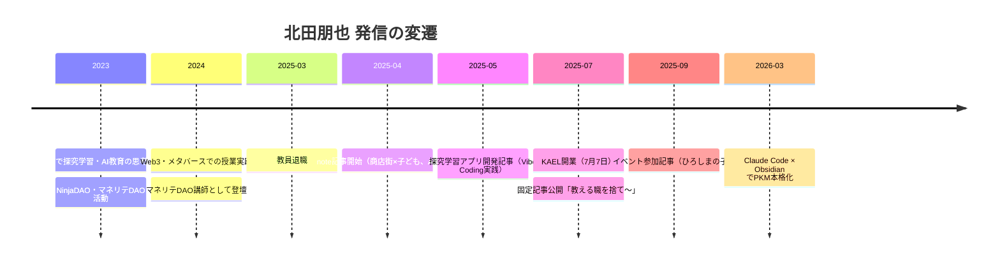

---
tags:
  - ホーム
  - プロフィール
  - 自分
  - SNS
  - note
  - 発信
created: 2026-03-18
updated: 2026-03-21
---

# 北田朋也 - SNS・発信まとめ

> 公開プロフィール・SNSアカウント・発信コンテンツの一覧・アーカイブ

→ 詳細な活動・経歴は [[北田朋也 - ホーム]] を参照

---

## 📱 SNSアカウント一覧

| プラットフォーム | アカウント名 | URL | 主な発信テーマ |
|----------------|------------|-----|--------------|
| note | 北田朋也@KAEL | [note.com/kitada_tomoya](https://note.com/kitada_tomoya) | 探究学習・AI×教育・教員退職・地域連携 |
| X（旧Twitter） | VOMOYA@AI×教育×マネリテ（@vomoya1） | [x.com/vomoya1](https://x.com/vomoya1) | AI教育・Web3・マネリテ・NinjaDAO |
| Facebook | 北田朋也 | [facebook.com/kitada.tomoya](https://www.facebook.com/kitada.tomoya) | 教育関係者ネットワーク・活動報告 |

---

## 📝 note

### プロフィール文（note公式）

> **Kyoto AI×Edu Lab(KAEL)ファウンダー**
> 探究学習・地域連携・AIをテーマに、学校と社会をつなぐ！
> "夢中になれる学び"を追求し、研修講師やプロジェクト伴走などで活動中。
> 元教員ならではの視点から、学びの変革を全国展開。

---

### 📌 記事一覧

| # | タイトル | 公開日 | テーマ |
|---|---------|--------|--------|
| 1 | ["教える職"を捨て、学びを創る側へ。なぜ私は教壇を降りてAI×教育ラボを立ち上げたのか？](https://note.com/kitada_tomoya/n/n02596a4542a4) | 2025-07-07 | 📌 固定記事・自己紹介 |
| 2 | [親子で塩麹づくりに挑戦！学びと発見があふれるjukuHOPEの放課後](https://note.com/kitada_tomoya) | 2025-07-09 | 探究・地域・jukuHOPE |
| 3 | [『ひろしまの子』出版記念イベントに参加して](https://note.com/kitada_tomoya) | 2025-09-19 | 教育・読書・イベント |
| 4 | [【探究学習×AI】「これ、あったらいいのに」を自分でつくってみた話](https://note.com/kitada_tomoya) | 2025-05-18 | AI×探究・Vibe Coding |
| 5 | [元教員だった私が「３時間」で探究学習アプリを完成させた話](https://note.com/kitada_tomoya) | 2025-05-14 | AI×教育・アプリ開発 |
| 6 | [『商店街×子ども』が生む未来への架け橋](https://note.com/kitada_tomoya) | 2025-04-20 | 地域連携・あおいカレッジ |
| 7 | [誰でも著者に!? イケハヤ式・AI出版革命を体験してきた](https://note.com/kitada_tomoya) | 2025-04-19 | AI×出版・イベント |

### 📚 マガジン

**「探究学習を探究する！『探究する先生らぼ』」**（5本収録）
- 対象：探究学習を導入したい教員・指導者
- 内容：授業実践事例、探究トレンド、導入ノウハウ

---

### 固定記事ハイライト

> 「16年間、教員という"安定"の椅子に座りながらも、心のどこかでずっと違和感がくすぶっていた」

**公開日**：2025年7月7日（KAEL開業日と同じ日）
**URL**：[note.com/kitada_tomoya/n/n02596a4542a4](https://note.com/kitada_tomoya/n/n02596a4542a4)

教員として16年間働いた後、2025年3月に退職。同年7月7日に[[Kyoto AI Edu Lab（KAEL）]]を正式開業。その理由と想いを語った自己紹介的な記事。

---

## 🐦 X（旧Twitter）@vomoya1

### アカウント概要（2026-03-19 エクスポートデータより）

| 項目 | データ |
|------|--------|
| 表示名 | VOMOYA@AI×教育×マネリテ |
| ハンドル | @vomoya1 |
| アカウント開設 | 2020年8月12日 |
| フォロワー数 | **1,071人** |
| フォロー数 | **1,527人** |
| 総ツイート数 | **5,800件** |
| 獲得いいね総数 | **20,094** |
| 獲得RT総数 | **1,609** |

> 詳細分析 → [[北田朋也_Twitter分析レポート_2026-03]]

### 発信テーマの変遷

```
〜2024年：Web3・NFT中心（CNP/NinjaDAO/マネリテDAO/朝活）
2025年〜：AI×教育に完全シフト（KAEL/NotebookLM/探究学習）
```

### 関連コミュニティ（X経由）

- **NinjaDAO**：VOMOYA皇帝として参加。CNP（Crypto Ninja Partners）コレクター（上位ハッシュタグ #CNP 304回）
- **新鮫流朝活道場**：毎朝「昨日の良かったこと」報告コミュニティ（222ツイート）
- **マネリテDAO**：大河内薫先生のコミュニティ。金融教育講師として活動（127ツイート）
- **STARTLAND**：教育・起業系コミュニティ
- **KAEL（自主）**：月1オンラインLT・AIワークショップ主宰

### 歴代バズTOP3

1. 「遂に起業しました🎉✨」2025年7月7日 → **113いいね**（歴代1位）
2. 「30代ラストイヤー✨」誕生日投稿 → **99いいね**
3. NinjaDAO×TMAオフ会 イケハヤさんと写真撮影実現 → **94いいね**

---

## 👤 Facebook

- **URL**：[facebook.com/kitada.tomoya](https://www.facebook.com/kitada.tomoya)
- **主な用途**：教育関係者・地域連携ネットワークとの情報共有
- **特徴**：学校関係者・保護者・地域コーディネーターとのつながりが中心

> ※ Facebook はログイン必須のため詳細データ取得不可。内容は随時手動で追記推奨。

---

## 🗓️ 発信タイムライン



---

## 💡 発信軸・キーワード

```
探究学習 × AI × 地域
教員→フリーランスへのキャリア転換
Vibe Coding（子どもへの応用）
学校と社会をつなぐ
夢中になれる学び
```

---

## 📌 更新メモ

- 2026-03-18 初版作成（Claude Codeによる自動生成）
- note記事URLは個別記事リンクを随時追記すること
- Facebook・Xの詳細は手動での追記推奨（ログイン必須のため自動取得不可）
- 新しい記事・投稿が増えたら随時このノートを更新する
