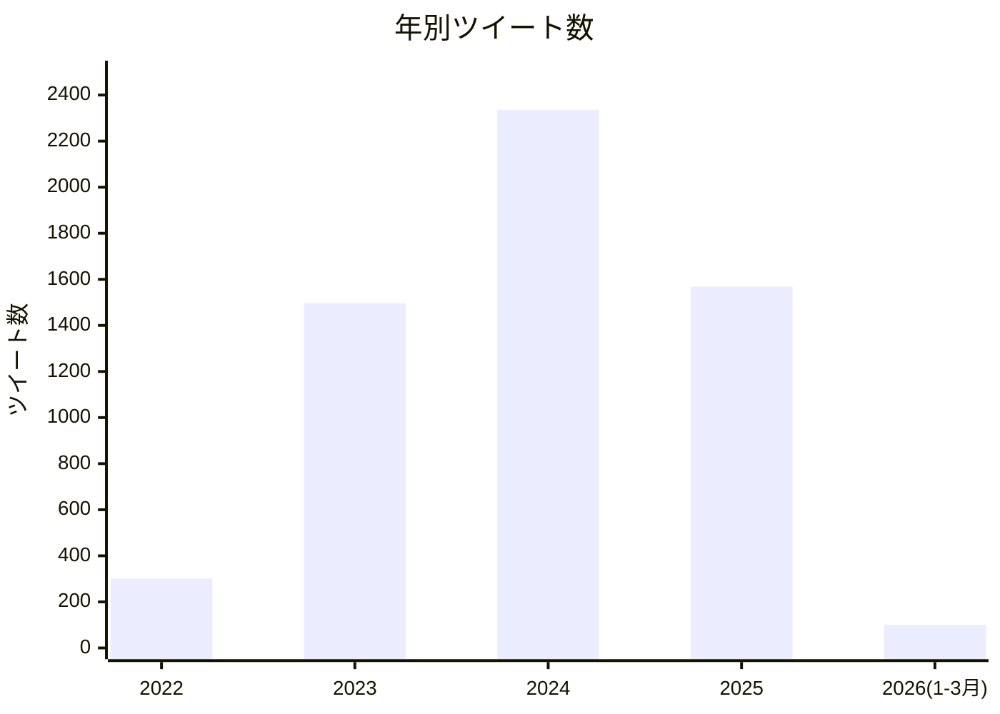
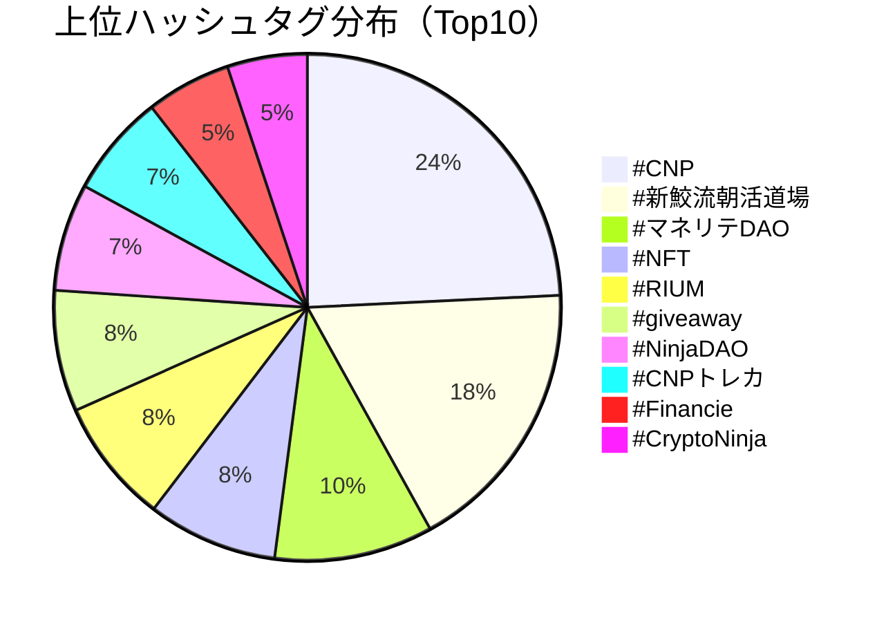
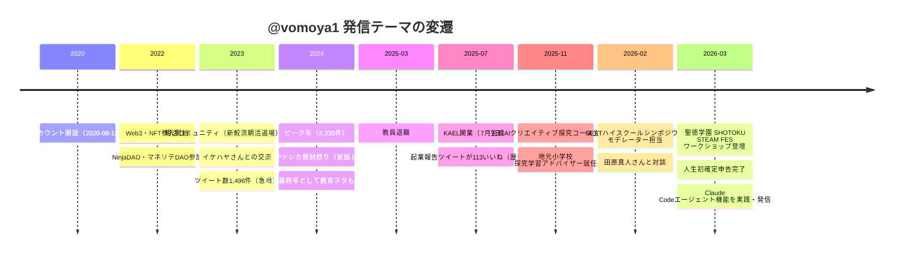

---
tags:
  - ホーム
  - プロフィール
  - 自分
  - SNS
  - Twitter
  - X
  - 分析
  - レポート
created: 2026-03-21
updated: 2026-03-21
---

# 北田朋也 Twitterアーカイブ 分析レポート（2026年3月）

> Twitterエクスポートデータ（2026-03-19取得）をClaude Codeで解析した自己ナレッジレポート
> → [[北田朋也 - SNS発信まとめ]] と連携して参照すること

---

## 📊 アカウント基本データ

| 項目 | データ |
|------|--------|
| ハンドル | @vomoya1 |
| 表示名 | VOMOYA@AI×教育×マネリテ |
| アカウント開設 | 2020年8月12日 |
| データ取得日 | 2026年3月19日 |
| 総ツイート数 | **5,800件** |
| フォロワー数 | **1,071人** |
| フォロー数 | **1,527人** |
| 獲得いいね総数 | **20,094** |
| 獲得RT総数 | **1,609** |
| メール | vomoya04198628@hotmail.co.jp |
| 所在地 | 日本 京都 |

---

## 📈 年別ツイート数推移



| 年 | ツイート数 | 傾向 |
|----|-----------|------|
| 2022 | 301件 | Web3/NFT参入期 |
| 2023 | 1,496件 | NinjaDAO・朝活コミュニティ本格化 |
| 2024 | 2,335件 | ピーク年。CNP活動・教員在職最終年 |
| 2025 | 1,568件 | 退職→起業→AI×教育軸への転換 |
| 2026 | 100件（1-3月） | AI×教育フリーランスとして稼働中 |

---

## 🏷️ 上位ハッシュタグ（Top20）



| ハッシュタグ | 使用回数 | カテゴリ |
|------------|---------|---------|
| #CNP | 304回 | Web3・NFT |
| #新鮫流朝活道場 | 222回 | コミュニティ（朝活） |
| #マネリテDAO | 127回 | マネーリテラシー |
| #NFT | 104回 | Web3・NFT |
| #RIUM | 100回 | Web3 |
| #giveaway | 97回 | Web3イベント |
| #NinjaDAO | 86回 | Web3コミュニティ |
| #CNPトレカ | 82回 | Web3・トレカ |
| #Financie | 68回 | トークン・DAO |
| #CryptoNinja | 64回 | Web3 |
| #CNG | 55回 | Web3トークン |
| #ニンジャ寺子屋 | 54回 | 教育×Web3 |
| **#探究学習** | **53回** | **教育（本業）** |
| #クリプトニンジャ咲耶 | 52回 | NFT |
| #メタバース | 49回 | Web3 |
| #Voicy | 48回 | コンテンツ |
| #STARTLAND | 41回 | 教育コミュニティ |
| #CNPC | 41回 | Web3 |
| #素材屋CNP | 40回 | Web3 |
| #LLAC | 32回 | Web3 |

> 💡 **読み解きポイント**:
> - 全体の上位はWeb3/NFT関連（CNP・NinjaDAO等）が圧倒的
> - 朝活コミュニティ（#新鮫流朝活道場）が222回と2位に
> - 本業軸の #探究学習 は53回（13位）→ 2025年以降に集中している可能性

---

## 🏆 バズったツイートTop10

| 順位 | いいね | RT | 年 | ツイート概要 |
|------|-------|----|----|-------------|
| 1 | **113** | 7 | 2025 | 「遂に起業しました🎉✨」令和7年7月7日・教員退職3ヶ月後に開業報告 |
| 2 | **99** | 5 | 2025 | 「30代ラストイヤー✨」誕生日投稿・新たな挑戦の宣言 |
| 3 | **94** | 1 | 2023 | NinjaDAO×TMAオフ会 イケハヤさんとの3度目の挑戦で写真撮影実現 |
| 4 | **85** | 10 | 2024 | 誕生日ケーキにCNPミタマっちを描いてもらった（家族エピソード） |
| 5 | **79** | 3 | 2024 | 「リアルイケハヤさん発見!?」動物園で子どもたちが動物をイケハヤ認定 |
| 6 | **76** | 1 | 2023 | ピンクのマカミちゃんをお迎え（CNP NFT購入） |
| 7 | **69** | 3 | 2025 | CNPトレカ息子たちとBOX開封！テンションやばい |
| 8 | **63** | 3 | 2025 | CNPトレカ開封祭り 連日和室で家族4人祭り |
| 9 | **59** | 4 | 2024 | CNP購入報告「爆炎オロチ」お迎え |
| 10 | **58** | 4 | 2024 | 仮想通貨バブルでNFT熱い🔥 CNPお迎え |

> 💡 **最多バズは「起業報告」**。2025年7月7日の開業ツイートが113いいねで歴代1位。
> 家族エピソードとNFT購入報告がバズりやすい傾向。

---

## 🔄 発信テーマの変遷



---

## 🎯 活動フェーズ分析

```
Phase 1（〜2024）：Web3・NFT中心
  └ CryptoNinja（CNP）コレクター
  └ NinjaDAO・VOMOYA皇帝として活動
  └ マネリテDAO参加（大河内薫先生コミュニティ）
  └ 朝活コミュニティ（新鮫流朝活道場）222ツイート

Phase 2（2025年3月〜）：転換期
  └ 教員退職（2025年3月）
  └ KAEL開業（2025年7月7日）
  └ フリーランス×AI×教育軸へシフト

Phase 3（2025年秋〜）：AI×教育フリーランスとして確立
  └ NotebookLM活用・普及支援
  └ 探究学習ワークショップ・研修講師
  └ NEXTハイスクール構想への関与
  └ Claude Code × Obsidian でPKM進化
```

---

## 📅 最近の主な活動（2026年1-3月）

| 日付 | 内容 |
|------|------|
| 2026-03-14 | Claude Codeエージェント機能の実践報告ツイート（ブログクリティカルリーディング・Obsidian自動保存） |
| 2026-03-13 | 「AIがあるのに、学校で何を学ぶ？」テーマのオンライン学習会告知（ゲスト：日本体育大学柏高校 熊井允人先生） |
| 2026-03-10 | **人生初確定申告完了🎉**（#元教員フリーランス中年おっさん） |
| 2026-03-09 | 聖徳学園中学高等学校「SHOTOKU STEAM FES 2025」AIワークショップ登壇（「資料ゼロで始めるAI研修」） |
| 2026-02-21 | NEXTハイスクールシンポジウム（大阪工業大学梅田キャンパス）モデレーター担当 |
| 2026-02-17 | 公立小学校 探究学習 教員研修講師 |
| 2026-02-17 | 田原真人さん（反転授業の研究コミュニティ代表）との対談 → NotebookLMでダイジェスト作成 |
| 2026-02-16 | 文科省NEXTハイスクール構想（2/13追加資料）をNotebookLMで解説動画作成・公開 |
| 2026-02-23 | NotebookLM スライド直接編集新機能 実践レポート |

---

## 🤝 主なX上の関係性・コミュニティ

| コミュニティ | 役割 | 関連ハッシュタグ |
|------------|------|----------------|
| NinjaDAO | VOMOYA皇帝として参加。CNP所持 | #CNP #NinjaDAO #CryptoNinja |
| 新鮫流朝活道場 | 毎朝「昨日の良かったこと」を報告 | #新鮫流朝活道場 |
| マネリテDAO | 大河内薫先生コミュニティ。金融教育関連 | #マネリテDAO |
| STARTLAND | 教育・起業系コミュニティ | #STARTLAND |
| KAEL（自主） | 月1オンラインLT・AIワークショップ主宰 | #KAEL #KyotoAIEduLab |
| TankyuSenseiLab | 探究学習関係者ネットワーク（RTなど） | #探究学習 |

---

## 💬 発信スタイルの特徴

- **冒頭の記号**: `\\\〜///`「🎉」「📢」「👇」などで視認性を高める
- **ハッシュタグ活用**: 特定コミュニティへのリーチを意識した複数タグ使用
- **家族ネタ**: 子どもとのCNPトレカ開封、妻の手作り鞄など、温かみのある日常投稿がバズりやすい
- **実践報告型**: ツール（NotebookLM, Claude等）を試した結果を即発信
- **オフ会・登壇報告**: リアルイベントの様子を写真付きで共有

---

## 📌 このレポートについて

- **データ取得日**: 2026年3月19日（Twitterエクスポート）
- **解析日**: 2026年3月21日（Claude Codeによる自動解析）
- **収録期間**: 2022年〜2026年3月（アーカイブ内）
- **アーカイブ総ツイート**: 5,800件
- **注記**: アカウント開設は2020年8月だが、アーカイブ内の最古ツイートは2022年頃から。2020-2021年分は別保存か削除の可能性あり。

→ SNS全体のまとめは [[北田朋也 - SNS発信まとめ]] を参照
