# 📄 KAEL提案書｜AI×和食×国際交流 実践プログラム

> **"学びたいから、言葉を超える"**
> AIと人が協働することで、新しい学びの形を実現する

---

## 🌏 ① 背景と目的

### ■ 社会的背景

近年、グローバル化の進展に伴い、日本国内での国際交流機会は急速に拡大している。特にアメリカの高校生・大学生との交流プログラムは増加傾向にあり、従来の「通訳頼み」の運営モデルは限界を迎えつつある。

| 課題 | 現状 | 目指す姿 |
|------|------|----------|
| 言語の壁 | 通訳が必須 → コスト・スケール問題 | AIが橋渡し → 通訳不要モデル |
| 運営規模 | 60人対応が困難 | 標準化・AI補助で対応可能 |
| 担い手不足 | 熟練スタッフ依存 | 若者アシスタントを育成・配置 |
| 学びの深さ | 体験のみで終わる | 探究×文化理解の往復 |

### ■ このプログラムが目指すもの

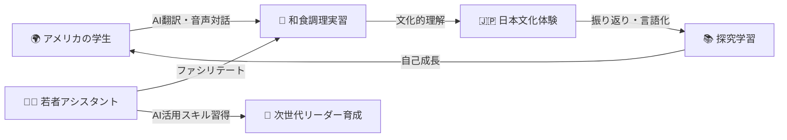

---

## 💡 ② コンセプト

### 「AIと共に学ぶ、ことばを超えた和食体験」

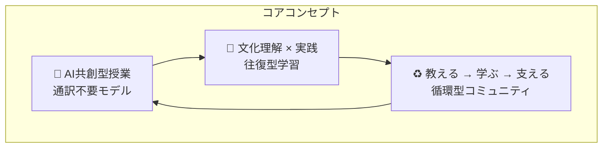

このプログラムの特徴は、**技術（AI）が人をつなぐツール**として機能し、言語的ハンディキャップを乗り越えた**真の相互理解**を生み出す点にある。

> 💬 **KAEL代表・北田朋也より**
> 「言葉が通じるから学べる」のではなく、「学びたいという意欲が言葉の壁を超えさせる」——その環境をAIと共に設計します。

---

## 📋 ③ プログラム設計（全11回）

### ■ 全体スケジュール俯瞰

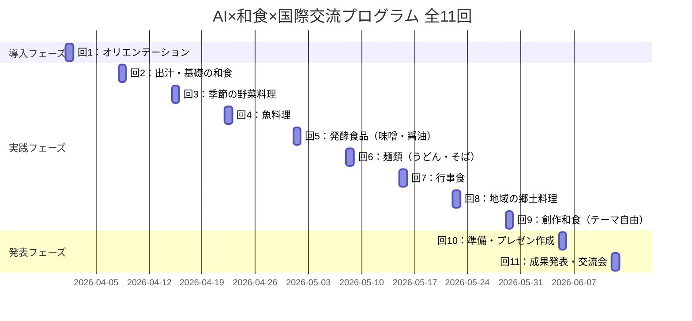

### ■ 1回の流れ（モデル）

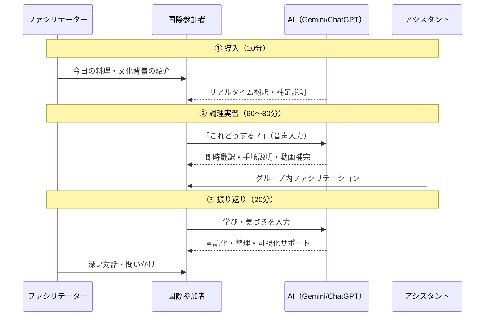

---

## 🤖 ④ AI活用設計（KAELの強み）

### ■ 3ツールの役割分担

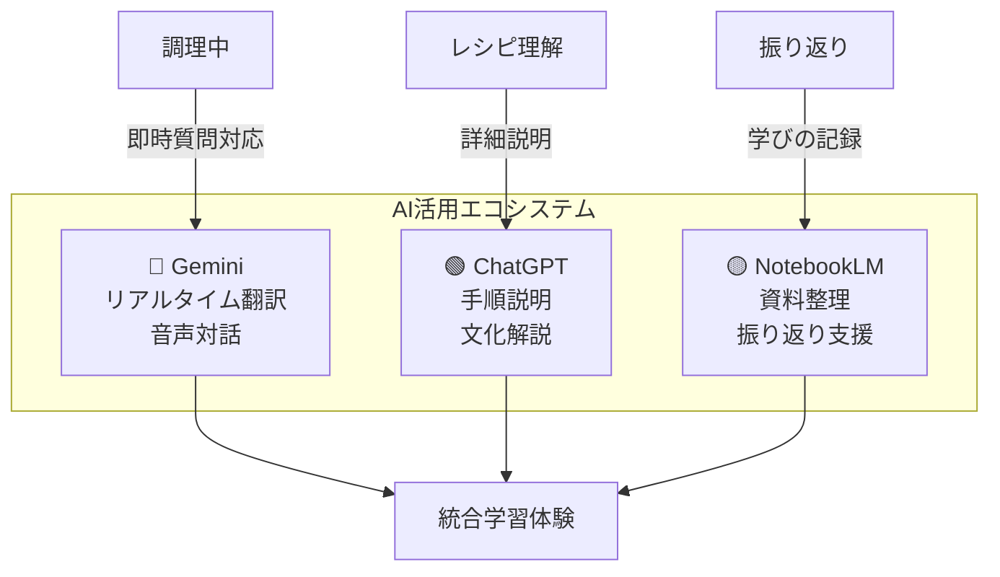

### ■ AI活用シーン詳細

| フェーズ | 課題 | AIの役割 | 使用ツール |
|---------|------|---------|----------|
| 調理中 | 「この調味料何？」 | 画像認識→即翻訳 | Gemini |
| 調理中 | 手順がわからない | 音声→ステップ説明 | Gemini |
| レシピ | 工程が複雑 | 画像・動画で補完 | ChatGPT |
| レシピ | 文化的背景 | 歴史・由来を解説 | ChatGPT |
| 振り返り | 学びを言語化 | 問いかけ→整理 | NotebookLM |
| 振り返り | 記録・共有 | ポートフォリオ化 | NotebookLM |

### ■ 「AI活用能力グラデーション」設計

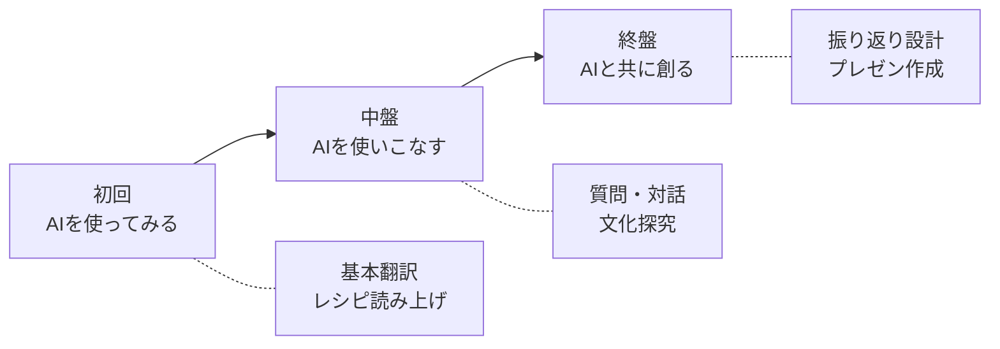

---

## 📖 ⑤ 教材・レシピ設計

### ■ ビジュアルファースト設計の原則

```
┌─────────────────────────────────────────────┐
│           KAELレシピカード設計                │
│                                             │
│  🇯🇵 日本語     🇺🇸 English                  │
│  ────────     ────────                      │
│  出汁を取る    Make dashi                    │
│                                             │
│  [📷 写真]     [📷 Photo]                   │
│                                             │
│  1工程 = 1情報 の原則                        │
│  言語に依存しない図・写真中心                 │
│  AIで補完できる余白設計                      │
└─────────────────────────────────────────────┘
```

### ■ KAELが提供する教材パッケージ

- **日英併記レシピカード**（Canvaで図解・イラスト化）
- **文化背景解説シート**（英語ver.）
- **AI活用ガイド**（参加者・アシスタント向け）
- **振り返りシート**（日英・デジタル対応）

---

## 👩‍💼 ⑥ 若者アシスタント育成モデル

### ■ アシスタントの役割定義

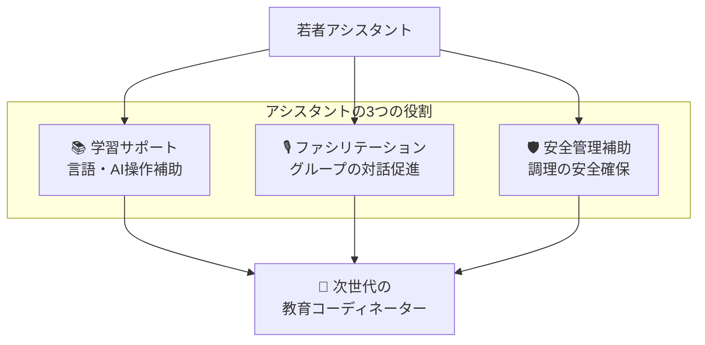

> 🔑 **育成の哲学：「教える側」ではなく「支える側」として育成**
> 正解を教えるのではなく、参加者の気づきを引き出すファシリテーターとして育てる。

### ■ KAEL支援の育成プログラム（3ステップ）

| ステップ | 内容 | 期間 | 目標 |
|---------|------|------|------|
| Step 1 | AIツール研修 | 2時間 | Gemini/ChatGPT/NotebookLM基本操作 |
| Step 2 | 多文化コミュニケーション | 3時間 | 異文化理解・言語不要コミュニケーション |
| Step 3 | ファシリテーション基礎 | 3時間 | 問いかけ・傾聴・グループ運営 |

---

## 🏗️ ⑦ 運営設計（60人×2グループ対応）

### ■ 会場レイアウト概念図

```
┌─────────────────────────────────────────────────┐
│                    調理室                        │
│                                                 │
│  [Aグループ：30人]        [Bグループ：30人]       │
│  ┌───┐ ┌───┐ ┌───┐   ┌───┐ ┌───┐ ┌───┐       │
│  │G1 │ │G2 │ │G3 │   │G4 │ │G5 │ │G6 │       │
│  │5-6│ │5-6│ │5-6│   │5-6│ │5-6│ │5-6│       │
│  │人 │ │人 │ │人 │   │人 │ │人 │ │人 │       │
│  └───┘ └───┘ └───┘   └───┘ └───┘ └───┘       │
│  👩‍💼助  👩‍💼助  👩‍💼助     👩‍💼助  👩‍💼助  👩‍💼助          │
│                                                 │
│  🎙️ファシリテーター                               │
└─────────────────────────────────────────────────┘
```

### ■ 成功の3つの鍵

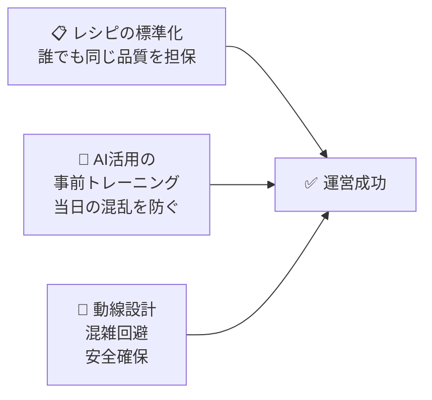

---

## 💎 ⑧ KAELが提供する価値

### ■ 3つの提供価値

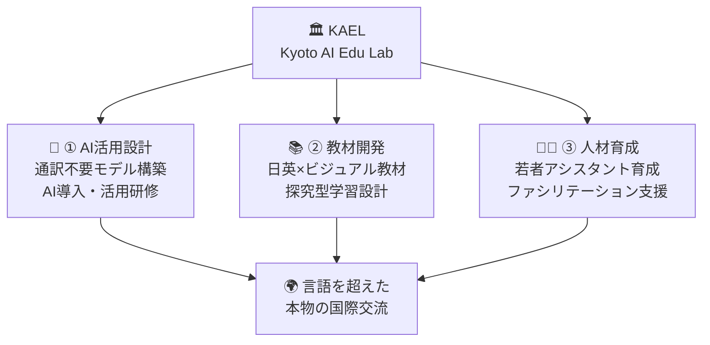

### ■ 他社・従来モデルとの差別化

| 比較軸 | 従来モデル | KAELモデル |
|--------|-----------|-----------|
| 言語対応 | 通訳者を配置（コスト大） | AI翻訳で対応（スケール可） |
| 学習設計 | 体験のみ | 探究×文化理解の往復 |
| 担い手 | 熟練スタッフのみ | 若者アシスタント育成 |
| 記録 | 写真・感想文 | AI活用のポートフォリオ |
| 展開性 | 属人的 | 標準化→横展開可能 |

---

## 🗓️ ⑨ 今後の進め方

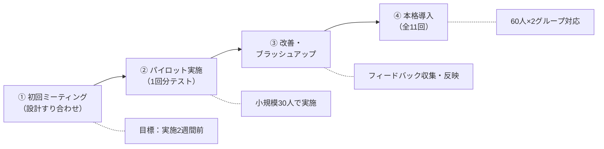

### ■ KAEL側の準備スケジュール

| フェーズ | 準備内容 | タイミング |
|---------|---------|----------|
| 設計 | プログラム詳細設計・レシピ選定 | ミーティング後1週間 |
| 教材 | 日英レシピカード・ガイド作成 | 実施3週間前 |
| 研修 | アシスタント向けトレーニング | 実施1週間前 |
| 当日 | ファシリテーション・AI運用 | 当日 |
| 振り返り | 記録・改善点整理 | 実施後3日以内 |

---

## 🚀 ⑩ 展開可能性（KAELのビジョン）

### ■ このプログラムが開く可能性

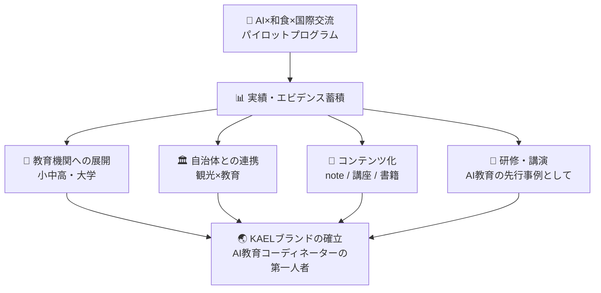

### ■ 数値目標（KPI案）

| 指標 | 目標値 | 測定方法 |
|------|--------|---------|
| 参加者満足度 | 90%以上 | アンケート |
| AI活用率（当日） | 全グループの80%以上 | 記録シート |
| 言語困難の発生 | 従来比50%減 | ファシリテーター記録 |
| アシスタント育成数 | 10名/年 | 参加者リスト |
| 他機関への横展開 | 3件/年 | 契約・MOU数 |

---

## 💬 メッセージ

> 「言葉が通じるから学べる」ではなく
> **「学びたいから、言葉を超える」**
>
> AIと人が協働することで、新しい学びの形が実現できます。
> KAELは、テクノロジーを「教育の翻訳者」として活用し、
> 文化と文化をつなぐ架け橋を設計します。

---

## 🏷️ タグ

#KAEL #AI教育 #国際交流 #和食 #探究学習 #ファシリテーション #提案書 #2026

---
*作成日：2026-03-21 / KAEL（Kyoto AI Edu Lab）北田朋也*
