---
tags:
  - 教育政策
  - 2040年問題
  - AI教育
  - 保護者向け
  - 食育
  - 探究学習
  - KAEL
  - nalba
  - 対話録
created: 2026-03-19
updated: 2026-03-19
---

# AI時代の子育てと生きる力
## 教育対話レポート｜nalba × 安田曜先生 × 北田朋也（KAEL）

> **日時：** 2026-03-20
> **場所：** nalba（学習・居場所コミュニティ）
> **登壇者：** 安田曜先生（元校長・nalba顧問）／北田朋也（KAEL）
> **進行：** 貞愛さん（nalba主宰）

---

## 全体マップ

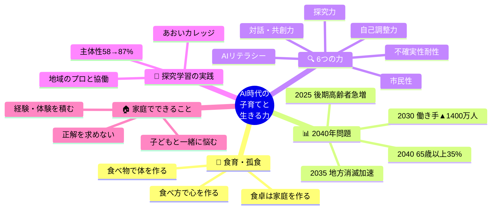

---

## 第1章：子育ては「いつも今」

```
╔══════════════════════════════════════╗
║ 明治20年代の都日日新聞（京都新聞の前身）に ║
║                                      ║
║「最近の保護者は子育てを学校任せにしている」 ║
║  という社説が掲載されていた。            ║
║                                      ║
║  ── 安田曜先生                         ║
╚══════════════════════════════════════╝
```

> 💡 子育ての悩みは時代を超えて普遍。「今」を懸命に生きることが子育ての本質。

---

## 第2章：食育が育てる「生きる力」

### 安田先生が見た「食の格差」

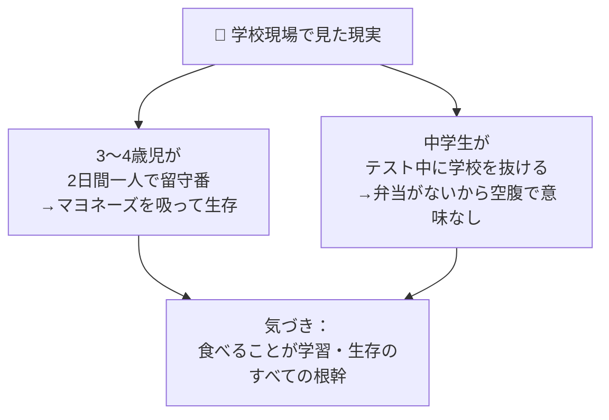

---

### 「こしょく」の多様な漢字

```
┌─────────────────────────────────────────┐
│             「こしょく」の6つの字          │
├──────┬──────────────────────────────────┤
│ 孤 食 │ 一人で食べる（孤独・孤立）          │
│ 個 食 │ 家族でも各自バラバラのものを食べる   │
│ 子 食 │ 子どもだけで食べる（子ども食堂の背景）│
│ 小 食 │ 食が細い・量が少ない               │
│ 粉 食 │ 粉もの（うどん等）ばかりの食事       │
│ 固 食 │ 決まったものしか食べない偏食         │
└──────┴──────────────────────────────────┘
```

---

### 食育3つの言葉

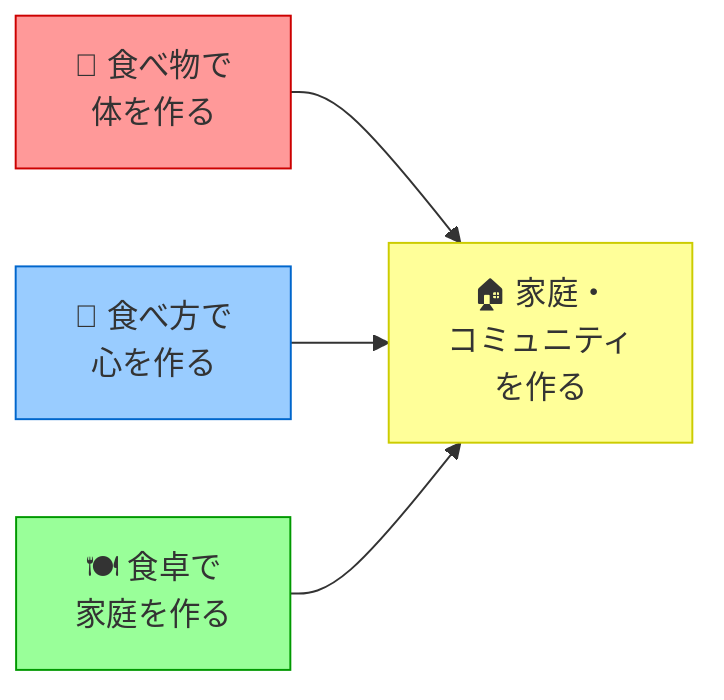

> 📝 安田先生が校長時代に考案したスローガン。
> 京都市教育委員会の反対を押し切って「お弁当の日」「干し柿作り」などを実践。

---

### nalbaの食の取り組み

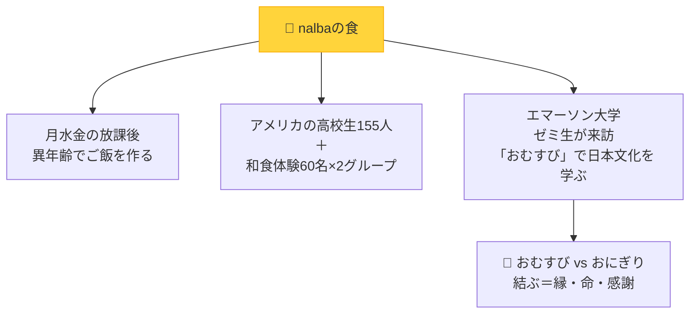


> **おむすびの意味：** 「縁を結ぶ」「命を結ぶ」——ただ握るだけでなく、作ってくれた人への感謝と、食べ物との縁を感じる行為。

---

## 第3章：2040年問題とは何か

### 日本社会の4段階の変化

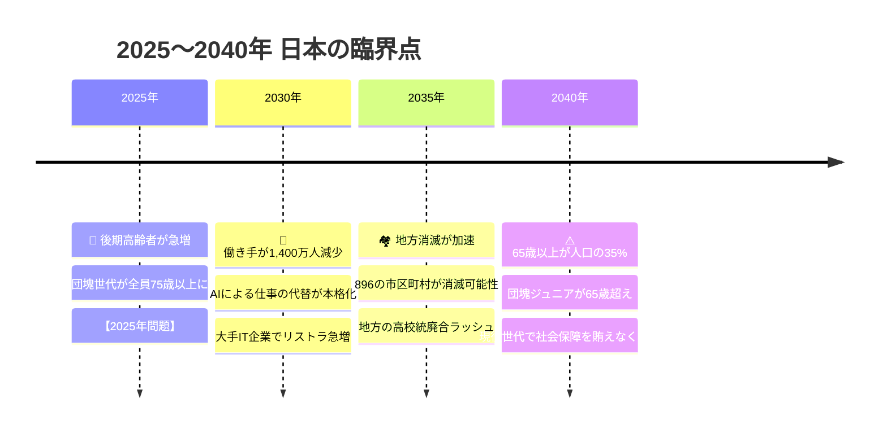

---

### 数字で見る2040年

| 指標           | 2025年    | 2040年                  |
| ------------ | -------- | ---------------------- |
| 65歳以上の割合     | 約29%     | **約35%（3人に1人以上）**      |
| 働く世代         | 約7,200万人 | **約6,000万人（▲1,200万人）** |
| 消滅可能性のある市区町村 | ─        | **896市区町村**            |

---

### 今の子どもたちのタイムライン

```
今12歳の子どもは──

  2026年 → 中学1年生（13歳）
  2032年 → 大学1年生（18歳）  ← 2030年問題の波をモロに受ける
  2040年 → 社会人6年目（26歳）← 2040年問題の臨界点で働き盛り
  2060年 → 46歳（バリバリの現役世代）
```

> ⚠️ 今の子どもたちは**2040年問題の最前線を担う世代**。今の教育が問われている。

---

### 高校消滅＝町の消滅

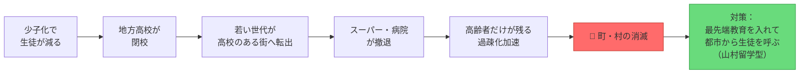

---

## 第4章：AI時代に必要な「6つの力」

### 経団連・文科省が求める人物像

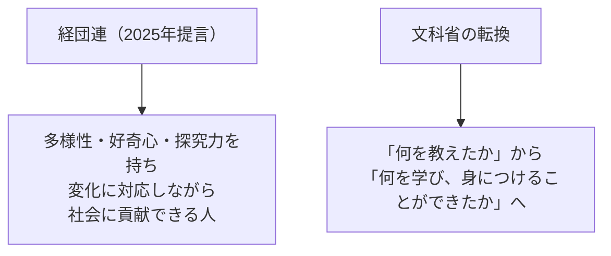

---

### 2040年に必要な6つの力

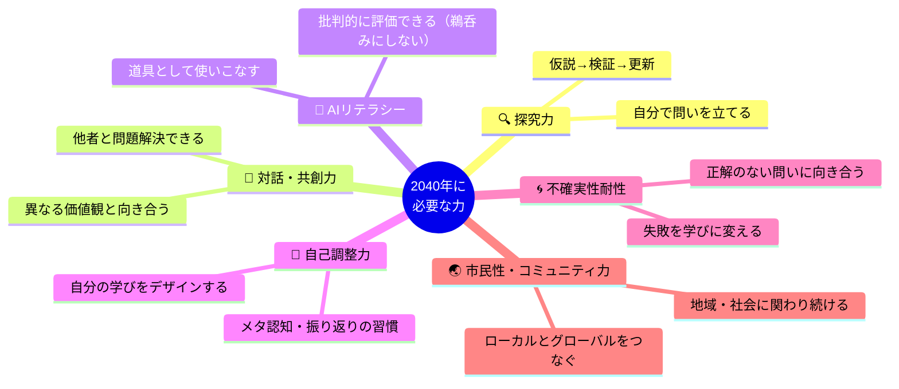

---

### 今の学校 vs 2040年に必要なこと

```
【今の学校が重視していること】    【2040年に必要なこと】

  ✅ 正解を速く出す力         ≠     🔍 問いを立てる力
  ✅ 知識を記憶する力         ≠     🧩 知識を組み合わせる力
  ✅ みんなと同じにできる      ≠     🌈 自分らしく表現できる
  ✅ 先生の指示に従う力        ≠     🎯 自分で判断し動く力
  ✅ 点数・順位で評価される    ≠     📁 成長のプロセスが認められる
```

> ⚠️ AIは東大の問題も論述もこなせる時代。**数値化できる力だけを育てることの限界**。

---

### 言葉の「一人歩き」問題

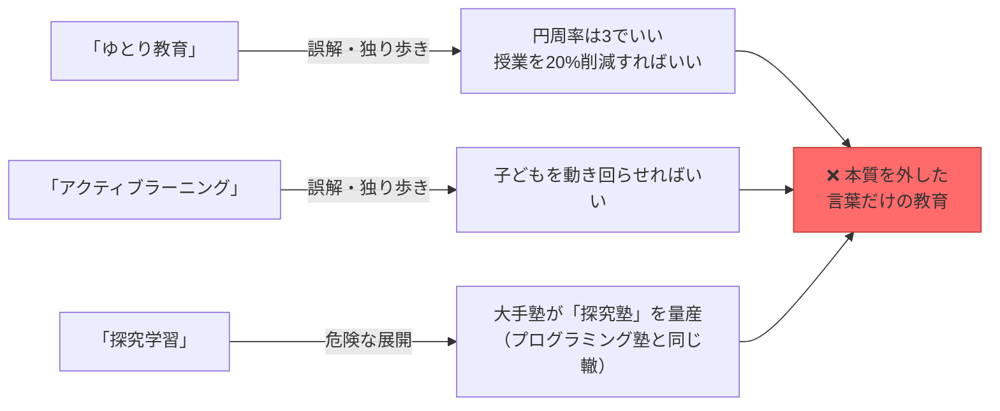

> 📌 **北田先生の警告：** 探究学習塾が乱立する日は近い。プログラミング学習の二の舞を避けるために、**本質を肌感覚で捉えた大人**が伝え続けることが重要。

---

## 第5章：探究学習の実践｜あおいカレッジ

### 葵小学校の7年間

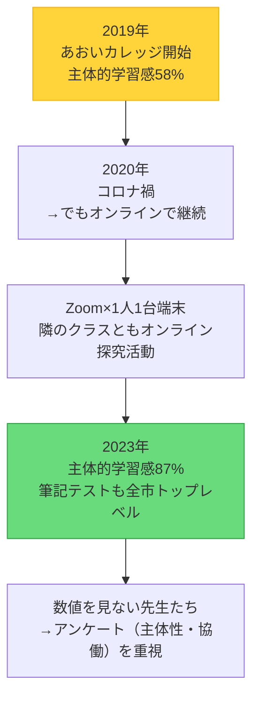

---

### あおいカレッジの「問い方」

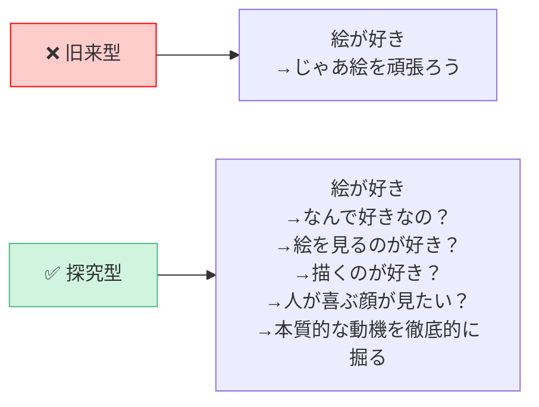

---

### 教師の役割の転換

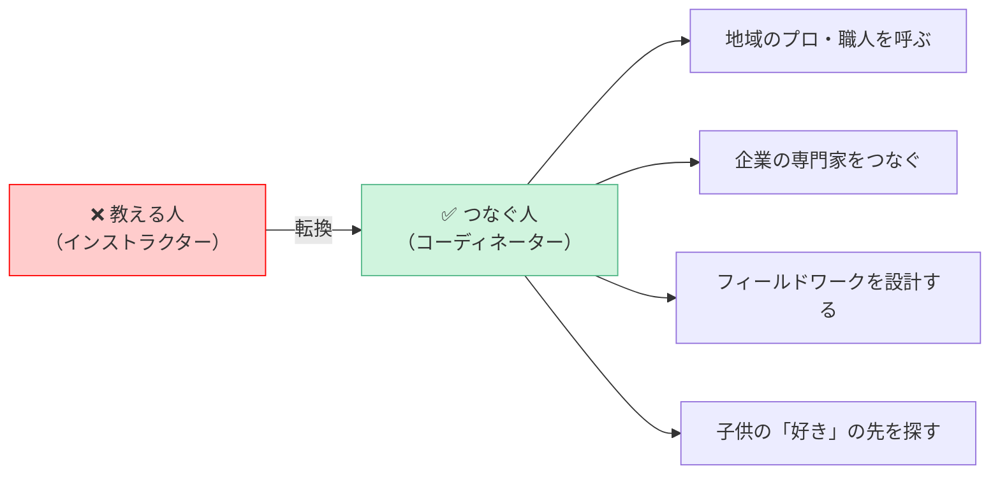

> 📝 実例：和菓子職人への「営業」、マーケターへの依頼、鴨川の環境スペシャリストとの連携、マイクラで教育委員会と交渉してロック解除

---

### マイクラで学ぶ自走力

```
【マイクラを学校に持ち込む際の交渉プロセス】

  ❌ 「マイクラ使わせてください」
       → 却下（遊びになるから）

  ✅ 「オンライン不登校支援の枠組みで
        子どもたちがメタバース空間に学校を作り、
        来られない子の居場所にします。
        それを子どもがやりたいと言っています。
        否定しますか？」
       → 許可

  💡 ポイント：子どもの「本物の動機」と「目的」が
     大人を動かす
```

---

## 第6章：保護者へのメッセージ

### 安田先生の言葉

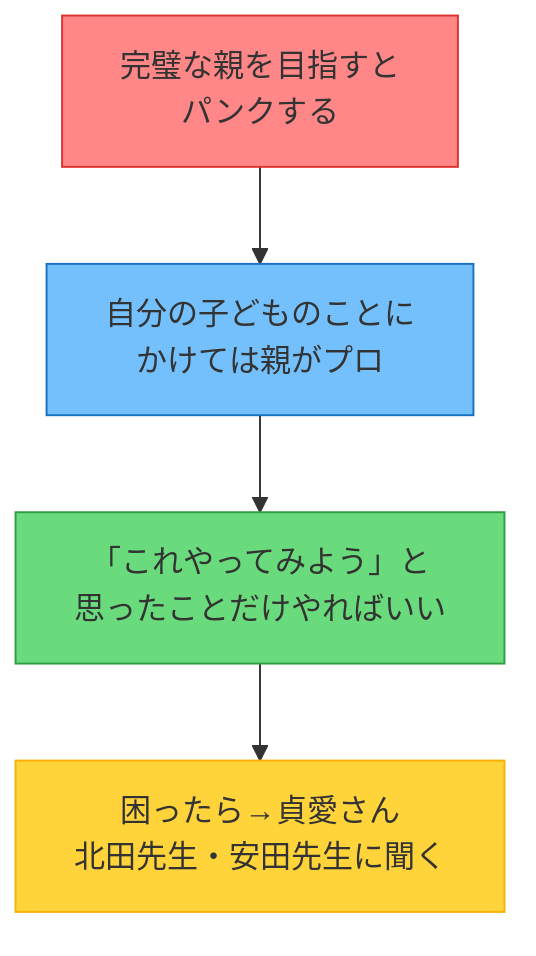

---

### 親として大切にしたいこと

| 場面 | やめたい声かけ | 試したい声かけ |
|---|---|---|
| テストの点が低い | 「なんでこんな点数なの？」 | 「どこが難しかった？次どうする？」 |
| 子どもが失敗した | 「だから言ったでしょ」 | 「失敗できたね。何がわかった？」 |
| 「なんで？」と聞いてきた | 「そういうものなの」 | 「おもしろい疑問だね。一緒に調べよう」 |
| AIを使いたがる | 「それはズルだよ」 | 「AIが何を言ったか教えて。本当にそう？」 |
| 好きなことに夢中 | 「勉強しなさい」 | 「そこまで好きなの？なんでそんなに好きなの？」 |

---

### 北田先生のまとめメッセージ

```
╔═══════════════════════════════════════════╗
║                                           ║
║   子どもたちに必要なのは、                    ║
║   「答えを持っている大人」ではなく、            ║
║   「一緒に考え続けられる大人」。               ║
║                                           ║
║   学校だけでなく、家庭で、地域で、             ║
║   大人たちが一緒に学び続けることが、           ║
║   子どもたちへの最大のプレゼント。             ║
║                                           ║
╚═══════════════════════════════════════════╝
```

---

## 第7章：nalbaという場の意味

### nalbaで起きていること

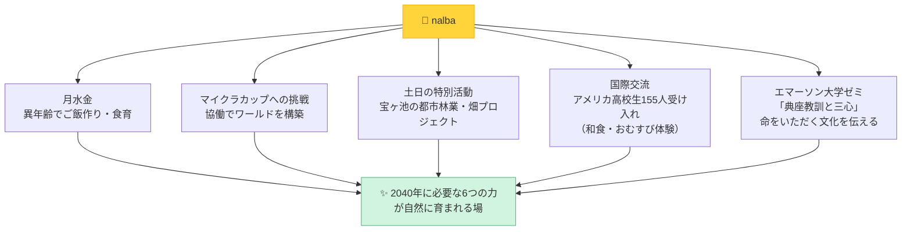


---

### nalbaが大切にしていること

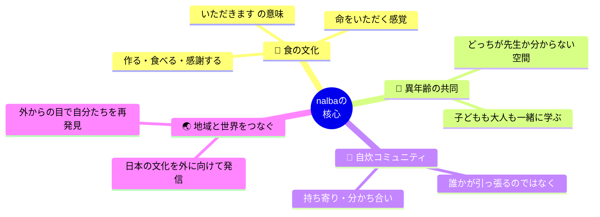


---

## 全体まとめ：対話から見えたキーワード

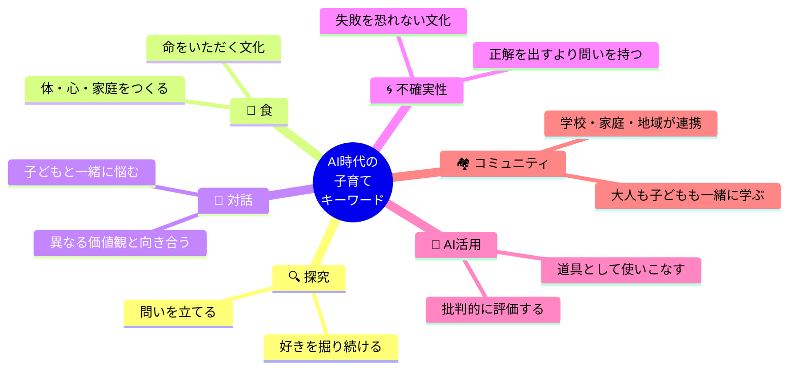


---

## 登壇者プロフィール

### 安田曜先生
- 元公立小中学校校長（京都市北部・南部の困難校を多数歴任）
- 「お弁当の日」を京都市立小学校で初めて実施（教育委員会の反対を押し切り）
- 社会教育主事
- nalba顧問

### 北田朋也（KAEL）
- 元京都市立葵小学校・探究学習主任（16年勤務、うち7年で「あおいカレッジ」を構築）
- 2025年7月7日 個人事業「KAEL（Kyoto AI×Edu Lab）」として独立
- 探究学習コーディネーター・AI活用授業支援・組織改革対話ファシリテーター
- 社会教育士

---

*記録：2026-03-19 by Claude Code × 北田朋也（KAEL）*
*文字起こし：AI時代子育て議論-Transcription.md（2026-03-20収録）をもとに作成*
