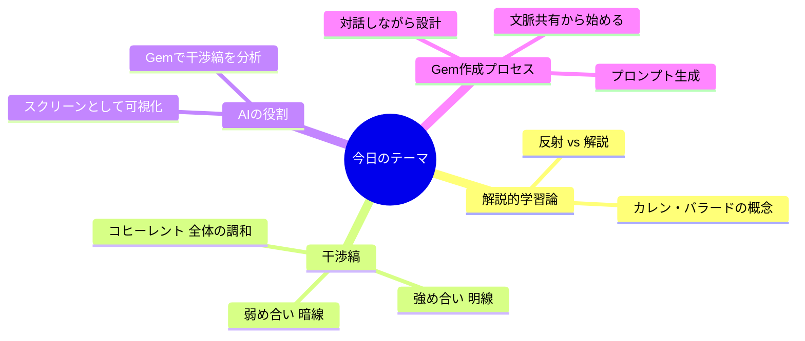
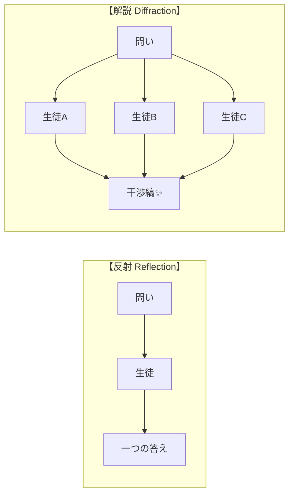
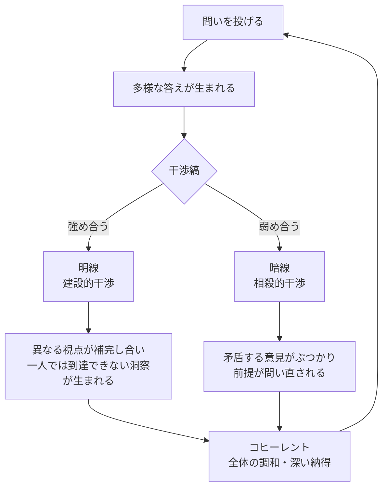
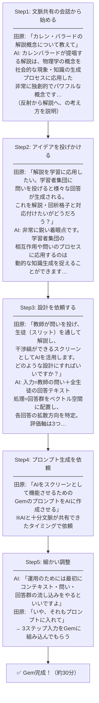
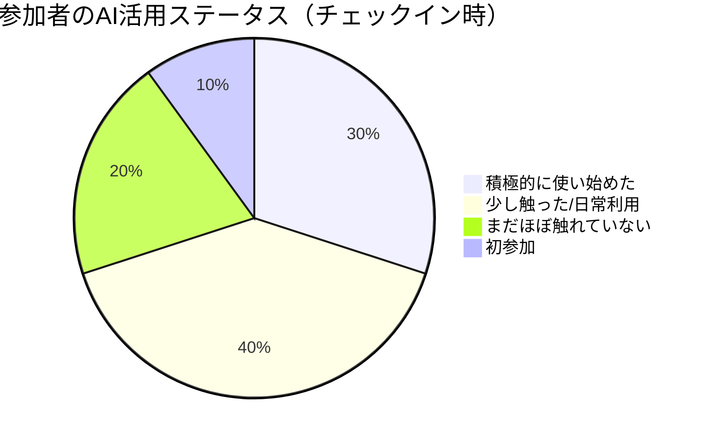

---
tags:
  - かえつ有明
  - AI研修
  - 解説的学習論
  - Gem
  - テクニカルファシリテーター
  - AI×教育
created: 2026-03-25
updated: 2026-03-25
---

# かえつ有明 AI研修 第2回レポート

> **日時：** 2026年3月25日（水）09:00〜11:00
> **形式：** Zoom オンライン研修
> **ファシリテーター：** 田原さん（コンテンツ）× 北田朋也（テクニカル）
> **テーマ：** 多様な意見を重ね合わせて深い理解を生む「干渉縞の学び」

---

## 参加者チェックイン

| 参加者 | 前回からのアップデート |
|--------|----------------------|
| 真田さん | まだほぼ触れていない。調べるときに少し使った程度。「今日頑張ります」 |
| 石田記子さん | 前回欠席・動画視聴も難しかった。でもGeminiが日常的な力になっている（新学年会議でも活躍！） |
| 大木さん | 「解説的学習論」で学ぶことの意味が改めてアップデートされた |
| 高田美喜さん | AIが「道具」だけでなく既存の考え方と結びつくと気づいた。家族間のAIリテラシーギャップも実感 |
| 高野美保さん | 特に触れていないが、先生同士の対話が広がった（中高の使い方の違いなど） |
| 山田秀男さん | 初参加。佐野先生から話を聞き「自分の考えが具体化できそう」と期待 |
| 上野愛さん | GeminiのGem機能を発見・使い始めた。ハードルが下がった |
| 佐野かずゆきさん | 岩井さんに聞きながらGemを作り、学校全体研修で振り返りアプリを使った。でも進め方への反省あり |
| 岩井健太さん | 前回の解説的実践を先生たちへのヒアリングGemに応用。ログを残す・工夫を入れる・プロセスへの組み込み方を考え中 |
| 吉井さん | 前回より前のめりに。「一つでも新しいことを掴みたい」 |
| **北田朋也** | Zoom議事録の自動化を実験中。文字起こし保存→ワンクリックで議事録生成を試験運用 |

---

## 今日のテーマ：干渉縞をつくる学び



---

## 核心概念①｜反射 vs 解説（カレン・バラードより）



> **反射** = 鏡のように、決まった答えが返ってくる。全員から同じ答えが戻る。
> **解説** = 回析格子のように、多様な答えが広がり、重なり合って新しいパターンが生まれる。

**ポイント：生徒一人ひとりが「スリット（溝）」になる**
光が溝を通って広がるように、問いが生徒を通して多様な回答に広がっていく。

---

## 核心概念②｜干渉縞の2パターン



### 強め合い（明線）

> 異なる視点が出会うことで、**一人では到達できなかった深い洞察や新しいコンセプト**が立ち上がる。
> お互いの意見の足りないところを補い合って、どちらからとも言えない良い考えが生まれる。

### 弱め合い（暗線）

> 矛盾する意見がぶつかり、**既存の固定観念が揺さぶられ、前提が問い直される**。
> ※悪いことではなく、新しい前提の発見につながる！

**例：数学の背理法**

```
仮定「√2 は有理数（整数/整数で表せる）」
         ↓ どんどん進めると…
              矛盾が生じる！
         ↓
「あの前提がおかしかったんだ」と気づく
         ↓
「無理数」という新しい概念に到達 ✨
```

> 「矛盾が出てくるということは、その矛盾を生み出す前提に何か問題があるんじゃないか。前提を置き直せば、その矛盾は解けるんじゃないか」 — 田原さん

---

## 核心概念③｜AIをスクリーンとして活用する

```
┌──────────────────────────────────────────────────────┐
│                                                      │
│  教師             生徒（スリット）    AI（スクリーン） │
│                                                      │
│  [問いを投げる] ─→ [生徒A] ────────────────┐         │
│                 ─→ [生徒B] ────────────────┼→ [干渉縞│
│                 ─→ [生徒C] ────────────────┤  を可視化│
│                 ─→ [生徒D] ────────────────┘  する]  │
│                                                      │
│  AIが多様な回答を分析・統合し、                      │
│  パターンを「見える化」する                          │
│                                                      │
└──────────────────────────────────────────────────────┘
```

**AIスクリーンの3つの評価軸：**

| 評価軸 | 内容 |
|--------|------|
| 建設的干渉（明線） | 補完し合う意見のクラスタ。強め合っている回答群 |
| 相殺的干渉（暗線） | 矛盾・対立する意見の発見。前提を揺さぶるもの |
| 分布と境界 | まだ観測されていない視点・空白地帯の可視化 |

---

## 個人ワーク（09:23〜09:30）

**問い：「AIは人間の思考を深めるのに役立つのか？」**

- 個人で6分間、Googleフォームに回答を入力
- ポジティブ・ネガティブ、両方の視点を考えつくだけ書く
- グループ思考（グループシンク）を防ぐため、まず個人ワーク優先

> 「誰かの意見に引っ張られると、その方向にみんなが流れてしまう。まず個人で多様な答えを生成することが大事」

---

## 田原さんのGem作成ライブデモ（09:30〜09:36）

### ① なぜプロセスを公開したか

> 「どうやって重ね合わせるためのGemを作ったのか、その内部情報を公開したい」

### ② AIとの実際のやりとり（ステップ詳解）



### ③ 大事なポイント

> 「いきなり『作って』ではなく、まずAIと文脈を共有する。
> AIに設計を言わせると、自分が思っているものと違ったりするので、
> やりとりしながら自分が納得するように作っていく。
> それが納得のいくGemへの道。」

---

## Gem作成デモを見た反応

### 佐野さんのフィードバック

> 「田原さんの例題が物理用語だったり、難しめの概念があった。
> 流れは先週と全く一緒なんだけど、そこで『んー』ってなってる人がいるんじゃないかと心配」

### 田原さんの応答

> 「バレーボールの話には関係してない用語が出ていると、必要以上に難しく感じる。
> でも要は、やりとりをしてこんな風にしたいんだけど、って伝えていくことが大事。
> 用語はあくまで入口。プロセスは同じ。」

---

## ファシリテーターの役割分担

```
┌─────────────────────────────────────────┐
│  田原さん                               │
│  ＝コンテンツファシリテーター            │
│                                         │
│  ・理論・概念を提示する                 │
│  ・問いを設計して投げかける             │
│  ・研究者目線でリードする               │
│  ・難しいことを言う係                   │
└─────────────────────────────────────────┘

              ↕ セットで機能

┌─────────────────────────────────────────┐
│  北田朋也                               │
│  ＝テクニカルファシリテーター            │
│                                         │
│  ・AI解説・補足コメントをチャットに投稿  │
│  ・Googleフォーム管理・議事録作成       │
│  ・Zoom録画・ブレイクアウト設定         │
│  ・AI活用の実演・サポート              │
│  ← 役割の言語化・定義が今後の課題！    │
└─────────────────────────────────────────┘
```

> 田原さんより：「Zoomが出てきたとき、人に喋るファシリテーターとテクニカルファシリテーターが二人でセットでやるスタイルを作った。AIが出てきて、そのテクニカルファシリテーターにAI活用という新しいロールが足された。北田さんが今まさにその役割を作っている最中。」

---

## 印象的なエピソード

### 長崎県教育委員会でのGem実験（前日）

> 岩井さん作の「粘り強く質問してくるGem」を長崎で使ったところ…

```
教育長 ──→ 3時間ぶっ通しでやりとり 😮
その他参加者 ──→ 30〜40分で完了

対策: 「3回で問いを終えて、続けますか？」のステップを追加
→ 教育長以外は全員30〜40分に収まった
```

> 「実践しながら、だんだんこうやればいいんだなっていうのがわかってくる」 — 田原さん

### 岩井さんのGem実践

> 「前回の解説的実践の考えを、生成AIをめぐる先生たちへのヒアリングに応用できないかとGemを作った。
> ログを残してみたり、やり取りに工夫を入れたり、全体のプロセスにジェムを使うフェーズを組み込む発想が得られた。もっといろんなことができそうでワクワクしている」

---

## 参加者の声から見えてきたこと



| 傾向 | 声 |
|------|-----|
| 世代間ギャップ | 「夫は全然わからない世代、息子は身近な世代」（高田美喜さん）|
| 焦りと進捗のばらつき | 「吉井さんのチームが進んでいると知って焦った」（佐野さん）|
| 日常的な活用が先行 | 石田さん：理論は難しくてもGeminiが「日常の力」になっている |
| 対話から生まれる学び | 高野さん：触っていなくても、先生同士の対話が広がった |
| 学習観のアップデート | 大木さん：「学校で学ぶことの意味が改めて考えるきっかけに」 |

---

## まとめ：今日の学びの干渉縞

> 「学びは一人では完結しない。
> 多様な視点が出会い、重なり合い、
> 時に強め合い、時にぶつかり合うことで、
> 一人では到達できなかった場所へたどり着く。
> AIはその干渉縞を可視化するスクリーンになれる。」

---

## 北田メモ・次のアクション

- [ ] テクニカルファシリテーターの「役割の言語化・命名」を検討（田原さんからリクエスト）
- [ ] 自動議事録ワークフローの改善（今日の試験運用を振り返る）
- [ ] 次回研修に向けてGem活用のサポート資料を準備

---

*作成：北田朋也 / 2026-03-25*
*参照：Zoom字幕ログ「2026-03-25 08.58.00 かえつ有明AI研修」*
