---
tags:
  - プロジェクト
  - 探究
  - AI×教育
  - KAEL
  - ぱ〜ぱす
  - 事業計画
created: 2026-03-19
updated: 2026-03-19
---

# 🏫 探究塾ぱ〜ぱす × KAEL 事業展開計画書

> [!quote] ビジョン
> **AI×探究学習で「問いを育てる」関西最大の教育エコシステムへ**
> 策定：北田朋也（KAEL代表）｜2026年3月19日

---

## 📋 目次

1. [[#🌏 1. 教育の未来：2026〜2040の地殻変動]]
2. [[#🔍 2. 現在地と強み分析]]
3. [[#🗺️ 3. 5年間ロードマップ]]
4. [[#💰 4. 収益モデル設計]]
5. [[#⚔️ 5. 差別化戦略]]
6. [[#⚠️ 6. リスクと対策]]
7. [[#📊 7. KPI・マイルストーン]]
8. [[#🚀 8. 今すぐできるアクション Top5]]

---

## 🌏 1. 教育の未来：2026〜2040の地殻変動

### 1-1. 時代を動かす4つの力

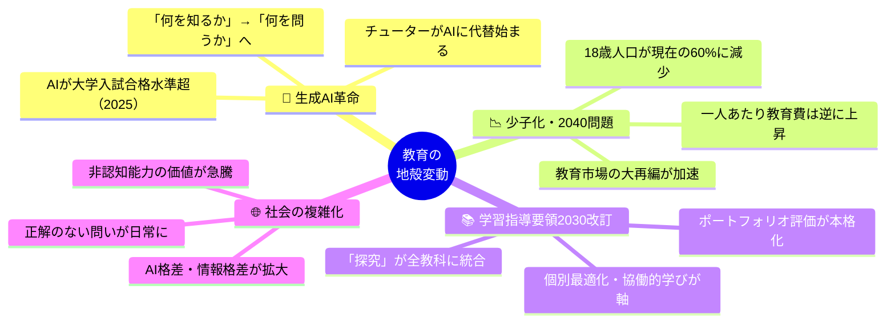

### 1-2. AI時代に求められる力の変化

> [!info] 2010年代 → 2030年代 の転換
>
> | 2010年代に求められた力 | → | 2030年代に求められる力 |
> |:---:|:---:|:---:|
> | 知識を暗記する | → | 知識を組み合わせ問いを立てる |
> | 効率よく答える | → | 不確実性の中で仮説を立てる |
> | 指示に従う | → | 自分で意思決定する |
> | 個人で完結する | → | 多様な他者と協創する |
> | ツールを使う | → | ツール（AI）を設計・批判する |

### 1-3. 次期学習指導要領スケジュール

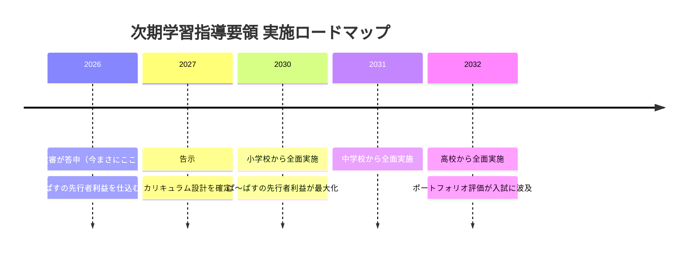

> [!tip] ビジネス機会
> 制度化「前」に「本物の探究体験」の実績を積んでいることが、2030年以降の最大の競争優位になる。今が仕込み期。

### 1-4. 不登校ニーズの爆発

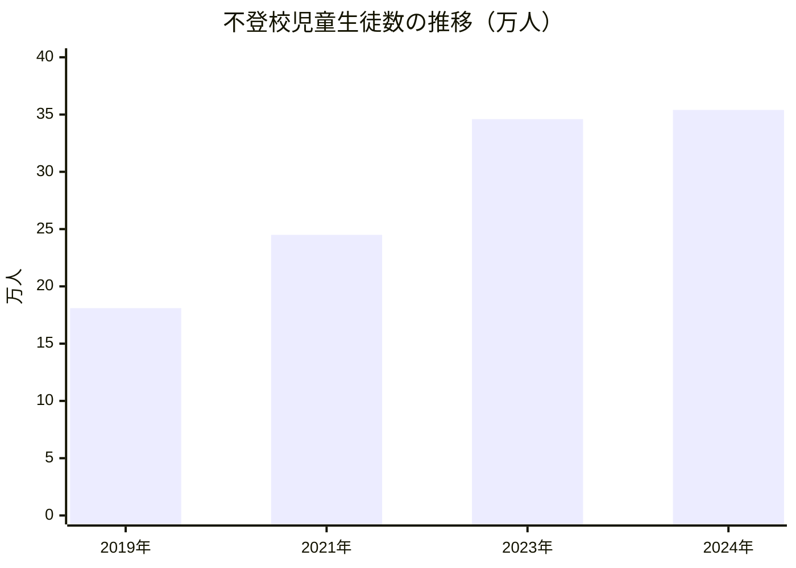

> [!warning] 支援の空白
> 教育支援センターの実際の**利用率はわずか8.8%**。35万人超の不登校児童のうち90%以上が「行き場のない」状態。探究塾は「安心して問いを持てる場所」として極めて親和性が高い。

### 1-5. 少子化の影響と逆転の発想

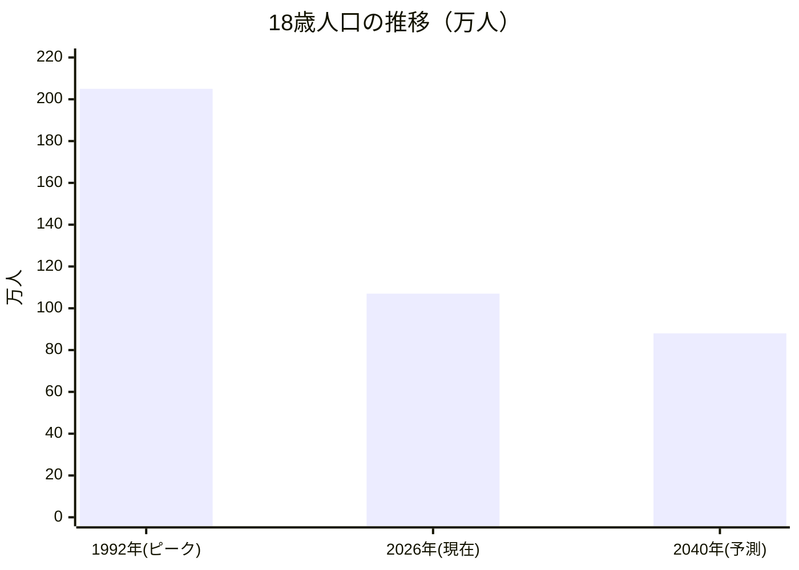

> [!success] 少子化でも「高付加価値塾」は伸びる
> - 一人っ子家庭の増加 → **一人あたり教育投資額は上昇**
> - 「量を追う塾」は苦しく「質・体験」の塾は伸びる
> - 地方の塾廃業 → 教育の空白 → オンライン需要増
> - ぱ〜ぱすの「少人数・高付加価値」モデルは時代に合っている

### 1-6. 市場規模データ

> [!abstract] EdTech市場の成長データ（2026年最新）
>
> | 市場 | 現在 | 予測 | 成長率 |
> |------|------|------|--------|
> | 日本 EdTech市場 | 3,000億円（2024） | 7,000億円超（2030） | — |
> | 世界 教育技術市場 | 18.7兆円（2025） | 21.9兆円（2026） | CAGR 16.9% |
> | 生成AI×教育（日本） | 1,530億円（2025） | 2,190億円（2026） | **CAGR 43.5%** |

### 1-7. 先行者利益ウィンドウ

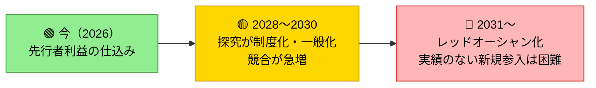

> [!danger] 警告
> **2026〜2030年**が探究塾として先行者利益を確立できる最後のウィンドウ。今動かなければ、2030年以降は大手塾・EdTechと戦うことになる。

---

## 🔍 2. 現在地と強み分析

### 2-1. 現在の活動ポートフォリオ

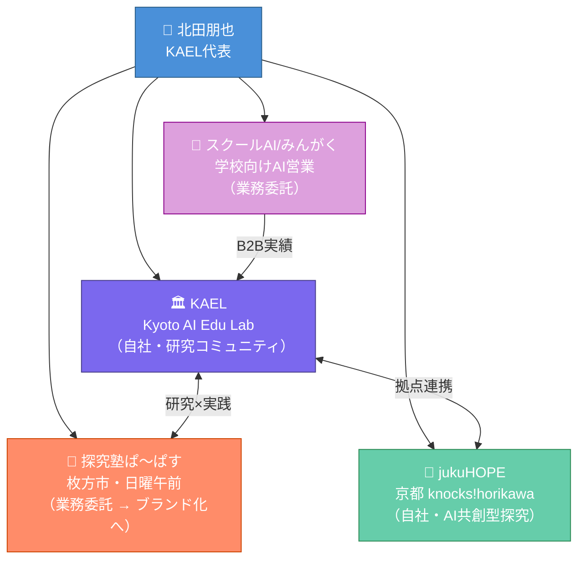

> [!warning] 現状の課題
> ぱ〜ぱすが「業務委託」止まりで、北田さんのブランド・ノウハウが自社資産になりにくい構造。**最優先で改善すべき点。**

### 2-2. SWOT分析

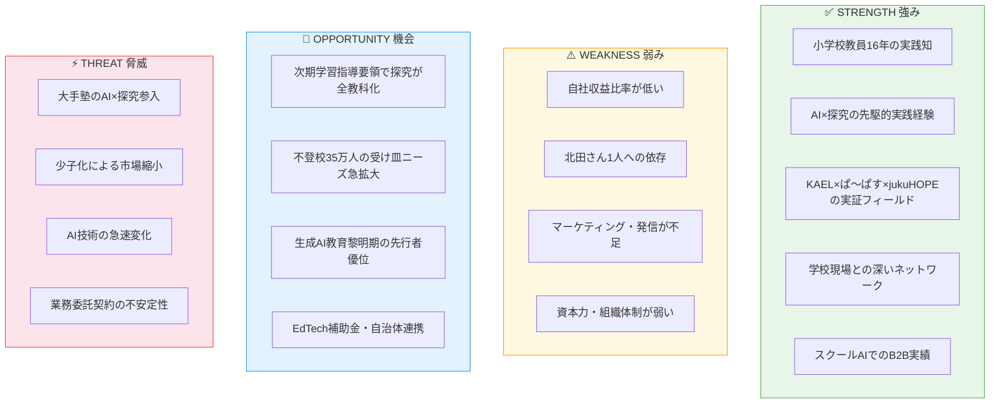

### 2-3. 核心的価値提案

> [!quote] Value Proposition
> ## 「答えを教える塾」ではなく
> ## 「問いを育て、AIと共に創る力を身につける場所」
>
> **16年の教室現場知 × AI最前線実践 × 探究学習理論**
>
> 子どもも保護者も教員も「一緒に学ぶ」コミュニティ

### 2-4. 北田ブランドの3本柱

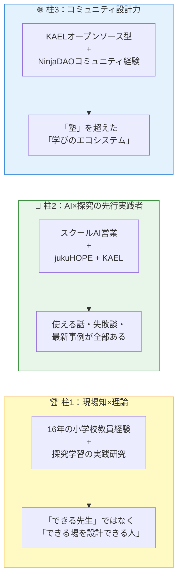

---

## 🗺️ 3. 5年間ロードマップ

### 3-1. フェーズ全体像

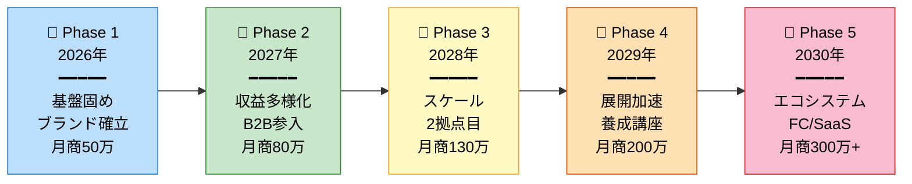

### 3-2. ガントチャート（主要アクション）

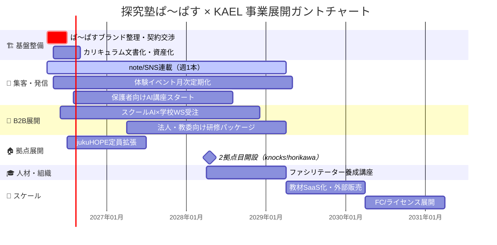

---

## 💰 4. 収益モデル設計

### 4-1. 収益の3本柱

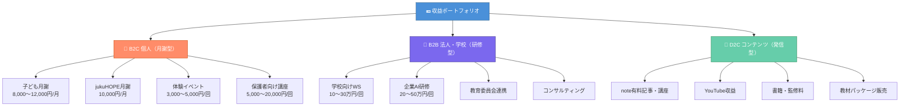

### 4-2. 年商成長シミュレーション

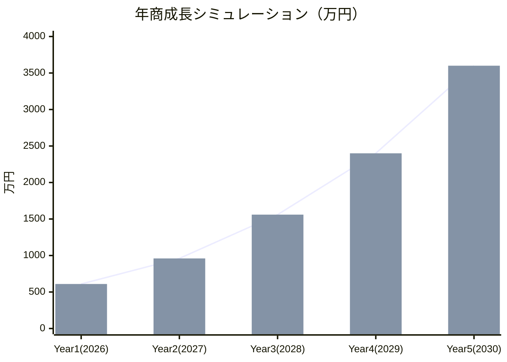

### 4-3. Year 1 収益内訳

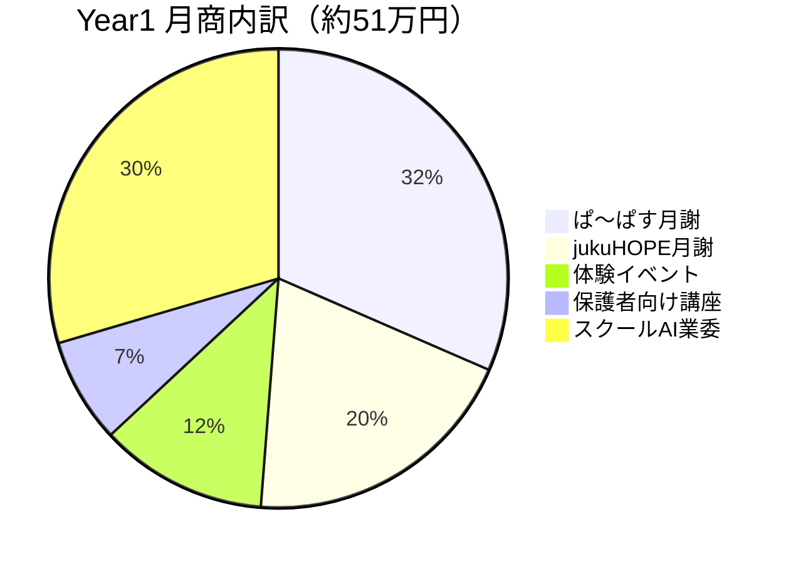

### 4-4. フェーズ別収益テーブル

**Year 1（2026年4月〜2027年3月）**

| 収益源 | 単価 | 規模 | 月商 |
|--------|------|------|------|
| ぱ〜ぱす月謝 | 8,000円/月 | 20名 | 16万円 |
| jukuHOPE月謝 | 10,000円/月 | 10名 | 10万円 |
| 体験イベント | 3,000円/回 | 20名×月1 | 6万円 |
| 保護者向け講座 | 5,000円/回 | 15名×隔月 | 3.75万円 |
| スクールAI業委 | — | — | 15万円 |
| **月商合計** | | | **約51万円** |
| **年商合計** | | | **約610万円** |

**Year 3（2028年度）**

| 収益源 | 月商想定 |
|--------|----------|
| 月謝収入（3拠点） | 60万円 |
| 法人・学校研修（月2〜4件） | 40万円 |
| ファシリテーター養成講座 | 20万円 |
| コンテンツ・教材販売 | 10万円 |
| **合計** | **約130万円（年商1,560万円）** |

**Year 5（2030年度）**

| 収益源 | 年商想定 |
|--------|----------|
| 直営教室（3〜5拠点）月謝 | 1,500万円 |
| ライセンス・FC加盟金 | 600万円 |
| 法人研修・コンサル | 800万円 |
| プラットフォーム（SaaS） | 500万円 |
| 書籍・講演・メディア | 200万円 |
| **合計** | **約3,600万円** |

### 4-5. 料金ラダー設計

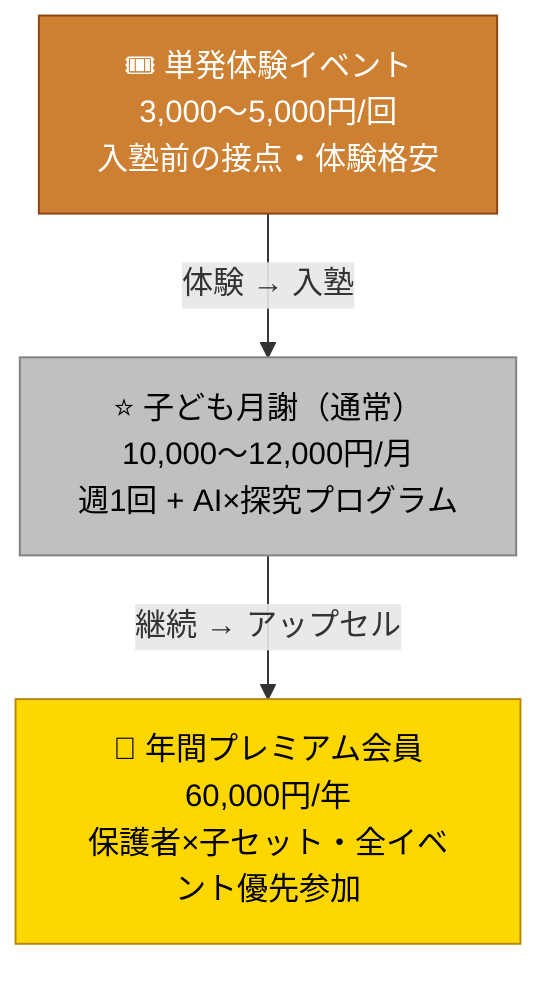

---

## ⚔️ 5. 差別化戦略

### 5-1. ポジショニングマップ

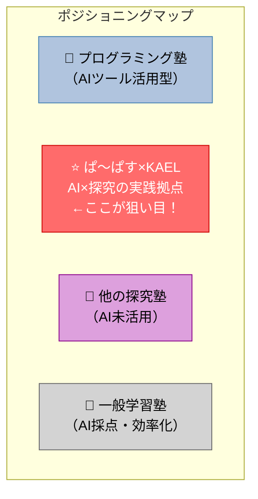

> [!abstract] ポジショニング解説
> - **縦軸**：AI活用度（上＝高）
> - **横軸**：探究・創造 ↔ 受験・スキル習得
> - **右上の空白地帯**「AI活用度が高く、探究・創造を重視」が**ぱ〜ぱす×KAELの独占領域**

### 5-2. 競合比較マトリクス

| 比較軸 | 一般学習塾 | プログラミング塾 | 他の探究塾 | **ぱ〜ぱす×KAEL** |
|:------:|:---------:|:---------------:|:---------:|:-----------------:|
| 探究学習の深さ | △ | △ | ○ | **◎** |
| AI活用の本格度 | × | ○ | △ | **◎** |
| 元教員の実践知 | △ | × | △ | **◎** |
| 学校現場との連携力 | △ | × | △ | **◎** |
| 研究コミュニティ | × | × | × | **◎（KAEL）** |
| 不登校・多様な子対応 | × | △ | ○ | **◎** |
| 費用対効果（保護者） | ○ | △ | △ | ○ |

---

## ⚠️ 6. リスクと対策

### 6-1. リスクマトリクス

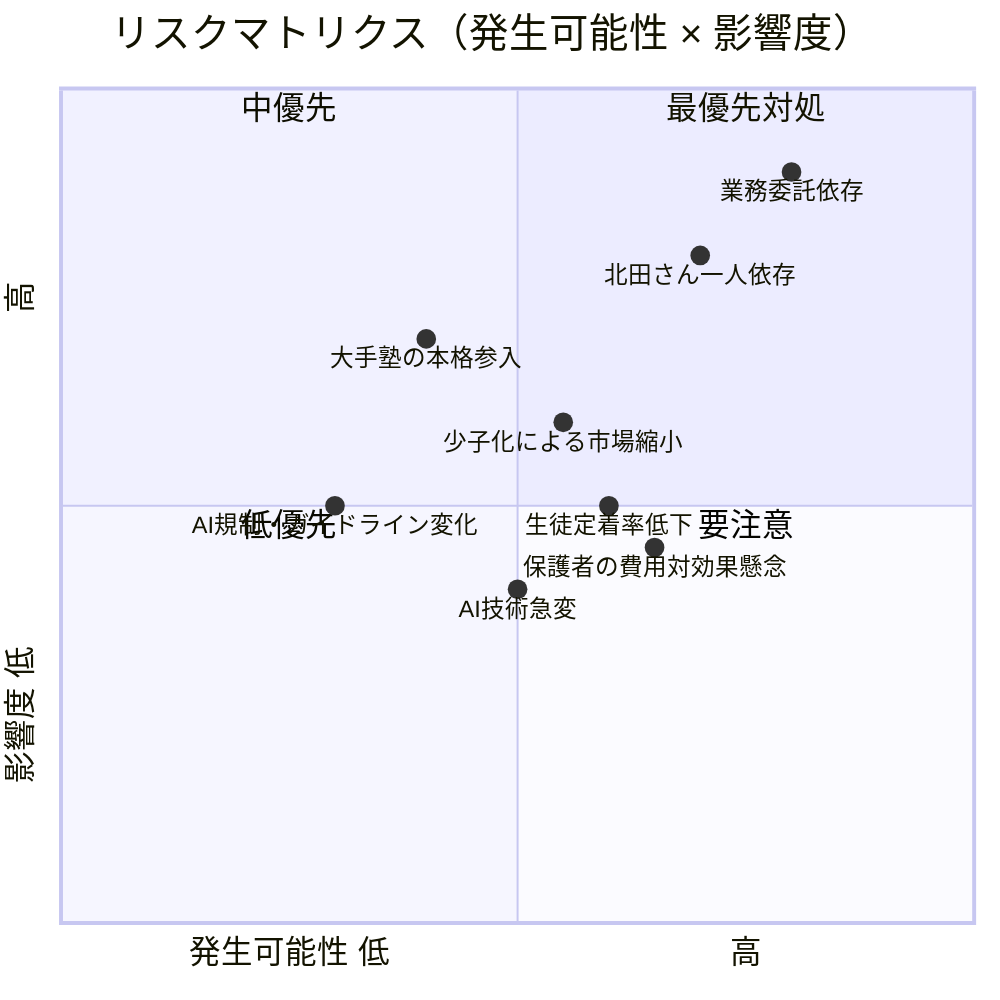

### 6-2. 主要リスクと対策

> [!danger] 最優先リスク：業務委託依存
> **懸念**：ぱ〜ぱす契約打ち切り・条件変更
> **対策**：KAELとjukuHOPEの自社収益比率を早期に**50%超**へ引き上げ

> [!warning] リスク：北田さん一人依存
> **懸念**：体調・多忙で提供品質が低下
> **対策**：ファシリテーター養成を早期着手し、マニュアル・動画資産化を推進

| リスク | 懸念シナリオ | 対策 |
|--------|------------|------|
| AI技術の急変 | 今使うツールが陳腐化 | ツール依存でなく「探究プロセス」中心のカリキュラム設計 |
| 生徒獲得の難しさ | 「探究」の認知度不足 | 体験イベント×SNS発信で継続的に見える化 |
| 保護者の受験志向 | 「受験に使えない」と敬遠 | 探究と学力向上の両立事例・データを積み上げ発信 |
| 競合大手参入 | 大手塾の資本力で席巻 | コミュニティ・元教員実践知・学校連携で差別化維持 |

---

## 📊 7. KPI・マイルストーン

### 7-1. KPIツリー

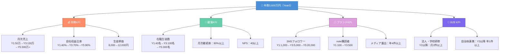

### 7-2. マイルストーン一覧

> [!check] 2026年 Q2（4〜6月）
> - [ ] ぱ〜ぱすとの契約をKAEL連携として再定義・交渉開始
> - [ ] 体験イベント第1回実施・参加者アンケート収集
> - [ ] note連載スタート「元小学校教員のAI×探究実践記」

> [!check] 2026年 Q3（7〜9月）
> - [ ] 保護者向けAI講座 初回実施
> - [ ] カリキュラム第1版ドキュメント完成
> - [ ] jukuHOPE 定員10名達成

> [!check] 2026年 Q4（10〜12月）
> - [ ] 学校向けワークショップ パッケージ完成・初受注
> - [ ] KAEL × ぱ〜ぱす 合同イベント実施
> - [ ] 月次売上 40万円達成

> [!check] 2027年（上半期）
> - [ ] 在籍生徒 50名達成
> - [ ] 法人研修 月2件ペース確立
> - [ ] ファシリテーター養成 第1期募集開始

> [!check] 2028年
> - [ ] 2拠点目（knocks!horikawa）オープン
> - [ ] 年商1,000万円達成
> - [ ] 教材パッケージ 外部販売開始

> [!check] 2030年
> - [ ] ライセンス/FC 第1号加盟校
> - [ ] 年商3,000万円達成・法人化
> - [ ] プラットフォームβ版リリース

---

## 🚀 8. 今すぐできるアクション Top5

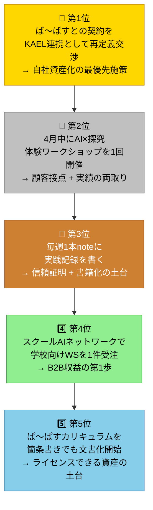

---

## 🌟 9. 組織・人材の進化

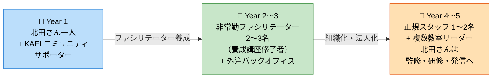

---

## 🏆 10. 5年後のありたい姿

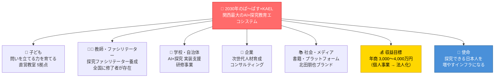

---

> [!note] 策定メモ
> 本計画は2026年3月時点の情報をもとに、教育未来トレンド調査（複数ソース）とビジネスモデル設計エージェントの分析を統合して策定。
>
> **次回レビュー予定：2026年9月（半年後）**
>
> 年次レビューで実績と乖離を確認しながらアップデートすることを推奨。

---

*関連ノート：[[KAEL]] | [[jukuHOPE]] | [[探究塾ぱ〜ぱす]] | [[スクールAI営業記録]]*
