---
tags:
  - 教育政策
  - 2040年問題
  - 探究学習
  - AI教育
  - KAEL
created: 2026-03-19
updated: 2026-03-19
---

# 2040年問題と学校教育のビジョン

> **問い：** 2040年の社会を生き抜く子どもたちに、今の学校は何を渡せるか？

---

## 1. 2040年問題とは何か

### タイムライン：危機への道筋

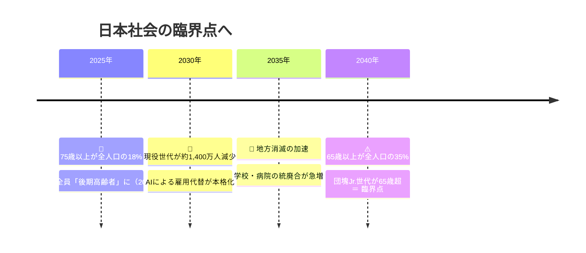

### 人口構造の変化

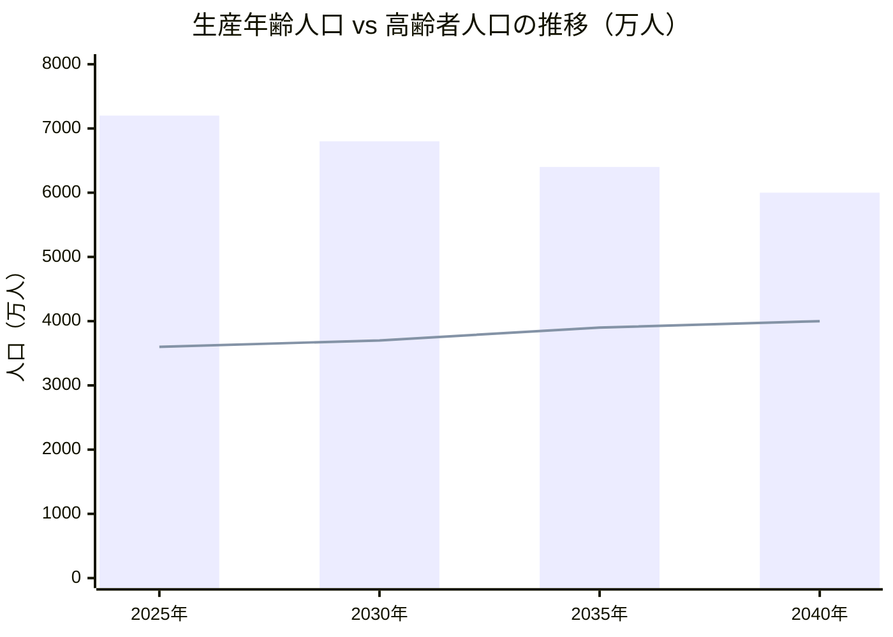

> 棒グラフ＝生産年齢人口、折れ線＝65歳以上人口

| 指標 | 現在（2025年前後） | 2040年 |
|---|---|---|
| 65歳以上の割合 | 約29% | **約35%** |
| 65歳以上の人数 | 約3,600万人 | **約4,000万人** |
| 生産年齢人口 | 約7,200万人 | **約6,000万人** |
| 社会保障給付費 | 約134兆円 | **約190兆円**（1.4倍） |
| 消滅可能性都市 | ― | **896市区町村** |

> 💡 働き手1人が高齢者約0.67人を支える構造。**社会のOSが根本から書き換わる。**

---

### 6つの構造的危機

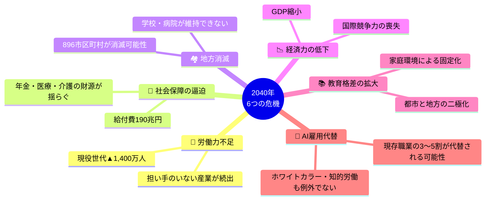

---

## 2. 今の学校教育の問題——「昭和の設計図」

```
【昭和モデル（工業社会）】        【2040年が求めるもの】
┌─────────────────────┐          ┌─────────────────────┐
│ 同年齢・一斉・均質     │   ≠      │ 個別・多様・非同期    │
│ 正解を速く出す力       │   ≠      │ 問いを立てる力        │
│ 知識の独占（教師）     │   ≠      │ 知識のナビゲーター    │
│ 1教員 × 30〜40人      │   ≠      │ チーム × 個人         │
│ 卒業＝学びの終わり     │   ≠      │ 生涯学び続ける入口    │
└─────────────────────┘          └─────────────────────┘
       ↑ 現在の学校はここ                ↑ 目指すべき姿
```

> ⚠️ 高度経済成長期に設計された構造のまま、**2040年の危機に向き合おうとしている**。

---

## 3. 2040年の社会が求める人間像

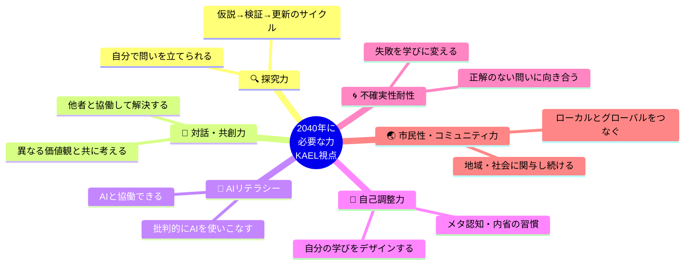

> 経団連提言（2025年2月）：**「多様性・好奇心・探究力を持ち、変化に対応しながら社会に貢献できる人」**
> 文科省：**「何を教えたか」→「何を学び、身に付けることができたのか」** への転換

---

## 4. 学校教育に必要なビジョン——5つの転換

### 全体像

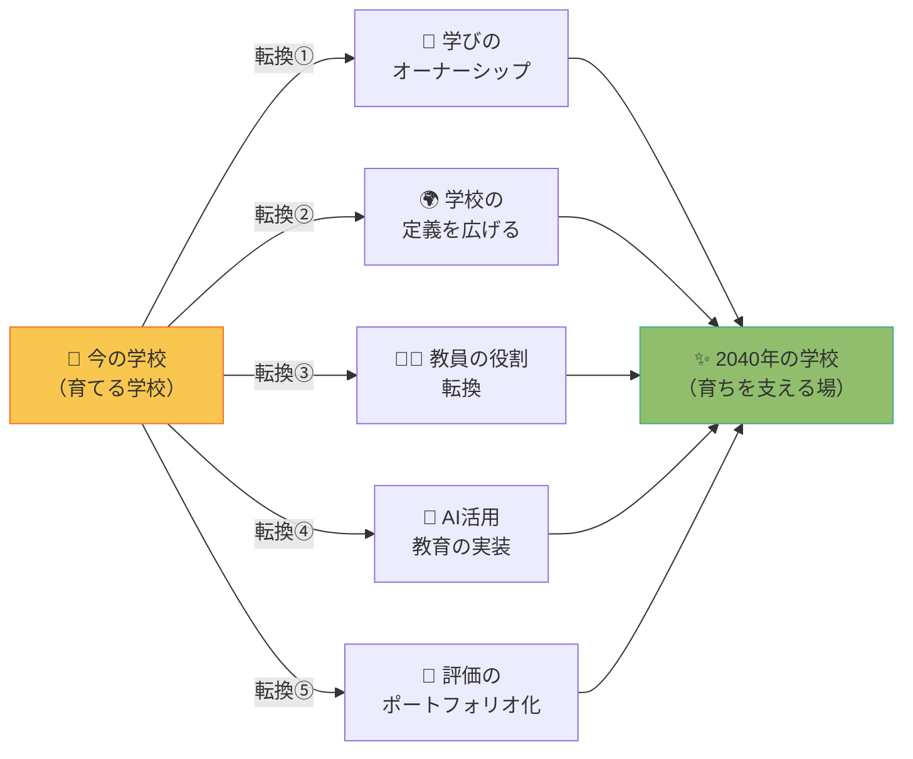

---

### 転換① 学びのオーナーシップを子どもへ返す

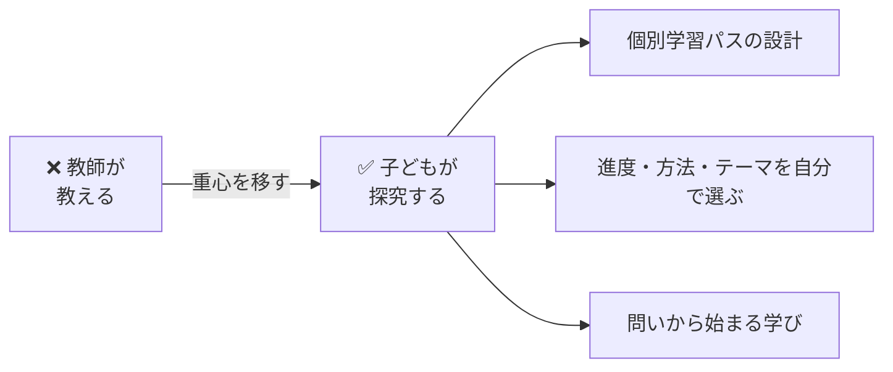

> 📊 実績：**あおいカレッジ（京都市立葵小学校）**
> 主体性肯定率 **58%（2019年）→ 87%（2023年）**

---

### 転換② 「学校」の定義を広げる

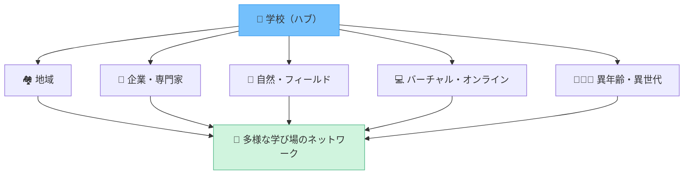

> 不登校・多様な学びを「逸脱」ではなく「**選択肢**」として制度化する

---

### 転換③ 教員の役割転換

```
【Before】インストラクター     【After】ファシリテーター
┌──────────────────┐         ┌──────────────────┐
│  知識を伝達する    │  ────▶  │  学びをデザインする │
│  一人でこなす      │  ────▶  │  チームで担う       │
│  授業に追われる    │  ────▶  │  子どもに向き合う   │
│  AI＝脅威         │  ────▶  │  AI＝協働ツール     │
└──────────────────┘         └──────────────────┘
```

> 💬 「今の教員の働き方では、2040年は乗り越えられない」

---

### 転換④ AIを「道具」として使いこなす教育

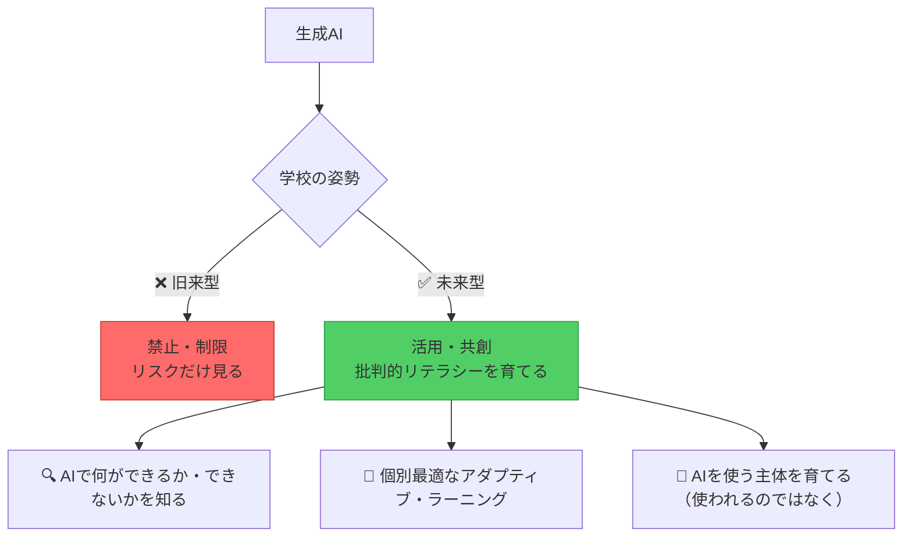

---

### 転換⑤ 評価の転換：点数からポートフォリオへ

```
【今の評価】                    【目指す評価】
　点数・順位・偏差値        →    学びのプロセス・変化・問い
　一発テストで決まる        →    継続的な成長の記録
　均一な基準で測る          →    多様な学びの軌跡を認める
　卒業証書が証明する        →    ポートフォリオが語る
```

---

## 5. 制度・政策レベルで変えるべきこと

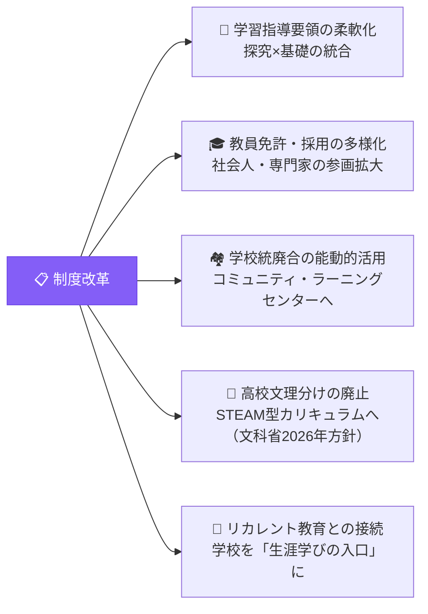

---

## 6. KAELとして何をするか——実践的接続

> 2040年問題は「未来の話」ではなく、**今ここで始まっている変化**。

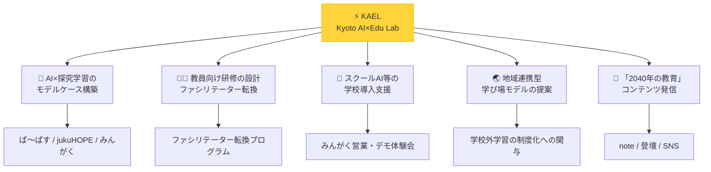

### アクションチェックリスト

- [ ] **AI×探究学習のモデルケース構築**（ぱ〜ぱす・jukuHOPE・みんがく）
- [ ] **教員向け研修の設計**：ファシリテーター転換を支援するプログラム
- [ ] **スクールAI等の学校導入支援**：AI活用の実装を伴走
- [ ] **地域連携型の学び場モデルの提案**：学校外学習の制度化への関与
- [ ] **「2040年の教育」を語るコンテンツ発信**（note・登壇・SNS）

---

## 7. まとめ：2040年教育のキーワード

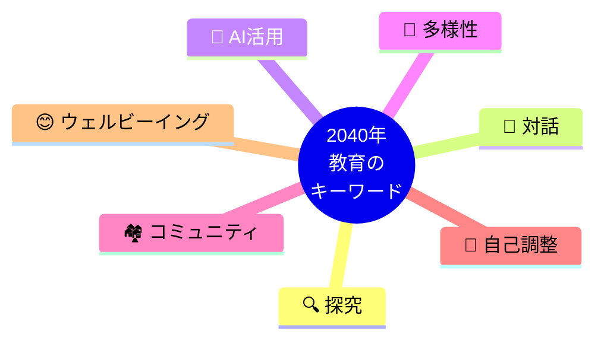

> 学校は「社会の鏡」であり「社会の設計図」でもある。
> 2040年の日本を生き抜く子どもたちのために、
> **今この瞬間の学校を変えることが、未来への最大の投資。**

---

## 参考・出典

- [経団連「2040年を見据えた教育改革」（2025年2月18日）](https://www.keidanren.or.jp/policy/2025/014.html)
- [文部科学省「2040年に向けた高等教育のグランドデザイン（答申）」](https://www.mext.go.jp/b_menu/shingi/chukyo/chukyo0/toushin/1411360.htm)
- [PwC Japan「2040年未来シナリオ——Future of Education」](https://www.pwc.com/jp/ja/knowledge/column/future-scenario2040/vol06.html)
- [ドクターメイト「2040年問題をわかりやすく解説」](https://doctormate.co.jp/blog/blog-14163)
- [PR TIMES MAGAZINE「2040年問題とは？」](https://prtimes.jp/magazine/2040-problem/)

---

*作成：2026-03-19 by Claude Code × 北田朋也（KAEL）*
