---
tags:
  - 教育政策
  - 2040年問題
  - AI教育
  - 保護者向け
  - 講演資料
  - KAEL
created: 2026-03-19
updated: 2026-03-19
---

# 2040年の未来と子どもたちの教育
## 〜 AI時代を生き抜く力とは何か 〜

> **保護者向け 教育コミュニティ講演資料**
> 作成：北田朋也（Kyoto AI×Edu Lab / KAEL）

---

## はじめに：今日お伝えしたいこと

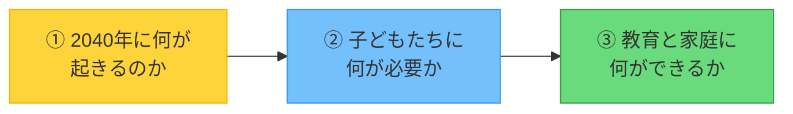

> 🌱 「不安を煽る話」ではなく、「今日から希望を持てる話」をしたいと思います。

---

## 第1章：2040年問題とは何か

### 日本社会に迫る「4つの変化」

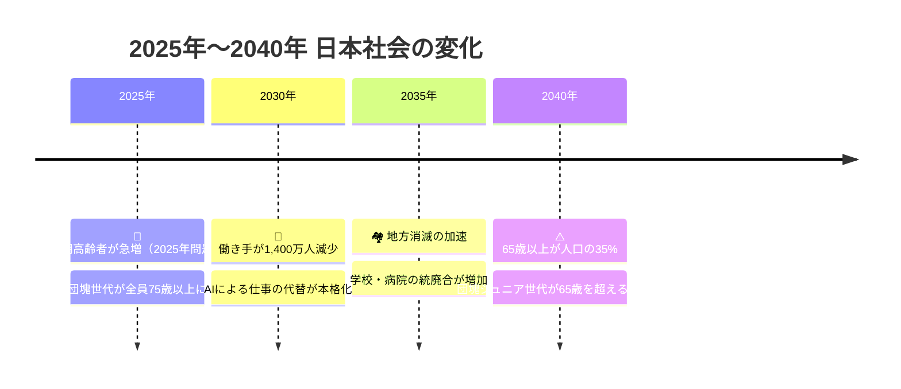

---

### 数字で見る2040年

| 指標 | 今（2025年） | 2040年 |
|---|---|---|
| 65歳以上の割合 | 約29% | **約35%** |
| 働く世代（生産年齢人口） | 約7,200万人 | **約6,000万人**（▲1,200万人） |
| 社会保障費 | 約134兆円 | **約190兆円**（1.4倍） |
| 消滅可能性のある市区町村 | ─ | **896市区町村** |

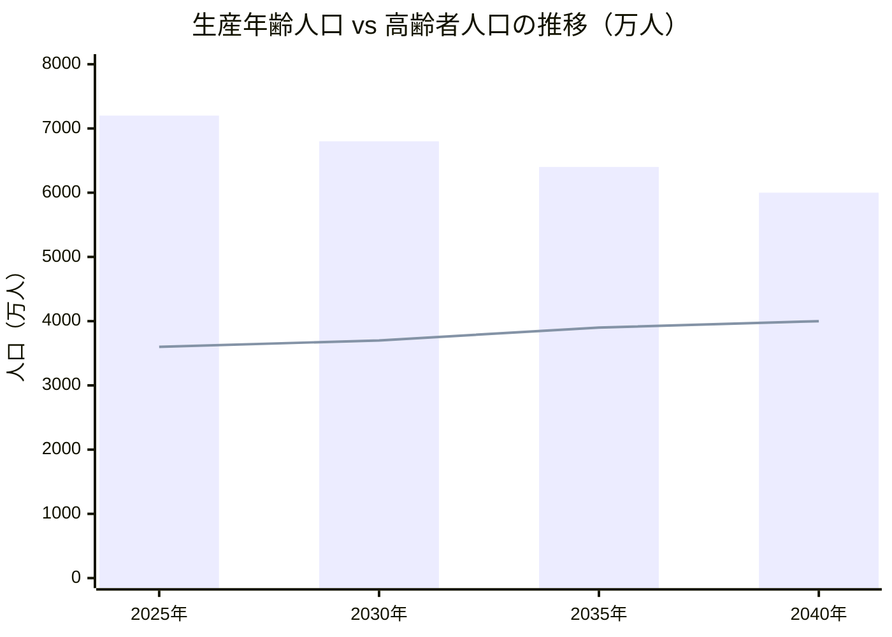

> 棒グラフ＝働く世代の人口　折れ線＝65歳以上の人口

---

### 子どもたちの「未来の職場」が変わる

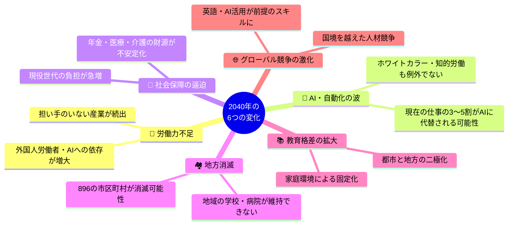

---

## 第2章：今の子どもたちが直面する未来

### 「今の子どもたちが大人になる頃」

```
【今小学6年生（12歳）の子どもは……】

  2026年 → 中学1年生
  2032年 → 大学1年生（18歳）
  2040年 → 社会人6年目（26歳）← ここが「2040年問題」の臨界点！
  2060年 → 46歳（バリバリの現役世代）
```

> 💡 つまり今の子どもたちは、**2040年の日本を最前線で支える存在**になります。

---

### AIによって「なくなる仕事」「生まれる仕事」

```mermaid
graph LR
    subgraph 代替されやすい仕事
        A1["📋 データ入力・処理"]
        A2["📞 定型的な電話対応"]
        A3["🚚 単純輸送・配送"]
        A4["📊 定型レポート作成"]
    end

    subgraph 残る・生まれる仕事
        B1["🤝 人との深い対話・ケア"]
        B2["🎨 創造・表現・デザイン"]
        B3["🧩 複雑な問題解決"]
        B4["🌱 AIを使う人材・設計者"]
    end

    AI["🤖 AI・自動化"] -->|置き換える| A1 & A2 & A3 & A4
    AI -->|生み出す需要| B1 & B2 & B3 & B4

    style AI fill:#ff6b6b,stroke:#c0392b,color:#fff
```

> **重要：** AIに「仕事を奪われる」のではなく、「AIを使いこなす人」が求められる時代へ。

---

## 第3章：2040年の社会が求める力

### 経団連・文科省が示す「これからの人間像」

> 経団連提言（2025年2月）：
> **「多様性・好奇心・探究力を持ち、変化に対応しながら社会に貢献できる人」**

> 文科省の方向転換：
> **「何を教えたか」→「何を学び、身に付けることができたのか」**

---

### 2040年に必要な「6つの力」

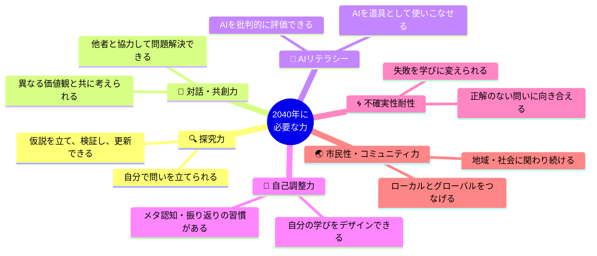

---

### 「テストの点数」と「本当に必要な力」の違い

```
【今の学校が重視していること】    【2040年に必要なこと】

  ✅ 正解を速く出す力         ≠     🔍 問いを立てる力
  ✅ 知識を記憶する力         ≠     🧩 知識を組み合わせる力
  ✅ みんなと同じにできる      ≠     🌈 自分らしく表現できる
  ✅ 先生の指示に従う力        ≠     🎯 自分で判断し動く力
  ✅ 点数・順位で評価される    ≠     📁 成長のプロセスが認められる
```

> ⚠️ 「学校の成績がいいこと」と「2040年を生き抜く力があること」は**必ずしも同じではない**。
> 大切なのは、成績の裏にある「学び方」と「姿勢」。

---

## 第4章：AI時代の教育はどう変わるか

### 教育の大転換：5つのシフト

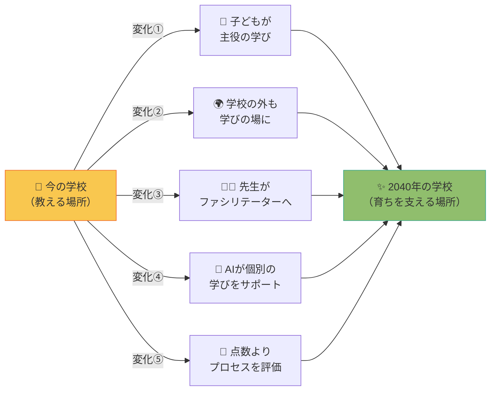

---

### 変化①：子どもが「学びの主役」になる

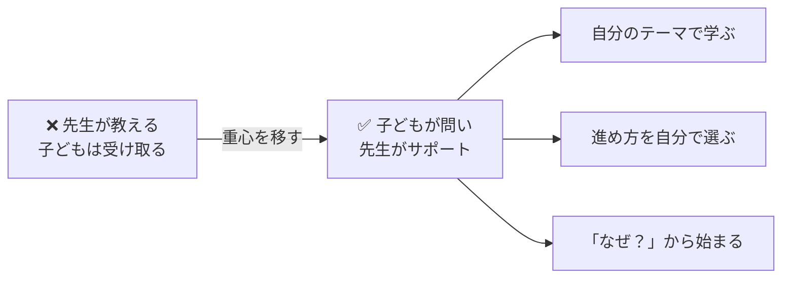

> 📊 実践例：**あおいカレッジ（京都市立葵小学校）**
> 「主体的に学べたか？」という子どものアンケート肯定率
> **58%（2019年）→ 87%（2023年）**
>
> 子どもたちは「やらされる学び」より「自分でやる学び」の方が伸びる！

---

### 変化②：「学校の外」も学びの場になる

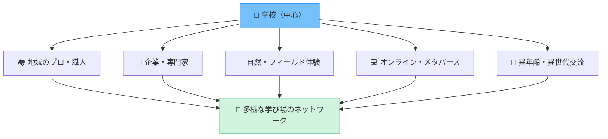

> **家庭での経験・体験が、最高の「学びの場」になる時代。**
> 旅行・料理・地域活動・趣味——これらすべてが学びにつながります。

---

### 変化③：先生の役割が「インストラクター」から「ファシリテーター」へ

```
【今の先生のイメージ】          【これからの先生のイメージ】

  📖 知識を伝える人         →    🎯 学びをデザインする人
  🏆 一人でこなす人         →    🤝 チームで子どもと向き合う人
  📋 授業に追われる人       →    💬 子どもとじっくり対話できる人
  ⚠️ AIを脅威に感じる人     →    🤖 AIを道具として活かせる人
```

> 先生の働き方が変わることで、子どもたちとの**質の高い時間**が生まれます。

---

### 変化④：AIが「個別最適な学び」を支える

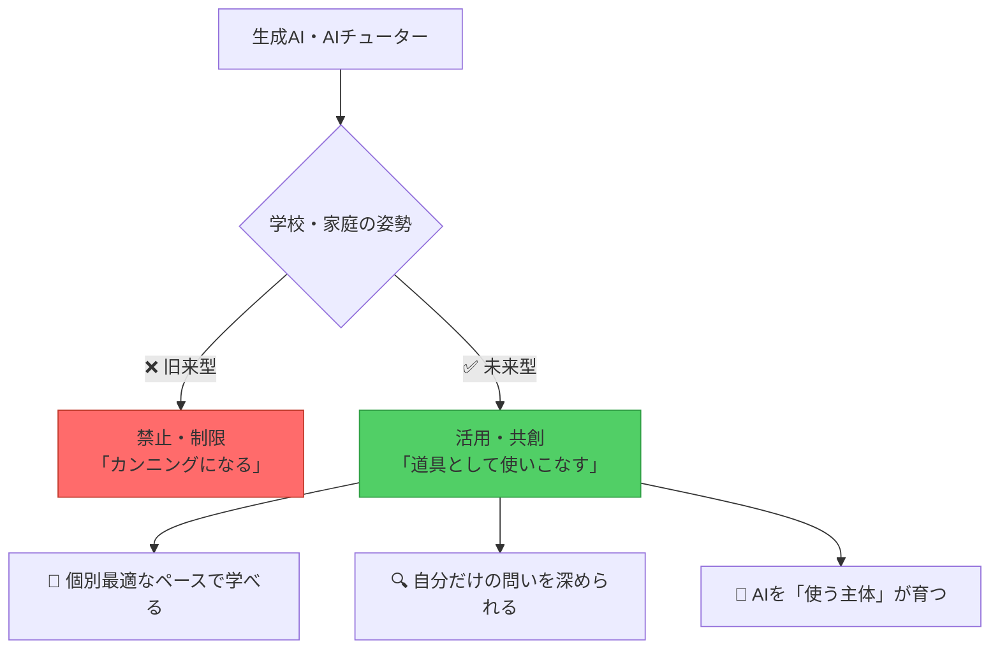

> 📚 ポイント：AIは「答えを教えるもの」ではなく、**「問いを深める相手」**として使うのが理想。
> 子どもが「AIに頼る」のではなく、「AIと対話しながら考える」力を育てることが大切。

---

### 変化⑤：評価が「点数」から「プロセスと成長」へ

```
【今の評価】                        【これからの評価】

  📊 点数・順位・偏差値        →    📁 学びのプロセス・変化・問い
  📝 一発テストで決まる        →    🗓️ 継続的な成長の記録
  📏 均一な基準で全員を測る    →    🌈 多様な学びの軌跡を認める
  🎓 卒業証書が証明する        →    📖 ポートフォリオが語る
```

---

## 第5章：家庭でできること——保護者へのメッセージ

### 「AI時代の子育て」3つの柱

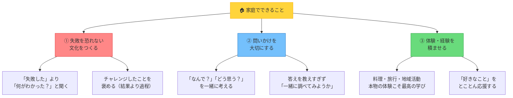


---

### 具体的な声かけのヒント

| こんな場面 | NG な声かけ | OKな声かけ |
|---|---|---|
| テストの点数が低かった | 「なんでこんな点数なの？」 | 「どこが難しかった？次はどうしたい？」 |
| 子どもが失敗した | 「だから言ったでしょ」 | 「失敗できたね。何がわかった？」 |
| 子どもが「なぜ？」と聞いてきた | 「そういうものなの」 | 「面白い疑問だね。一緒に調べてみよう」 |
| 子どもがAIを使いたがる | 「それはズルだよ」 | 「AIが何を言ったか教えて。本当にそうかな？」 |
| 子どもが好きなことに夢中 | 「勉強しなさい」 | 「そこまで好きなら、なんでそれが好きなの？」 |

---

### AIとの付き合い方：家庭でのルールづくり

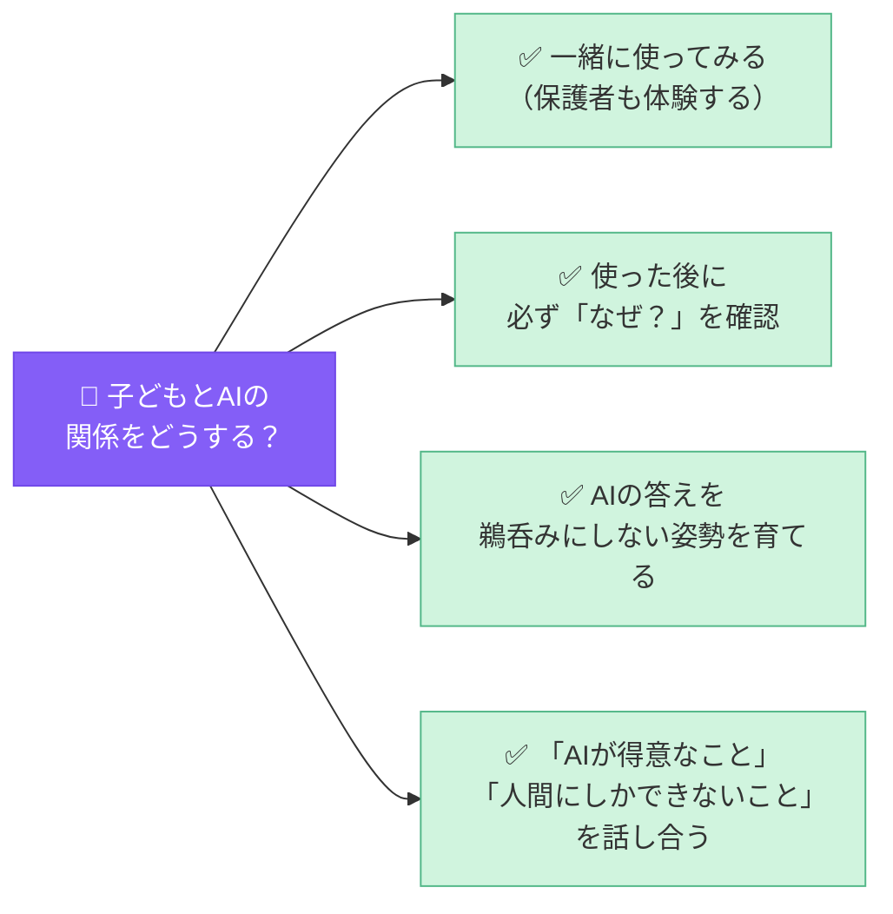

> 💬 「AIを使うな」ではなく、「AIを**賢く使える人間**に育てる」が今の親の役割。

---

## 第6章：これからの教育コミュニティへ

### 「学校に任せる」から「地域で育てる」へ

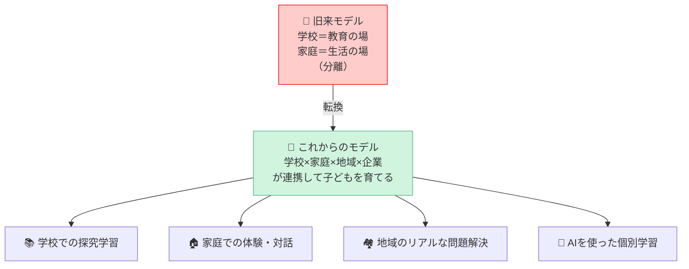

---

### 保護者に伝えたいメッセージ

> 📝 子どもたちの未来に必要なのは、
> **「答えを持っている大人」ではなく、**
> **「一緒に考え続けられる大人」**です。

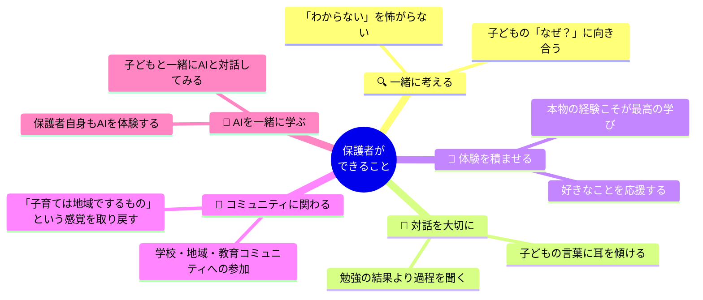

---

## まとめ：2040年の教育のキーワード

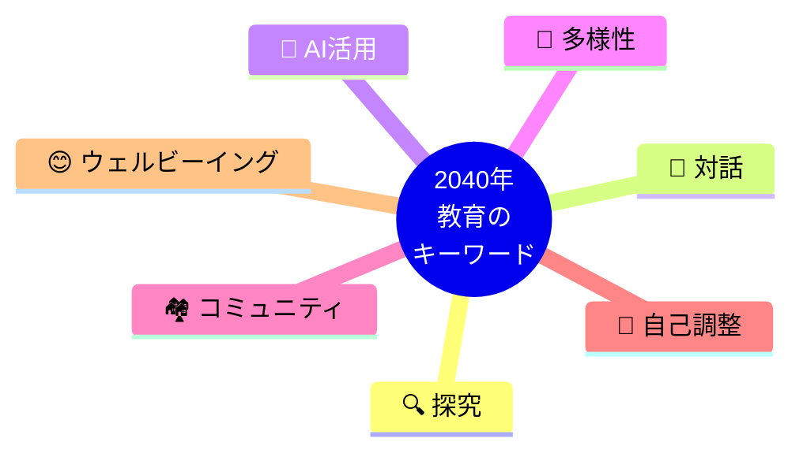

---

### 今日のメッセージ

```
╔══════════════════════════════════════════════════════╗
║                                                      ║
║   子どもたちは、正解のない時代を生きていく。          ║
║                                                      ║
║   だからこそ、「問いを立てる力」「対話する力」        ║
║   「AIと共存する力」を育てることが大切。              ║
║                                                      ║
║   学校だけでなく、家庭で、地域で、                   ║
║   大人たちが一緒に学び続けることが、                  ║
║   子どもたちへの最大のプレゼントです。                ║
║                                                      ║
║                      北田朋也（KAEL）                ║
╚══════════════════════════════════════════════════════╝
```

---

## 参考：KAELについて

**Kyoto AI×Edu Lab（KAEL）**は、AI×探究学習の実践研究コミュニティです。

- 元公立小学校教員16年（京都市立葵小学校 探究学習主任）
- 2025年7月7日 個人事業として独立
- AI活用授業支援・教員研修・探究塾運営
- スクールAI（みんがく）コーディネーター

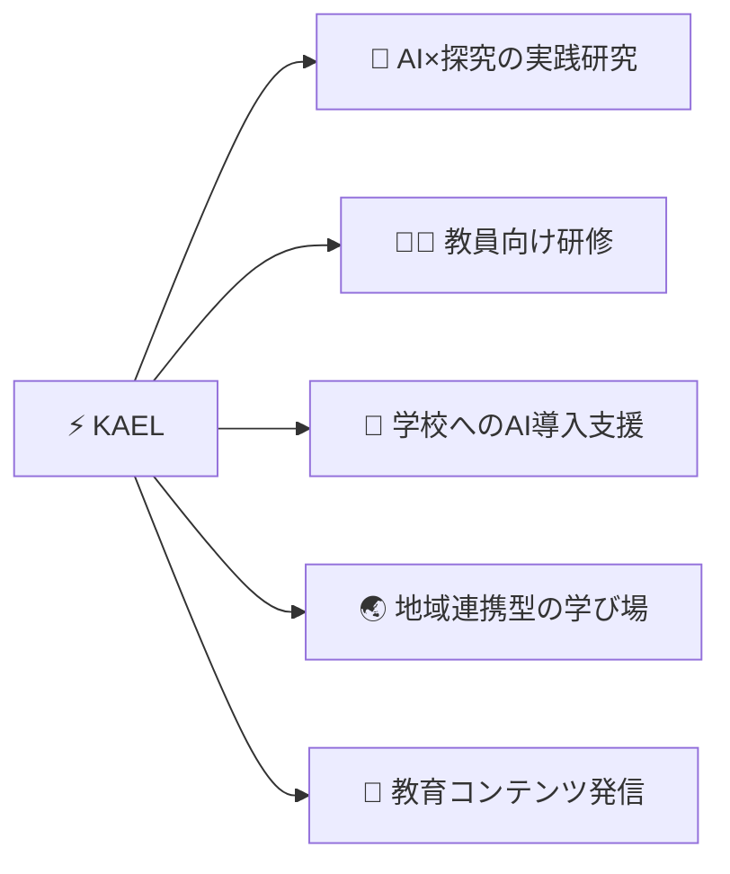

---

## 参考資料・出典

- 経団連「2040年を見据えた教育改革」（2025年2月18日）
- 文部科学省「2040年に向けた高等教育のグランドデザイン（答申）」
- OECD「Learning Compass 2030」
- UNESCO「Generative AI in Education」（2023）
- PwC Japan「2040年未来シナリオ」
- 探究学習白書2024（ESIBLA）

---

*作成：2026-03-19 by Claude Code × 北田朋也（KAEL）*
*講演用途での引用・転載は事前にご連絡ください*
