---
tags:
  - 研修
  - 反転授業
  - AI教育
  - 学習理論
  - 回折的実践
  - ファシリテーション
  - Gem
  - プロンプト設計
created: 2026-03-18
updated: 2026-03-18
発話者: 真人 田原（ほか参加者）
時間: 09:12〜10:11
series: AI時代の反転授業三本柱（全3回）
---

# AI時代の反転授業三本柱 — 研修メモ #1

> [!info] シリーズ概要
> 反転授業の三本柱をAI時代にアップデートする **3回シリーズ**の**第1回**。
> 三本柱の概要と学習理論の基盤を整理。

---

## 🏛️ 反転授業の三本柱（AI時代版）

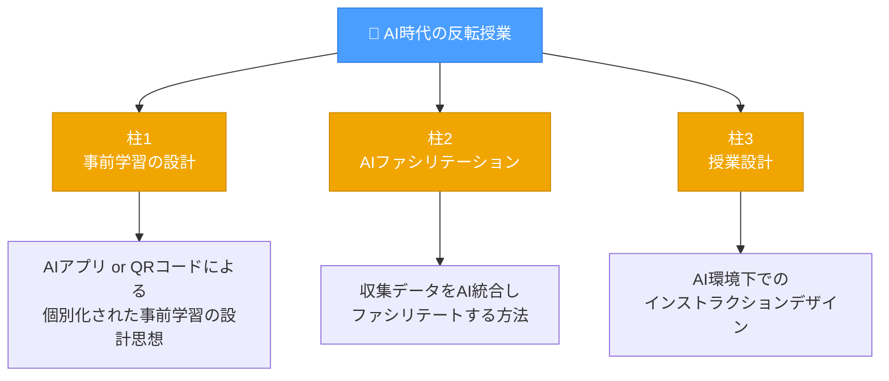

---

## 🤖 AIアプリの利点 — 個別化と自分ごと化

動画と異なり、**AIアプリは学習内容を個別化できる**。

> [!example] 具体例：2040年問題
> 「2040年問題があなたの仕事にどう影響しますか?」という同じ問いに対し…
> - 国語教師 → 読解力・AIとの役割分担
> - 社会教師 → 人口構造・地域社会変容
> - 司書 → 情報アクセスの変化
> - 情報担当 → テクノロジー対応
>
> 役割によって**異なる答え**が生まれ、自説が形成される。

### 学びの構造

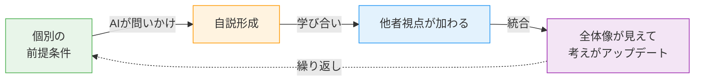

---

## 📚 学習理論の背景 — 二つの学習観

> [!tip] 全体の構図
> この研修は「**省察的実践**」から「**回折的実践**」へのパラダイムシフトを軸に組み立てられている。

### 1️⃣ 省察的実践（コルブの経験学習サイクル）

小林氏のラーニングファシリテーション（アクティブラーニング）を起点に、田原氏の実践が始まった。

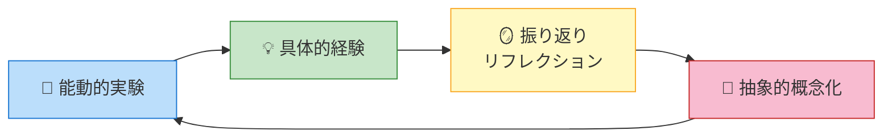

**振り返りの手法**：氷山モデルなど多様なアプローチ
→ 生徒一人一人が経験学習サイクルを回せるよう介入する

#### 省察的実践における学習者像

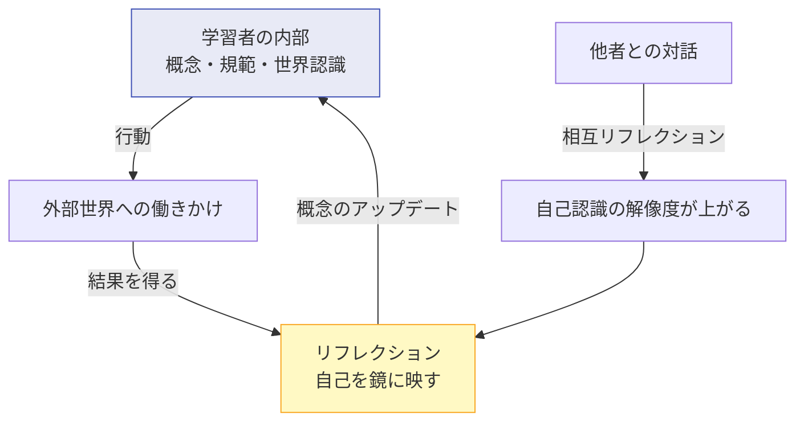

> [!quote] 省察的実践の定義
> **「学習とは、リフレクションによって個人の概念や規範をアップデートすることである」**
>
> → この学習観は今でも有効。

---

### 2️⃣ 回折的実践（Diffractive Practice） ← 「未知の領域」

田原氏の**物理学バックグラウンド**（量子力学・自己組織化）から導入。

#### リフレクション vs 回折（Diffraction）

| | 省察的実践（リフレクション） | 回折的実践（Diffraction） |
|:--|:--|:--|
| **物理メタファー** | 光の反射（鏡） | 光の回折（格子 → 干渉縞） |
| **個人観** | 概念・規範をもつ「個」がすでに存在する | 問いかけによって初めて「個と声」が生成される |
| **対話の役割** | 既存の考えを交換・照合する | 声の重ね合わせにより干渉縞（パターン）を作る |
| **信念対立** | 「私の規範 vs あなたの規範」が起きやすい | 「私と世界の間で現象が生成される」という捉え方 |

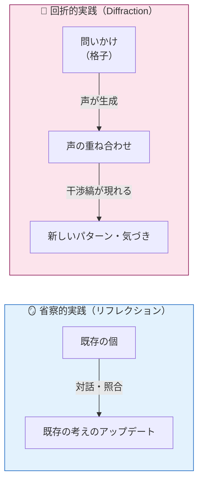

#### エージェンシャル・リアリズム（Karen Barad）

物理学者・哲学者 **Karen Barad（カレン・バラード）**が提唱。

> [!abstract] エージェンシャル・リアリズムの核心
> ❌ 「初めから客観的な現実が存在していて、それを観察する」
>
> ✅ 「**観察するという行為によって、初めて現実が生成される**」

> [!quote] 田原氏の言葉
> **「質問される前には答えは存在していなかった。質問されることによって、答えが初めて今、作られて存在してくる」**

#### ChatGPT との類比

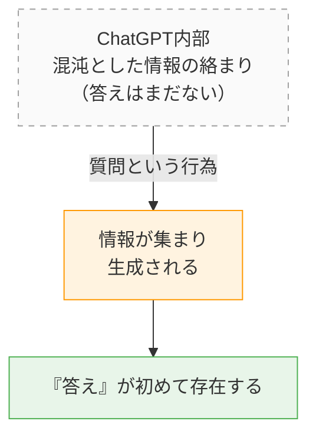

> [!note] ポイント
> これがエージェンシャル・リアリズムのモデル。AIは「問いかけによって現実が生成される」世界観の具体例。

> [!example] 日常例：「夕飯どうする?」
> すき焼きを食べたい自分が**あらかじめいるのではない**。
> 「夕飯何食べたい?」と聞かれたとき、初めて「すき焼き」という答えが生成される。
> → 答えは問いかけの**前には存在しない**。（グループDの古賀先生の解説が全体に紹介された）

---

#### 回折的実践のサイクル

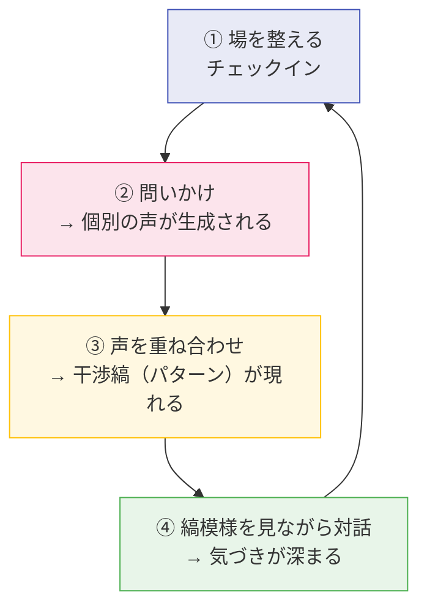

> [!tip] ファシリテーターの役割
> 「設定と問いかけが変われば、別の干渉縞ができる」
> → **ファシリテーターは問いの設計者**

---

#### AIツールの役割の再定義

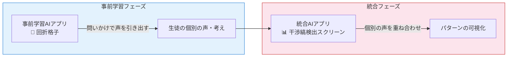

| AIツール | 回折的実践における役割 |
|:--|:--|
| **事前学習AIアプリ** | 🔬 **回折格子** — 問いかけを通じて生徒の声・考えを引き出す装置 |
| **統合AIアプリ** | 📊 **干渉縞検出スクリーン** — 個別の声を重ね合わせてパターンを可視化する |

#### AIと「私」の境界

> [!quote] 田原氏
> 「AIが出てくると余計どこが私かわからなくなる。AIと私の間で生成される——だから『間で生成される』という考え方だとAIが出てきた世界を捉えやすくなる」

---

## 💬 グループワーク — 各グループの共有（09:50〜09:55）

講義後、**3人×4グループで15分のブレイクアウト**。テーマ：「今聞いた話をどう受け止め、どう咀嚼しているか」。

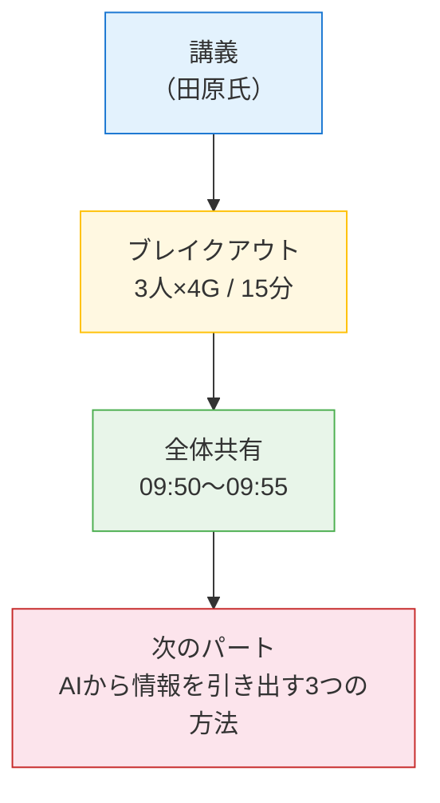

### グループA（吉井・高野・田中）

- AI初心者グループ（田中先生のみAI経験あり）
- 「AIとどう付き合えばいいか足踏みしている」という正直な声が中心
- 授業での活用イメージがまだ持てない段階

### グループB（岩井・伊藤・高田）

- 回折的実践の理解が難しいという話からスタート
- **注目の議論：** 生徒の「わからない」という思考停止反応に対し、回折的実践の考え方でAIアプリを通じて「わからない」を繰り返すうちに、その反応自体が変わっていくのではないかという仮説が出た

### グループC（上野・佐野・大木）

- 佐野先生が事例を挙げながら回折の考え方を補足説明（「細いスリットから波が広がる」）
- 次年度の授業実践への応用を議論
- 少人数・大人数で対話の設計が変わるという視点も出た

### グループD（倉田・立川・古賀）

- 古賀先生が「夕飯どうする?」の日常例で回折的実践を解説 → グループの理解が進んだ
- 三人それぞれのAI活用状況をシェアする時間にもなった
- 田原氏がこの例を全体に紹介（→ 上述の「夕飯の例」callout）

---

## 🧲 AIから情報を引き出す3つの方法（09:57〜10:02）

### 3要素の構造

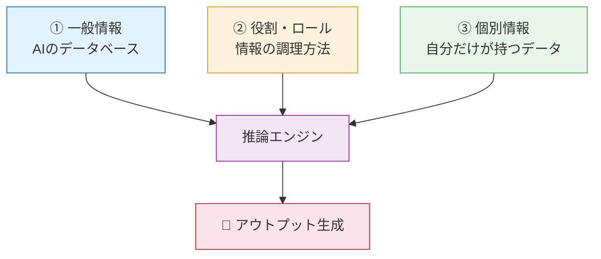

| 要素 | 説明 | 例 |
|:--|:--|:--|
| **① 一般情報** | AIのデータベースから知識を引き出す | 「コルブの経験学習サイクルを教えて」「世界のAI教育事例は?」 |
| **② 役割（ロール）** | 専門家としての振る舞い・調理方法を指定する | 「あなたはすき焼きを作るシェフです」 |
| **③ 個別情報** | 自分だけが持つ情報をAIに与える | 「冷蔵庫に白菜・豆腐・牛肉・春菊・レタスがある」「講義要約PDF」 |

### ライブデモ：すき焼き

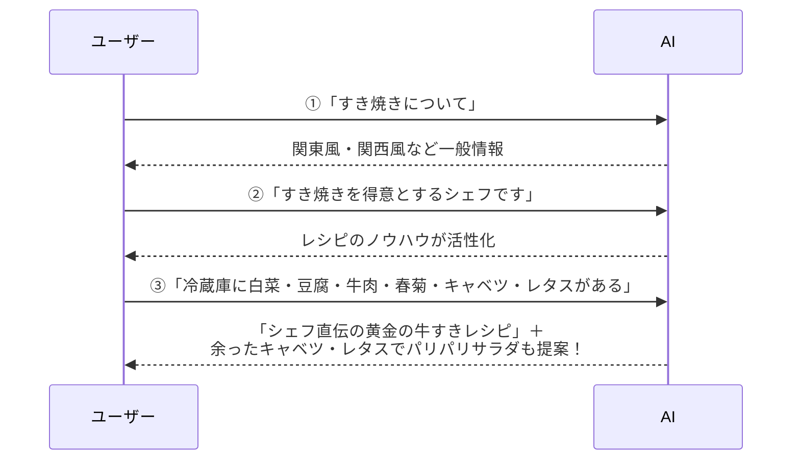

> [!tip] アプリ（Gem等）とは
> **①②③をあらかじめ固めておく仕組み**。ユーザーの入力（個別情報）と組み合わせてアウトプットが生成される。

---

## 🛠️ Gem（カスタムAIアプリ）の作り方（10:02〜10:11）

### ツールによる呼び名の違い

| ツール | アプリの呼び名 |
|:--|:--|
| **Google Gemini** | Gem |
| **ChatGPT** | GPTs |
| **Microsoft Copilot** | エージェント |

いずれも「**システムプロンプト（事前指示）＋知識ファイル**」で構成される。

### Gem作成ワークフロー

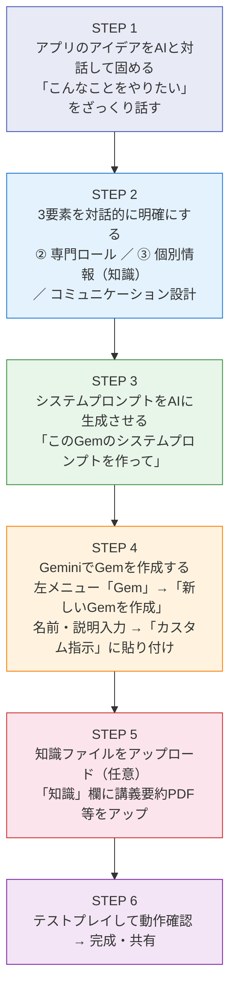

### ライブデモ事例 — 「回折的チューター」Gem

| 項目 | 内容 |
|:--|:--|
| **名前** | 回折的チューター |
| **ロール** | ソクラテス式チューター——答えを教えず、問いかけで本質にたどり着かせる |
| **知識ファイル** | 北田氏作成の田原講義要約PDF |
| **コミュニケーション** | 一問一答形式（一度に一つの問いのみ） |

**実際のやり取り（抜粋）：**

> Gem:「田原さんは学習を説明するために二つの物理学的メタファーを使っています。鏡と回折格子です。学習者の中にもともと答えがあるかどうかという点で、どのような違いがあると思いますか?」

> 田原氏:「最初から学習が自分の頭の中のアルゴリズムの改善なのか、世界との対話の仕方の習得なのかの違い」

> Gem:「鋭い洞察ですね。その視点で鏡と格子を捉え直すと講義の本質が見えてきます。では次のステップの問いかけです——」

---

## 📋 運営メモ

> [!warning] 参加者のAIリテラシー
> 想定より低め → AIアプリ作成パートは **30分 → 15分に短縮**し、残りは来週までの宿題に変更。

- 北田氏がZoomの文字起こし機能＋Claudeでリアルタイム要約を作成し、URLをチャット欄で随時共有
- 「わからなかった人も心配しないでください」と伝えることで参加者のリラックスを促す設計

---

## 🔄 パラダイムシフト — まとめ

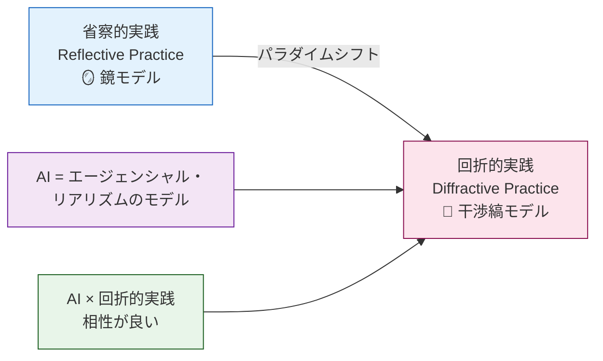

> [!success] この世界観をもつことで…
> - AIの**使い方（Gem等のアプリ設計）が変わる**
> - AIは「便利ツール」ではなく、**回折格子（問いを通じて声と現実を生成する装置）**として捉えられる
> - 教師・ファシリテーターは**問いの設計者**になる

---

## 🛠️ Gem作成グループワーク（10:11〜10:19）

前回と同じ4グループで20分間のブレイクアウト。テーマ：「初めての自分のGemを実際に作ってみる」。

- 北田氏がGem作成ワークフロー図をZoomチャットに貼付し参考資料として共有
- 佐野先生から「AI苦手な女性3人グループがある」との連絡を受け、田原氏がブレイクアウトルームを巡回してサポート

> [!quote] 田原氏
> 「チューターは教えるよりザクッと話してチューターと対話して理解してっていう方が、みんな個別に理解してくれる」

> [!note] 田原・北田氏の裏話
> 「文字起こし要約をすぐ渡すって新境地だね」「みんなAIがあればその要約をまたAIに貼り付けて自分なりに咀嚼させることができる」

---

## 📤 ObsidianノートをGitHubへ（10:51〜10:52）

北田氏が今日の講義内容をObsidianでまとめたノートをGitHubにアップし、参加者へのお土産として共有。

> [!quote] 田原氏の評価
> 「後ろでいろんなことができるんじゃないかと試してくれた新しい役割」

---

## 🌊 AIで参加者の声を干渉縞として分析（10:53〜10:57）

田原氏がGeminiに「バラドの哲学に基づく回折的実践を進めている」文脈を共有し、「AIアプリを使うとあなたの仕事はどのようにアップデートできますか」という問いへの参加者の回答を貼り付け、**干渉縞（パターン）として分析**させた。

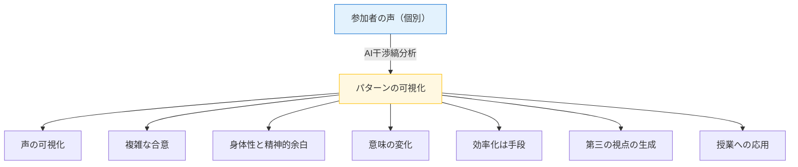

### AIが抽出した主要パターン（干渉縞）

| パターン | 内容 |
|:--|:--|
| **声の可視化** | 内省的なタイプや静かな人の声を拾い干渉縞をつくる。従来は発言力の差で一部の声が排除されがち |
| **複雑な合意** | 多数決・平均化ではなく、一人一人の違いが重なり合うことで現れる納得感のある合意へ |
| **身体性と精神的余白** | 精神的負担の激減とやりがいの激増がセットで語られている |
| **意味の変化** | 事務作業・分析時間の短縮（物質的変化）によって余白が生まれ、生徒との対話を共に味わうことに意識が向く |
| **効率化は手段** | 効率化は目的ではなく、教員がより人間的に・より深く生徒と絡まり合うための空間 |
| **第三の視点の生成** | 自分の経験×AIの膨大な知識を重ね合わせることで「私という答え」からは生まれなかった視点が生成される |
| **授業への応用** | 英作文など重いテーマにAIをスリットとして機能させ、生徒の思考の波長を豊かに変化させる |

---

## 👁️ 重要な視点：可視化と同時に不可視化されるもの（10:57〜10:59）

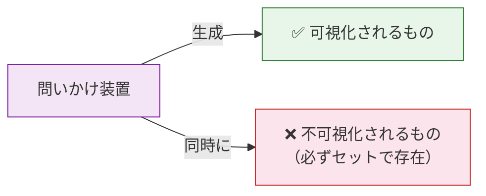

| | 内容 |
|:--|:--|
| **✅ 可視化されたもの** | AIによる声の平等化・余白の創出・第三の視点・教員のやりがい増加 |
| **❌ 不可視化されたもの（AIが推定）** | 身体的な揺らぎと間 / 効率化の陰にある無駄な豊かさ / 平均化による特異性の喪失 / 装置自体の物質的出自 / 権威の再構成 |

> [!quote] 田原氏
> 「今までのやり方でやってたから常にこういう結果が出てきたけど、AIを使うと違う結果が出てくる。でも逆にAIでやることによって失われているものが必ずあるっていうのも一緒に考える」

> [!warning] エージェンシャル・リアリズムの核心
> **「問いかけ装置があるから結果が出てきて、その結果は客観的な真実ではない」**
> この「可視化と不可視化のセット」を意識することが、回折的実践の本質。

---

## 📅 次回予告

- [ ] 柱2：AIファシリテーション（収集データをAI統合しファシリテート）
- [ ] 柱3：授業設計（AI環境下でのインストラクションデザイン）
- [ ] 🏠 宿題：各自が来週までにAIアプリ（Gem）を作成してくる
- [ ] 北田氏作成のObsidianノート（GitHub公開）を参照可能

---

## 🔗 関連ノート

- [[探究学習×AI教育 深化のための学習マップ]]
- [[探究学習の理論・エビデンス総覧]]
