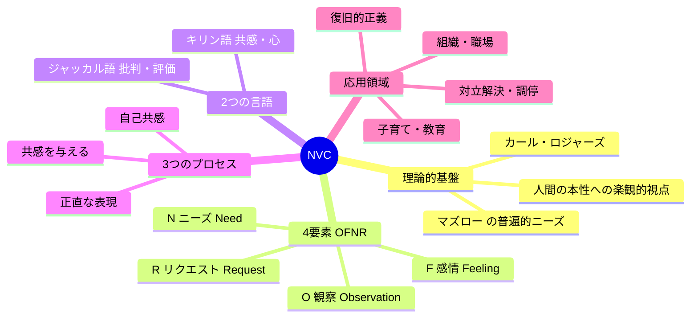
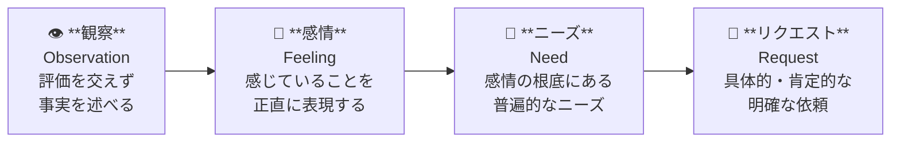
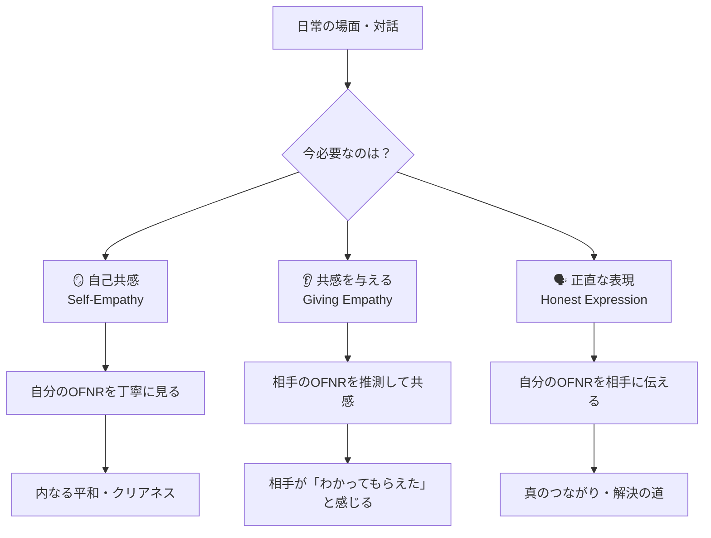
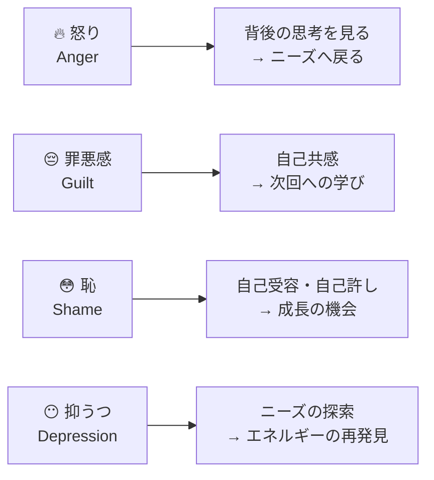
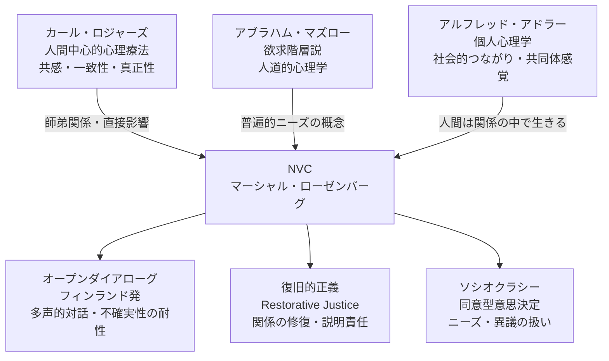

---
tags:
  - 方法論
  - コミュニケーション
  - ファシリテーション
  - 対話
  - 感情
  - 探究
  - 教育
created: 2026-03-18
updated: 2026-03-18
---

# NVC（非暴力コミュニケーション）

> 「私たちの暴力は、怪物的な人間の性質から生まれるものではない。私たちが学んだ思考と言語のパターンから生まれる。」
> — マーシャル・B・ローゼンバーグ

## 概要

**NVC（Nonviolent Communication / 非暴力コミュニケーション）** は、マーシャル・B・ローゼンバーグが1960〜70年代に開発したコミュニケーションの方法論。「共感的コミュニケーション」「ライフ・ランゲージ」とも呼ばれる。

世界60カ国以上で実践され、主著『NVC 人と人との関係にいのちを吹き込む話し方』は700万部超・40言語以上に翻訳されている。

**核となる信念：**
- 人間の本性は本来、他者の幸福に貢献することにある
- 暴力は人間本性ではなく、教育・社会化によって生まれる
- すべての人間は共感する能力を持っている

---

## 創始者：マーシャル・B・ローゼンバーグ（1934–2015）

```
1934年  デトロイト生まれ（暴力的な近隣環境で育つ）
1961年  ウィスコンシン大学で臨床心理学 Ph.D. 取得
         ↓ カール・ロジャーズに師事（1957-1963）
1960s   公民権運動の時代に学校統合プロジェクトでNVC初使用
1984年  非暴力コミュニケーション・センター（CNVC）設立
2015年  逝去。著作15冊以上
```

**カール・ロジャーズとの関係：**
ロジャーズはローゼンバーグの友人・メンター・同僚。「ウィスコンシン・プロジェクト」でも協働。ロジャーズの**人間中心的心理療法（一致性・共感的傾聴・真正性）** がNVC理論の基盤になった。

---

## NVCの全体像



---

## OFNR：4つの要素

NVCのコミュニケーションは4段階で構成される。これは「正しい話し方」ではなく、**意識を訓練するためのフレームワーク**。



---

### 1. 観察（Observation）— 評価と分離した事実

**目的：** ビデオカメラが一瞬を捉えるように、判断・解釈なしに状況を描写する。

| 観察（○） | 評価が混じった表現（×） |
|---|---|
| 「あなたは昨日、約束の時間に30分遅れた」 | 「あなたはいつも無責任だ」 |
| 「今週の会議で3回発言しなかった」 | 「あなたはやる気がない」 |
| 「彼女は私の話の途中に話し始めた」 | 「彼女は私を尊重していない」 |

> [!tip] ポイント
> 「いつも」「絶対」「決して」という一般化は観察ではなく評価。「このとき」「この状況で」と特定する。

---

### 2. 感情（Feeling）— 思考と感情の区別

**目的：** 「良い」「悪い」などの曖昧な言葉ではなく、具体的な感情語彙で自分の内側を表現する。

**疑似感情（×）と真の感情（○）の違い：**

| 疑似感情（思考・解釈が混じる） | 真の感情 |
|---|---|
| 「無視されている気がする」 | 「悲しい」「孤独だ」 |
| 「裏切られた気がする」 | 「傷ついた」「怒っている」 |
| 「誤解されている気がする」 | 「不安だ」「もどかしい」 |

#### 感情インベントリ

**ニーズが充足されているとき：**

| カテゴリ | 感情例 |
|---|---|
| 喜び・幸福 | 嬉しい・楽しい・幸せ・誇らしい・ウキウキする |
| 愛情・温かさ | 愛しい・温かい・感謝している・親しみを感じる |
| 安心・平和 | 安心する・穏やか・落ち着いている・のびのびしている |
| 活力・意欲 | 生き生きしている・わくわくする・興奮している・エネルギッシュ |
| 満足・達成感 | 満足している・充実している・満ち足りている・すっきりした |
| 好奇心・開放感 | 好奇心がある・興味深い・開かれている・インスパイアされている |

**ニーズが未充足のとき：**

| カテゴリ | 感情例 |
|---|---|
| 悲しみ・喪失 | 悲しい・寂しい・切ない・虚しい・惜しい |
| 恐れ・不安 | 不安だ・怖い・心配・おびえている・おびえている |
| 怒り・いらだち | 怒っている・イライラする・腹立たしい・くやしい |
| 混乱・困惑 | 混乱している・戸惑っている・途方に暮れている |
| 疲れ・消耗 | 疲れた・くたびれた・燃え尽きた・重い |
| 恥・罪悪感 | 恥ずかしい・申し訳ない・後ろめたい・自己嫌悪 |
| 失望・落胆 | がっかりした・落胆した・絶望的・やるせない |

---

### 3. ニーズ（Need）— 普遍的な人間のニーズ

**核となる考え方：** ニーズはすべての人間に普遍的。文化・年齢・性別を超えて共通している。ニーズの違いではなく、ニーズを満たすための**戦略の違い**が対立を生む。

> [!important] NVCとマズローの違い
> マズローのニーズ階層は「低次ニーズが充足されてから高次ニーズへ」という階層的構造。
> NVCのニーズは**非階層的**。すべてのニーズは相互に支え合い、同時に存在しうる。

#### ニーズインベントリ（カテゴリー別）

| カテゴリ | 具体的なニーズ |
|---|---|
| **つながり・関係** | 愛・受け入れ・帰属・親密さ・共感・理解・確認・コミュニティ |
| **自律性** | 選択・自由・自発性・独立・主体性 |
| **意味・目的** | 貢献・創造性・希望・インスピレーション・目的・成長・学習 |
| **誠実さ** | 真正性・誠実さ・信頼・開放性 |
| **遊び・喜び** | 楽しみ・笑い・ユーモア・軽さ・わくわく |
| **平和・安らぎ** | 美しさ・調和・秩序・静けさ・均衡 |
| **協力・相互性** | 協力・尊厳・配慮・サポート・平等・相互性 |
| **基本的生存** | 食・住・休息・安全・身体的健康・タッチ |

> [!note] 「戦略」と「ニーズ」の区別
> 「お金が欲しい」「あなたに謝ってほしい」「もっと時間がほしい」は**戦略**。
> その背後にある「安全がほしい」「つながりたい」「尊重されたい」が**ニーズ**。
> ニーズの言語に翻訳すると、解決の選択肢が広がる。

---

### 4. リクエスト（Request）— 要求との違い

**目的：** 相手の自発的な協力を招待する。強制ではない。

| リクエスト（○） | 要求・命令（×） |
|---|---|
| 具体的・実行可能 | 漠然・曖昧（「もっとちゃんとして」） |
| 現在・未来の行動 | 内面の変化を求める（「気にしないで」） |
| 相手が断れる | 断ることへの罰がある |
| 肯定的表現（〜してほしい） | 否定的表現（〜しないで） |

**良いリクエストの例：**
- ❌「もっと気を遣ってほしい」
- ✅「今週の水曜日、一緒に30分話す時間をもらえますか？」

---

## キリン語 vs ジャッカル語

ローゼンバーグが選んだ2つの象徴的な動物。

```
┌─────────────────────────────┬─────────────────────────────┐
│     🦒 キリン語（Giraffe）   │    🐺 ジャッカル語（Jackal） │
├─────────────────────────────┼─────────────────────────────┤
│ 心の言語                     │ 頭（判断）の言語             │
│ ニーズと感情に焦点           │ 批判・評価・分析に焦点       │
│ つながりを生む               │ 分離・防衛を生む             │
│ 人間性を認識する             │ レッテル・ラベルを使う       │
│ リクエストをする             │ 命令・脅しをする             │
│ 責任を引き受ける             │ 責任を転嫁する               │
└─────────────────────────────┴─────────────────────────────┘
```

**キリンが選ばれた理由：**
- 陸上動物最大の心臓を持つ → 大きな共感力
- 長い首で遠くまで見渡せる → 俯瞰・先を見る力
- 強い動物（ライオンを蹴り殺せる）→ 力強い境界線も持てる

**ジャッカル語の具体例：**
- 「あなたはいつも自己中だ」（批判・レッテル）
- 「〜しなければならない」「〜すべきだ」（強制・義務化）
- 「あなたのせいで私は〜になった」（責任転嫁）
- 「そんなことで怒るなんて子どもだ」（無効化）

> [!warning] ジャッカル語は悪ではない
> ジャッカル語は「誤り」ではなく、ニーズのサインが歪んで表れたもの。批判の言葉の裏にも必ずニーズがある。ジャッカルの言葉を「ニーズの言語」に翻訳する練習がNVC。

---

## 3つのプロセス



### 自己共感（Self-Empathy）

「NVCの最も重要な使用は、自己共感の発展にあるかもしれない」— ローゼンバーグ

**プロセス：**
1. **立ち止まる** — 反応する前に内側に注意を向ける
2. **感情を感じる** — 判断・物語なしに、身体の感覚として感じる
3. **ニーズを探す** — この感情はどんなニーズが充足/未充足されているサインか
4. **悲しみか祝いか** — ニーズが満たされていれば祝い、そうでなければ悼む

> [!tip] 自己共感なしに他者への共感は枯渇する
> 最新の神経科学研究によれば、「共感疲労」の正体は「共感的苦痛（Empathic Distress）」であり、他者の苦しみに飲み込まれる状態。自己共感によってニーズに根ざした「コンパッション（Compassion）」は枯渇しない。

### 共感を与える（Giving Empathy）

**共感は「言葉」ではなく「完全な存在（Full Presence）」**

**プロセス：**
1. **完全なプレゼンス** — 自分の判断・アドバイス・同情を手放す
2. **観察する** — 相手が使う言葉の背後を聴く
3. **感情を推測する** — 「〜という気持ちですか？」
4. **ニーズを推測する** — 「〜という必要性があるのでしょうか？」
5. **正確さは不要** — 外れても修正される。推測すること自体が共感

> [!note] 共感と共感的応答の違い
> 「それは大変だったね」はシンパシー（同情）。
> 「〜という気持ちがあって、〜というニーズがあるのですね」がエンパシー（共感）。
> アドバイス・慰め・解決策の提示は、相手が求めていなければ共感を妨げる。

---

## 困難な感情の扱い方

NVCでは以下の4つを「特別なアラーム感情」と位置づける。これらはニーズから切断されているサイン。



**怒りについて：**
- 怒りは「あなたのせい」という判断から来る。実は自分のニーズが満たされていないサイン
- 怒りを感じたら → 頭の中の思考（ジャッカル）を見る → ニーズを探す

**恥について：**
- 恥は「自分が誰であるか」についての判断
- 麻痺させるエネルギー。学習と成長を妨害する
- 健康的な悼みと自己許しに変換することで超越できる

**罪悪感について：**
- 「私はすべきだった/すべきでなかった」という義務からの行動
- NVCは「選択から行動する」ことを提案。「〜する」という能動的言語へ

---

## 教育・ファシリテーションへの応用

[[探究学習の理論・エビデンス総覧]] や [[対話する学校ラボ]] との接点も深い。

### NVCと探究学習・対話的授業

| 従来の教室言語 | NVCを活かした言語 |
|---|---|
| 「なぜできないの？」 | 「今、何が難しいと感じてる？」 |
| 「ちゃんとしなさい」 | 「〜してほしいな。どう思う？」 |
| 「そんなことで怒らない」 | 「今、悔しい気持ちがあるのかな」 |
| 「〜しなければいけません」 | 「〜することが大切だと感じているんだ」 |

### 子育て・教育での主要原則

1. **強制ではなく招待** — 「〜しなさい」→「〜してくれる？」
2. **自然な結果の活用** — 罰ではなく行動の自然な帰結を体験させる
3. **感情を認める** — 「泣かないで」→「悲しいんだね」
4. **子どもをニーズを持つ人間として扱う** — 問題行動の背後のニーズを見る

### ファシリテーターとしての実践

渋谷聡子さんとの学びや [[対話する学校ラボ]] での実践と連動：

- 参加者の「ジャッカルの言葉」をニーズに翻訳して返す
- 対立が起きたとき、双方のニーズを可視化する
- グループの感情温度を感じ取り、自己共感で内なる安定を保つ

---

## 関連理論との接続



| 理論 | NVCとの共通点 | 違い・補完点 |
|---|---|---|
| ロジャーズ | 共感・真正性・無条件の積極的関心 | NVCは構造的な4要素を提供 |
| マズロー | 普遍的ニーズの存在 | NVCは非階層的。同時複数のニーズ |
| アドラー | 社会的つながり・貢献の重要性 | アドラーは勇気・目的論を重視 |
| オープンダイアローグ | 対話・プレゼンス・多様な声 | ODは精神医療から、NVCは日常会話から |

---

## NVCの批判・限界・誤解

> [!warning] 誤解されやすいポイント
> NVCへの批判の多くは、NVCの誤解から来ている。

| 誤解 | 実際 |
|---|---|
| 「特定の言い方を覚える技術」 | 意識の変化が核。言語は練習ツール |
| 「相手に従う = 弱さ」 | 自分のニーズを主張することもNVC |
| 「感情を出せばいい」 | 評価・思考を感情と区別することが重要 |
| 「全場面で使うべき」 | 文化・状況・関係性によって調整が必要 |

**実際の限界：**
- 言語能力が低い状況（幼い子ども・危機状態）では使いにくい
- 相手がNVCに参加する意志がない場合は機能しにくい
- 西洋文化的前提があり、非西洋文脈では適応が必要
- 構造的権力の不均衡（ハラスメント等）には別のアプローチが必要

**よくある間違い：**
1. 問題に焦点を当てすぎる（ニーズへの到達前に解決策へ）
2. 言語だけを変える（内側の意識変化なし）
3. 最初の学びで全場面に使おうとする

---

## 実践のステップ

### 日常でのNVC練習法

```
Step 1: ジャッカルの観察
  日記・会話でジャッカル語（批判・評価・義務）を見つける

Step 2: ニーズへの翻訳
  「この批判の裏にある私のニーズは何か？」を問う

Step 3: 感情語彙を増やす
  上記の感情リストを参照しながら、今の感情を具体的に言語化

Step 4: 自己共感の実践
  朝・夜5分、自分のOFNRを静かに確認する

Step 5: 共感の推測を試みる
  日常会話で「〜という気持ち？」と聴いてみる
```

### OFNRで話す練習テンプレート

```
「（観察）〜という状況のとき、
 （感情）私は〜と感じます。
 （ニーズ）それは〜というニーズがあるからです。
 （リクエスト）〜してもらえますか？」
```

---

## 主要文献・リソース

### 日本語

| タイトル | 著者 | 備考 |
|---|---|---|
| 『NVC 人と人との関係にいのちを吹き込む話し方』（新版） | マーシャル・B・ローゼンバーグ | 主著。安納献・小川敏子訳。第11章「紛争の解決」追加 |
| 『NVC大学』 | NVC大学（日本語コミュニティ） | 英語リソースを日本語で学べるプラットフォーム |

### 英語

| タイトル | 著者 | 備考 |
|---|---|---|
| *Nonviolent Communication: A Language of Life* | Marshall Rosenberg | 主著。700万部超 |
| *Raising Children Compassionately* | Marshall Rosenberg | 子育て特化 |
| *Teaching Children Compassionately* | Marshall Rosenberg | 教育者向け |
| *Parenting From Your Heart* | Inbal Kashtan | 子育てへの実践的統合 |
| *Connecting Across Differences* | Connor & Killian | 初心者向けにおすすめ |

### オンライン

- [Center for Nonviolent Communication (CNVC)](https://www.cnvc.org/) — 公式組織・認定資格
- [NVC Academy](https://nvcacademy.com/) — オンライン学習
- [PuddleDancer Press](https://nonviolentcommunication.com/) — ローゼンバーグの出版社

---

## 関連ノート

- [[探究学習の理論・エビデンス総覧]]
- [[AI時代の反転授業三本柱 — 研修メモ#1]]
- [[Claude Code × Obsidian で思考を10倍にする方法]]

---

*created: 2026-03-18 / updated: 2026-03-18*
