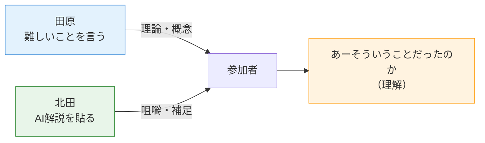
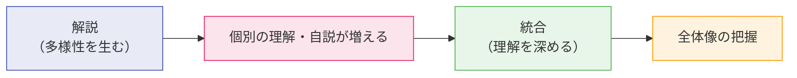
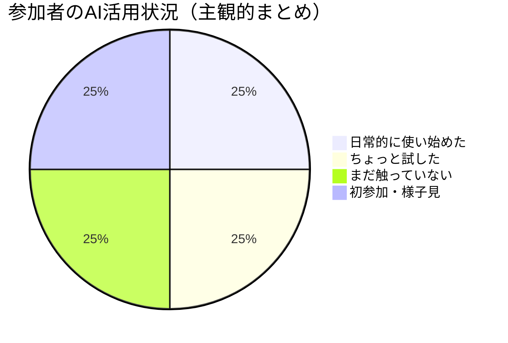

---
tags:
  - 研修
  - 反転授業
  - AI教育
  - かえつ有明
  - ファシリテーション
  - Gem
  - 解説的学習
created: 2026-03-25
updated: 2026-03-25
発話者: 真人 田原（ほか参加者）
時間: 08:58〜
series: AI時代の反転授業三本柱（全3回）
---

# かえつ有明AI研修 — 第2回研修メモ

> [!info] シリーズ概要
> 反転授業の三本柱をAI時代にアップデートする **3回シリーズ**の**第2回**。
> テーマ：**多様化した学びを統合して理解を深めるにはどうするか・そこにAIをどう活用するか**

---

## 🎙️ 事前やりとり（08:57〜08:58）

> [!note] 田原・北田の役割分担
> - 田原氏：難しい概念・理論を提示する
> - 北田氏：それをAI解説として貼り付けて参加者の理解を促す
>
> → **「北田さんみたいな人が何をやるのか」を言語化・定義することが次の宿題**

---

## 🚀 開会・今日のテーマ（09:02〜09:03）

田原氏の開会コメント：

> 「学習って、解説して多様性が増すのと、その多様性を統合して理解を深める——この**2つのプロセスの組み合わせ**になっている」

> 「今日は**多様化したものを統合して理解を深める**にはどうしたらいいか、そこにAIがどう活用されるか、これをテーマに2時間やっていきたい」

---

## 📋 チェックイン — 参加者の前回からのアップデート（09:04〜09:10）

### 真田さん（ssanada）
- 前回参加して「こんなことができるんだ」と感じた
- **実際にはまだ1度も試していない**（調べるときにちょっと使う程度）
- → 今日頑張る宣言

### 石田記子さん
- 前回は部活で欠席 → 動画を視聴したが「体育科でバレーしかやっていない」ため理解できず不安
- ただし**Geminiを日常的に使い始めている**
  - 新学年会議の準備に活用 → 笑顔で終了できた
- → 「ジェミニさんと一緒によりよい生活をどう作っていくか楽しみ」

### 大木さん（ohki）
- 「解説」という考え方が**学校で学ぶことの意味を改めて考えるきっかけ**になった
- **学習観がアップデートされた**という感覚
- 今日も新たな学びに期待

### 高田美喜さん
- 研修前：AIは「道具」としてしか見ていなかった
- 研修後：**既存の考え方とAIを結びつけられる**ことを発見
- 家族での世代間ギャップを実感（夫＝AI全くわからない世代 / 息子＝AI身近な世代）
- → 若い世代に近づいて日常的に使えるようになりたい

### 高野美保さん
- 前回から**ツール自体には触れていない**
- 研修後に他の先生と話が広がった → **横のつながりの広がり**が収穫

### 山田さん（Hideo YAMADA）
- 今回が初参加（前回は所用で欠席）
- 佐野先生から話を聞いて「自分の中で考えていたことがより具体的にしやすくなるかも」という期待
- **「はてなだらけ」** な状態で参加

### 上野愛さん（喉を傷めて参加）
- Geminiの**ジェムのタブを発見** → ハードルが下がった
- 問いに文字だけでなく役割を入力するようになった

### 佐野かずゆき先生
- 前回、自分のチームは「どうやっていいかわからないまま終わった」
- 田原氏が吉井さんチームに入って授業案作りまで進んだと聞いて「まずい」と感じた
- → 追いつこうとした経緯（以下、文字起こし途中）

---

## 📊 チェックイン全体の傾向

| 参加者 | 前回からの変化 | キーワード |
|:--|:--|:--|
| 真田さん | 意識あり、行動なし | 今日から頑張る |
| 石田さん | Geminiを日常活用 | 不安→楽しみに変化 |
| 大木さん | 学習観のアップデート | 解説的学習論 |
| 高田さん | AIと理論の統合発見 | 世代間ギャップ |
| 高野さん | 横のつながりが広がった | 教員間の対話 |
| 山田さん | 初参加 | 具体化への期待 |
| 上野さん | Gemのタブ発見 | ハードル低下 |
| 佐野さん | 危機感から行動へ | チーム間の差 |

---

## 💡 田原氏のコメント（チェックイン後）

> [!quote] 田原氏
> 「解説的学習論の論文を執筆中。現場のデータが不足しているので、かえつの先生方と共同研究してデータを分析したい」

> [!quote] 田原氏（世代間ギャップについて）
> 「ある年齢から新しいことをやるのが億劫になっていく。僕の中にもその億劫な気持ちがある。でも、まだなんとか超えていこうという感じでやってます」

---

## 🔗 関連ノート

- [[AI時代の反転授業三本柱 — 研修メモ#1]]
- [[探究学習×AI教育 深化のための学習マップ]]
