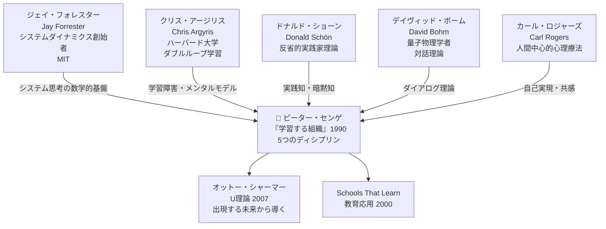
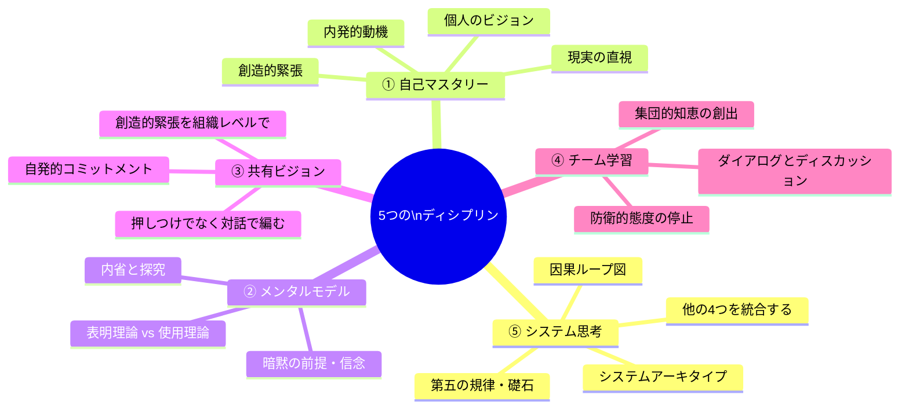
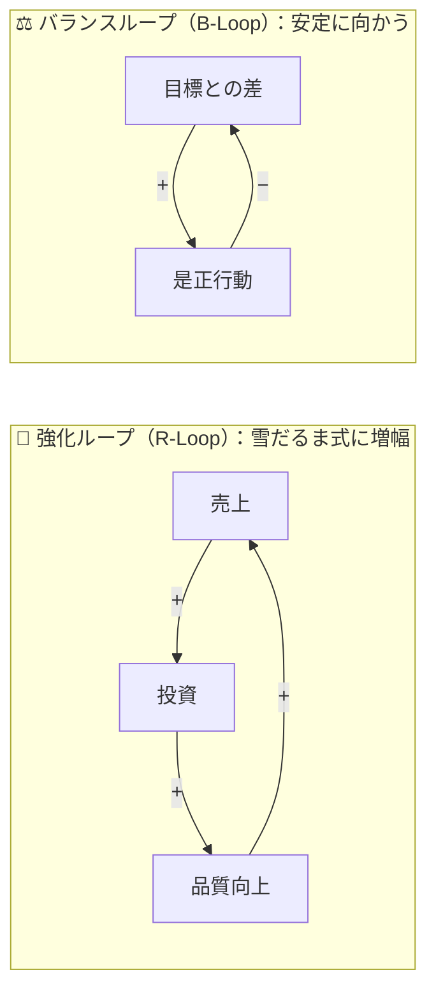
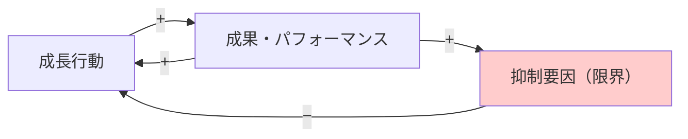
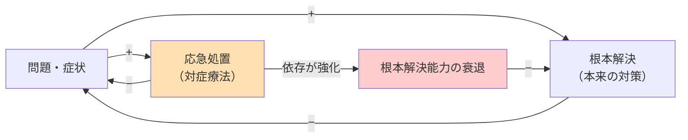
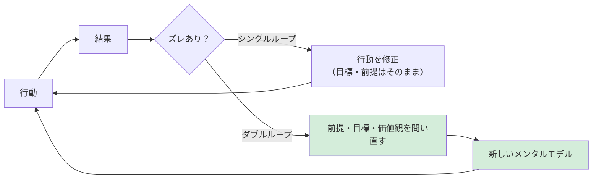
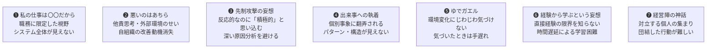
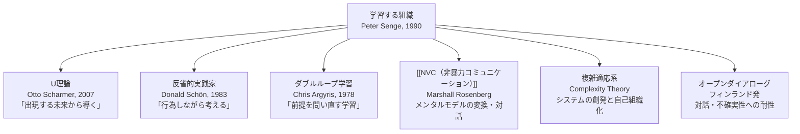

---
tags:
  - 方法論
  - 組織論
  - システム思考
  - 対話
  - 学習
  - 教育
  - ファシリテーション
created: 2026-03-18
updated: 2026-03-18
---

# 学習する組織（ピーター・センゲ）

> 「学習する組織とは、人々が継続的に自分たちが本当に望む結果を生み出す能力を広げ、新しい思考パターンを育て、集団的な意志が解き放たれ、人々が共にいかに学ぶかを学び続けている組織である。」
> — ピーター・センゲ

## 概要

**学習する組織（Learning Organization）** は、ピーター・センゲが1990年の主著 *The Fifth Discipline* で体系化した組織変革の理論。**5つのディシプリン（規律）** を核に、個人・チーム・組織レベルの学習能力を継続的に高める方法論。

- 日本語版『学習する組織』（英治出版, 2015）は世界的なロングセラー
- 1997年に設立した **Society for Organizational Learning（SoL）** が国際的実践コミュニティとして機能
- [[NVC（非暴力コミュニケーション）]] との接点：対話・メンタルモデル・チーム学習

---

## 創始者：ピーター・M・センゲ（Peter M. Senge, 1947–）

```
1947年  米国生まれ（ロサンゼルス育ち）
        ↓
スタンフォード大学 工学・哲学 学士
        ↓
1973年  MIT スローン経営大学院 修士（社会システムモデリング）
1978年  MIT スローン経営大学院 博士（経営学）
        ↓ ジェイ・フォレスター（システムダイナミクス創始者）に師事
1990年  『The Fifth Discipline』出版 → 世界的ベストセラーへ
1997年  Society for Organizational Learning（SoL）設立・創設議長
現在    MIT スローンのシニアレクチャー
```

**MIT での影響：**
ジェイ・フォレスター（Jay Forrester, 1918–2016）のシステムダイナミクスと、クリス・アージリスのダブルループ学習理論を統合して「学習する組織」の理論体系を構築。

---

## 理論的系譜



---

## 5つのディシプリン（規律）

「第五の規律（The Fifth Discipline）」がシステム思考であり、他の4つを束ねる。



---

### ① 自己マスタリー（Personal Mastery）

**定義：** 自分が心から求めている結果を生み出すために、自身の能力と意識を絶えず伸ばし続けるディシプリン。

**核となる概念：「創造的緊張（Creative Tension）」**

```
現在の現実（Current Reality）
         ↕  ← この「ギャップ」が創造的緊張
明確なビジョン（Vision）
```

> [!important] 創造的緊張とは
> ビジョンと現実のギャップを「問題」ではなく「エネルギー源」として使う。
> ビジョンを下げてギャップを埋めるのではなく、現実をビジョンの方向へ引き上げる力。

**個人の学習が組織の学習の土台：**
- 個人の自己マスタリーなくして、組織の学習は不可能
- 「私は何のために存在するか」という内発的問いが起点

---

### ② メンタルモデル（Mental Models）

**定義：** 世界をどう理解し、どう行動するかに深く影響する、無意識的な前提・信念・イメージ・一般概念。

**クリス・アージリスの「表明理論 vs 使用理論」：**

| 表明理論（Espoused Theory） | 使用理論（Theory-in-Use） |
|---|---|
| 「自分はこう行動している」と語る理論 | 実際の行動から推測される暗黙の理論 |
| 意識的・言語化されている | 無意識的・行動に埋め込まれている |
| 「対立は話し合いで解決する」 | 実際は権威的に判断している |

> [!warning] メンタルモデルの怖さ
> 人は自分のメンタルモデルに気づかない。
> 「自分のメンタルモデル」ではなく「現実」として認識してしまう。
> 変革を阻む最大の障壁はここにある。

**メンタルモデルの扱い方：**
1. 自分の前提を口に出す（探究）
2. 他者の前提を「攻撃せず」聴く（反省）
3. 両方のプロセスを同時に行う「内省的探究（Reflective Inquiry）」

---

### ③ 共有ビジョン（Shared Vision）

**定義：** 組織全体で実現したい未来像を、対話を通じて共に編み上げるプロセスと結果。

**「共有ビジョン」と「ビジョンの共有」の決定的な違い：**

```
❌ ビジョンの共有（Vision Sharing）
   トップが作った → 下に伝達 → 説得・浸透 → 強制コミットメント

✅ 共有ビジョン（Shared Vision）
   個人のビジョンを聴く → 相互に共鳴点を探す → 対話で統合 → 自発的コミットメント
```

**3つのコミットメントのレベル：**

| レベル | 状態 | 動機 |
|---|---|---|
| **コミットメント** | 本当に望んでいる | 内発的・自発的 |
| **エンロールメント** | 望んでいる・積極的 | 自発的だが規範的側面あり |
| **コンプライアンス** | 言われたからやる | 外発的・義務的 |

> [!tip] 学習する組織はコンプライアンスで動かない
> 命令・管理で動く組織はコンプライアンス。
> 学習する組織は、メンバーが本当に望むビジョンのコミットメントで動く。

---

### ④ チーム学習（Team Learning）

**定義：** 対話を通じて、個人の知識の合計を超える「集団的な知恵」を生み出すプロセス。

#### ダイアログ vs ディスカッション（デイヴィッド・ボームの対話理論）

```
┌────────────────────────────────┬────────────────────────────────┐
│   🌊 ダイアログ（Dialogue）     │   ⚔️ ディスカッション（Discussion）│
├────────────────────────────────┼────────────────────────────────┤
│ dia（通じて）＋logos（意味）    │ discuss（分割・投げつける）の語源 │
│ 意味の自由な流れ               │ 意見を競わせ、勝敗を決める       │
│ 相互理解を深める               │ 最良の選択肢を決定する           │
│ 判断・評価を「宙吊り」にする   │ 結論への移行が速い               │
│ 聴くことが中心                 │ 主張することが中心               │
│ 新しい集合的意味が生まれる     │ 既存の枠組みで最適解を探す       │
└────────────────────────────────┴────────────────────────────────┘
```

> [!note] 両方が必要
> ダイアログは相互理解のため。ディスカッションは意思決定のため。
> 問題は、現代組織がディスカッションに偏りすぎていること。

**チーム学習の3つの障害：**
1. **防衛的態度（Defensive Routines）** — 自分の考えへの挑戦を回避する習慣
2. **場への同調圧力** — 全員が「うまくやっている」ふりをする
3. **対話スキルの欠如** — 聴く・探究するスキルが訓練されていない

---

### ⑤ システム思考（Systems Thinking）— 第五の規律

**定義：** 物事を相互関連するシステムとして捉える思考様式。部分ではなく全体、静的ではなく動的、個別事象ではなくパターンと構造を見る。

> [!important] なぜ「第五」なのか
> システム思考は他の4つのディシプリンを**統合する礎石**。
> 個人・チーム・組織レベルの学習をシステム全体として見通す「メタ規律」。

---

## システム思考の道具

### 因果ループ図（Causal Loop Diagram）

変数を矢印でつなぎ、極性（＋強化 / −逆転）でシステムの構造を可視化する。

**2種類のループ：**



| ループ種類 | 特徴 | 組織への影響 |
|---|---|---|
| **強化ループ（R）** | 変化が増幅される自己強化型 | 好循環にも悪循環にもなる |
| **バランスループ（B）** | 目標状態に収束しようとする安定化機構 | 変革の抵抗力になることも |

---

### システムのアーキタイプ（Archetypes）

組織に繰り返し現れる典型的な「構造パターン」。「あ、これは成長の限界だ」と共通言語で認識できる。

#### アーキタイプ①：成長の限界（Limits to Growth）



**パターン：** 最初は成長が加速 → やがて限界にぶつかって停滞・後退

**組織の罠：** 成長が鈍化しても「もっと頑張れ」と成長行動を強化しようとする。
**本当の解決：** 抑制要因（限界）を探し、そこにレバレッジをかける。

**教育での例：** 探究活動を増やす → 教員の負担が増大（限界）→ 教員が疲弊 → 活動の質が下がる

---

#### アーキタイプ②：問題の転嫁（Shifting the Burden）



**パターン：** 応急処置が効くうちは快適。しかし根本解決への投資が後回しになり、問題が定期的に再発。

**組織の罠：** 効果的な応急処置への依存が強まり、根本解決の能力が退化していく。

**教育での例：** 授業の問題行動 → 叱責（応急処置）→ 根本的な授業設計改善が後回し → 同じ問題が繰り返す

---

### 氷山モデル（Iceberg Model）

「見えているもの」の下に、より深い構造が隠れている。

```
╔══════════════════════════════════════════════════════╗
║  🌊 水面上                                            ║
║  ─────────────────────────────────────────────────── ║
║  レベル１：出来事（Events）                           ║
║  「今日、〇〇が起きた」                               ║
║  → 反応的対処（対症療法）                            ║
╠══════════════════════════════════════════════════════╣
║  🧊 水面下（浅）                                      ║
║  レベル２：パターン・トレンド（Patterns & Trends）    ║
║  「ここ5年、毎年〇〇が繰り返されている」             ║
║  → 適応的対処（傾向の予測と準備）                    ║
╠══════════════════════════════════════════════════════╣
║  🧊 水面下（中）                                      ║
║  レベル３：構造（Structures）                         ║
║  「なぜこのパターンが生まれるか」因果ループ図        ║
║  → 設計的対処（レバレッジポイントへの介入）          ║
╠══════════════════════════════════════════════════════╣
║  🧊 水面下（深）                                      ║
║  レベル４：メンタルモデル（Mental Models）           ║
║  「その構造を作り出している無意識の前提・信念」       ║
║  → 変容的対処（前提・価値観の問い直し）             ║
╚══════════════════════════════════════════════════════╝
```

> [!important] 真の変革はレベル４から
> 出来事（レベル１）への対応は一時的解決に過ぎない。
> メンタルモデル（レベル４）を変えなければ、同じパターンが繰り返される。
> 学習する組織は、レベル４の変革を目指す。

---

## ダブルループ学習（クリス・アージリス）



| 学習タイプ | 問い | 変えるもの | 適した状況 |
|---|---|---|---|
| **シングルループ** | 「どうすれば目標に近づくか？」 | 行動・方法 | 安定環境・継続的改善 |
| **ダブルループ** | 「なぜその目標なのか？」 | 前提・目標・価値観 | 変革期・イノベーション |
| **トリプルループ** | 「私たちはどのように学ぶべきか？」 | 学習システム自体 | 深い変容・パラダイムシフト |

**温度調節器の比喩：**
- シングルループ：69°Fを下回れば暖房が作動する
- ダブルループ：「なぜ69°F設定なのか？より省エネな温度はないか？」

---

## 7つの学習障害

センゲが特定した「組織が学習できなくなる」7つのパターン。



> [!warning] 「ゆでガエル」は組織全体に広がりやすい
> 個人は変化を感じていても「自分だけかも」と黙る。
> 組織全体として警戒センサーが麻痺する。

---

## 教育・学校組織への応用

### Schools That Learn（2000年）

センゲと教育者が協働した「学習する組織の教育版」。学校を「学習するシステム」として設計・運営する。

**5つのディシプリンの学校への対応：**

| ディシプリン | 学校での実践 |
|---|---|
| 自己マスタリー | 教員・生徒が「本当に学びたいこと」を探究する |
| メンタルモデル | 「子どもとはこういうもの」という無意識の前提を検討する |
| 共有ビジョン | 「どんな学校にしたいか」を押しつけではなく対話で作る |
| チーム学習 | 教員間のダイアログ・授業研究・同僚性の構築 |
| システム思考 | 「問題行動」を個人の問題でなくシステムで見る |

**探究学習との接続：**

[[探究学習の理論・エビデンス総覧]] や KAEL の活動と深く共鳴する。

| 探究学習の要素 | 学習する組織の対応概念 |
|---|---|
| 問いの設定 | 自己マスタリー（本当に知りたいことは何か） |
| 前提の問い直し | メンタルモデルの内省 |
| 協働の探究 | チーム学習・ダイアログ |
| 全体像の把握 | システム思考・氷山モデル |
| ビジョンの共有 | 共有ビジョンの構築 |

---

## 関連理論との接続



### U理論（Otto Scharmer）との関係

センゲとシャーマーは共著 *Presence*（2005）を執筆。学習する組織の「深化版」として。

| 学習する組織 | U理論 |
|---|---|
| 現在の問題をシステムで理解し改善 | 出現する未来から逆算して行動 |
| 過去のパターンから学ぶ | 未来のシグナルを感じ取る |
| 5つのディシプリンで能力を高める | Uのプロセスで変容する |

---

## 批判・限界・誤解

| 批判・限界 | 実際のところ |
|---|---|
| 「理想主義的すぎる」 | 実装困難は本物。センゲ自身も The Dance of Change で「変革の困難」を詳述 |
| 「西洋文化前提」 | 個人主義・対話文化が前提。非西洋文化圏では適応が必要 |
| 「測定が難しい」 | 組織学習の定量化は困難。長期的な変化を見る必要がある |
| 「時間がかかりすぎる」 | 根本的変革には5年以上が必要。短期的成果との衝突 |

**実装でよくある失敗：**
1. 5つのディシプリンを「研修コンテンツ」として扱う → 意識変化が伴わない
2. トップが「学習する組織」を宣言するだけ → ダブルループになっていない
3. システム思考を「図を描く技術」として矮小化 → 思考様式の変革が起きない

---

## 実践のステップ

### 組織での始め方

```
Step 1: 氷山を描く
  現在の組織課題を「出来事」として書き出す
  → パターン・構造・メンタルモデルへと深堀りする

Step 2: 因果ループ図を描く
  「なぜこの問題が繰り返されるのか」を矢印で可視化
  → チームで一緒に描くことで共通理解が生まれる

Step 3: ダイアログの場を作る
  週1回30分、「最近感じている前提を話す」時間を作る
  → 評価なしに聴くことを徹底する

Step 4: 個人ビジョンを聴く
  「あなたが本当に実現したいことは？」を全員に問う
  → 共有ビジョンはここから編まれる

Step 5: アーキタイプで現状診断
  「うちの組織は今、どのアーキタイプにはまっているか？」
  → 成長の限界？問題の転嫁？
```

### ファシリテーターとしての実践

渋谷聡子さんとの学びや [[NVC（非暴力コミュニケーション）]] との接点：

- 参加者の「ジャッカルの言葉」をニーズ（メンタルモデル）として聴く
- グループの「パターン」を観察してフィードバックする
- 対立を「バランスループ」として可視化し、共通ニーズを探る

---

## 主要文献・リソース

### 日本語

| タイトル | 著者 | 備考 |
|---|---|---|
| 『学習する組織―システム思考で未来を創造する』 | P・センゲ | 主著。英治出版（2015）。枝廣淳子ほか訳 |
| 『最強組織の法則』 | P・センゲ | 旧版日本語訳。徳間書店（1995） |
| 『U理論』 | O・シャーマー | 英治出版（2010）。中土井僚・由佐美加子訳 |
| 『出現する未来から導く』 | O・シャーマー | 英治出版（2017）。U理論の実践版 |
| 『専門家の知恵』 | D・ショーン | ゆみる出版（2001）。佐藤学・秋田喜代美訳 |

### 英語

| タイトル | 著者 | 備考 |
|---|---|---|
| *The Fifth Discipline* (1990, rev.2006) | P. Senge | 主著 |
| *The Fifth Discipline Fieldbook* (1994) | Senge et al. | 実践ワークブック |
| *The Dance of Change* (1999) | Senge, Roth | 変革の困難さを詳述 |
| *Schools That Learn* (2000, rev.2012) | Senge et al. | 教育応用版 |
| *Presence* (2004) | Senge, Scharmer et al. | U理論との統合 |
| *On Dialogue* (1996) | D. Bohm | 対話理論の古典 |

### オンライン

- [Society for Organizational Learning (SoL)](https://www.solonline.org/) — センゲが設立した国際実践コミュニティ
- [チェンジ・エージェント](https://www.change-agent.jp/learningorganization/) — 日本語での解説と実践事例

---

## 関連ノート

- [[NVC（非暴力コミュニケーション）]]
- [[探究学習の理論・エビデンス総覧]]
- [[AI時代の反転授業三本柱 — 研修メモ#1]]

---

*created: 2026-03-18 / updated: 2026-03-18*
