---
tags:
  - 探究
  - AI×教育
  - 方法論
  - 教育政策
  - 学習ロードマップ
created: 2026-03-17
updated: 2026-03-17
---

# 探究学習 × AI教育 深化のための学習マップ

> 探究学習の理論（[[探究学習の理論・エビデンス総覧]]）を起点に、さらに深めるべき思想・資料・研究者を体系的に整理したナビゲーションノート。

---

## 全体マップ

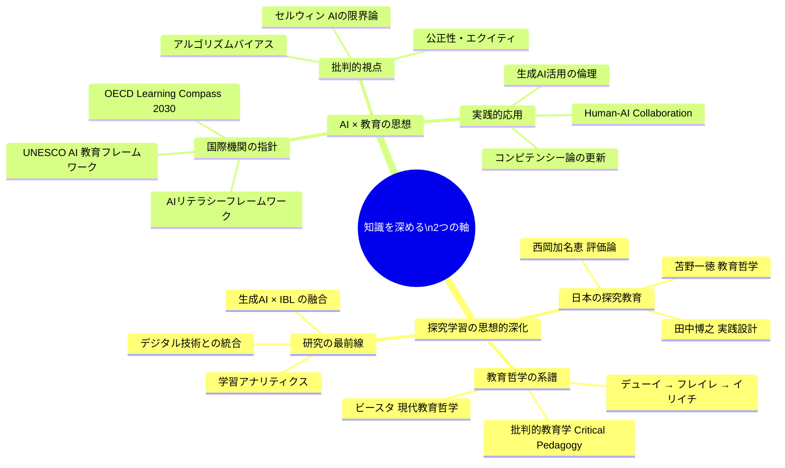

---

## 第1部：探究学習の思想的系譜を深める

### 教育哲学者の系譜

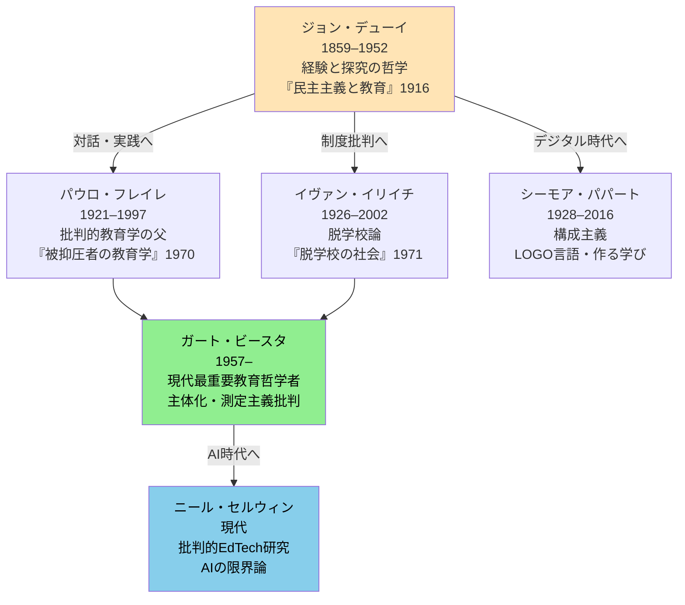

---

### 思想家ごとの核心概念と読み方

#### パウロ・フレイレ（Paulo Freire）— 必読

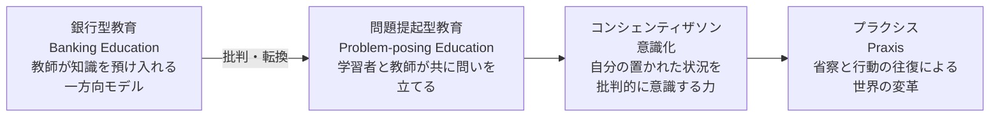

**探究学習との接続：** フレイレの「問い」は、IBL の Questioning フェーズの哲学的根拠。探究を「内容の習得」でなく「世界との関係を問い直す行為」として捉える視点を与える。

**読む順序：**
1. 『被抑圧者の教育学』*Pedagogy of the Oppressed*（1970）— 必読原典
2. *Pedagogy of Hope*（1992）— より実践的・対話的
3. *Rethinking Freire and Illich*（Enslin et al., 2023）— 現代的批判的再読

---

#### イヴァン・イリイチ（Ivan Illich）— 制度の外から見る目

**核心：**「学習は学校制度なしに深く起きる。むしろ制度が学習を歪める」

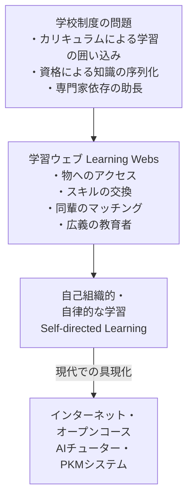

**探究学習との接続：** 「学習ウェブ」はAI時代の個別最適化学習・非制度的探究の先駆概念。Obsidian × Claude Code による知的探究まさにその実践。

---

#### ガート・ビースタ（Gert Biesta）— 現代最重要思想家

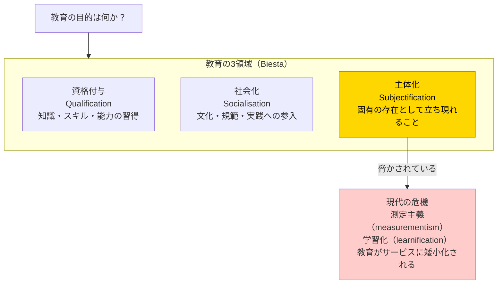

**「学習化（learnification）」とは：** 教育が「何を学んだか」の測定・最適化に縮減され、「何のために学ぶか」「どんな人間になるか」という問いが消える危険。AI教育の文脈で最重要な批判概念。

**主著の読み方：**
| 書籍 | テーマ | 難度 |
|------|--------|------|
| *Beyond Learning*（2006） | 民主主義教育の再定義 | ★★★ |
| *Good Education in an Age of Measurement*（2010） | 測定主義批判・3領域論 | ★★ |
| *The Beautiful Risk of Education*（2013） | 不確実性と教育の本質 | ★★★ |

---

### 批判的教育学（Critical Pedagogy）の系譜

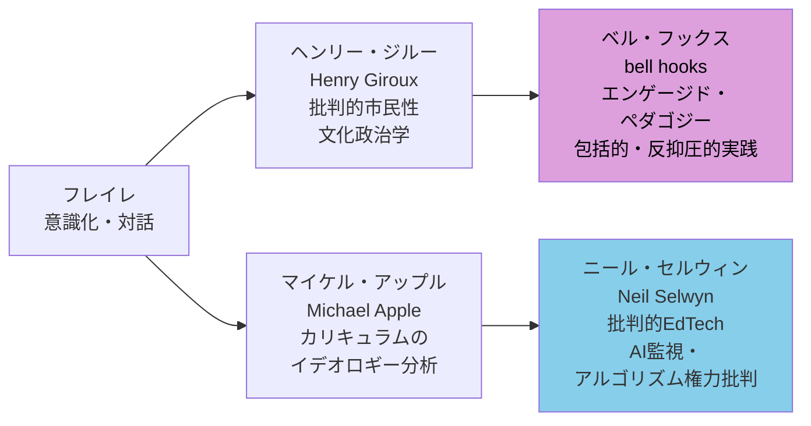

---

### 日本の探究教育：注目すべき研究者

| 研究者 | 所属 | 専門 | 代表著作 |
|--------|------|------|---------|
| **苫野一徳** | 熊本大学 | 教育哲学・「自由の相互承認」 | 『教育の力』（講談社現代新書）|
| **西岡加名恵** | 京都大学 | 教育方法学・パフォーマンス評価・UbD | 『新しい教育評価入門』（有斐閣）|
| **石井英真** | 京都大学 | カリキュラム論・学力論 | 『授業づくりの深め方』|
| **田中博之** | 早稲田大学 | 教育工学・探究授業設計 | 『高等学校 探究授業の創り方』|
| **奈須正裕** | 上智大学 | 学習科学・個別最適な学び | 『「資質・能力」と学びのメカニズム』|

---

## 第2部：AI × 教育の思想を深める

### 国際機関の枠組み

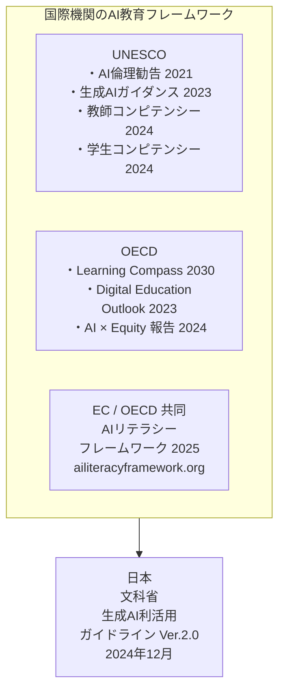

---

### OECD Learning Compass 2030

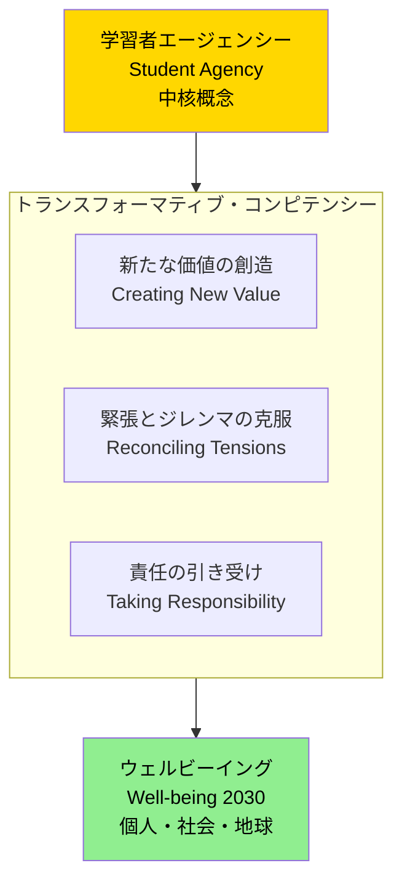

**探究学習との接続：** 「学習者エージェンシー」は Banchi & Bell の「開放型探究（Lv4）」と直結。自ら問いを立て、方法を選び、責任を持って結論を出す力。

---

### AIリテラシーの6次元モデル（BJET 2025）

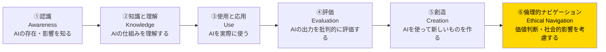

---

### ニール・セルウィンのAI教育批判

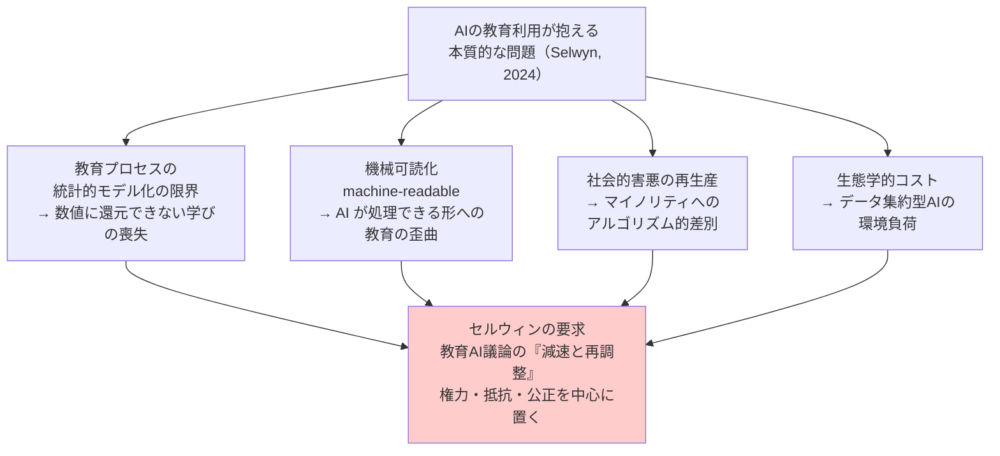

**読む：** *Should Robots Replace Teachers?*（Polity Press, 2019）— AI教育批判の最重要書

---

### アルゴリズムバイアスと公正性

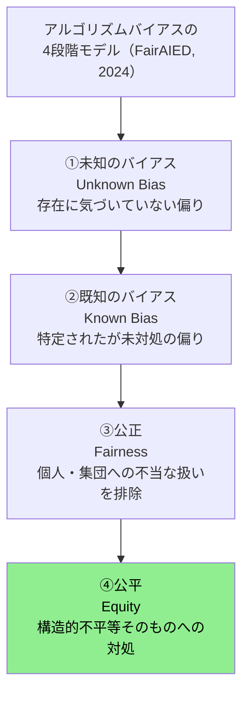

---

## 第3部：読書・学習ロードマップ

### フェーズ別学習計画

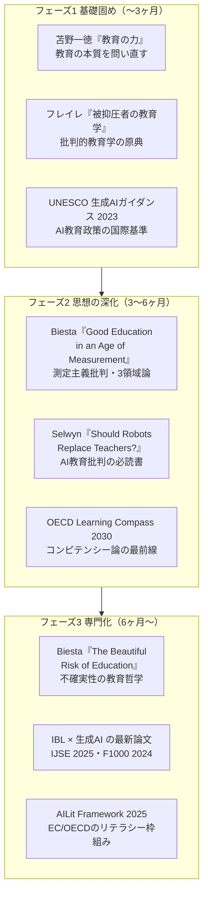

---

### 書籍リスト

#### 教育哲学・探究学習（洋書）

| タイトル | 著者・年 | 難度 | ポイント |
|---------|---------|------|---------|
| *Pedagogy of the Oppressed* | Freire, 1970 | ★★ | 批判的教育学の原典・探究の政治的意味 |
| *Deschooling Society* | Illich, 1971 | ★★ | 制度批判・学習ウェブの先駆 |
| *Beyond Learning* | Biesta, 2006 | ★★★ | 民主主義教育の哲学的再定義 |
| *Good Education in an Age of Measurement* | Biesta, 2010 | ★★ | 3領域論・測定主義批判 |
| *The Beautiful Risk of Education* | Biesta, 2013 | ★★★ | 不確実性と主体化 |
| *Rethinking Freire and Illich* | Enslin et al., 2023 | ★★★ | フレイレ・イリイチの現代的再読 |

#### AI × 教育（洋書）

| タイトル | 著者・年 | 難度 | ポイント |
|---------|---------|------|---------|
| *Should Robots Replace Teachers?* | Selwyn, 2019 | ★★ | AI教育批判の必読書 |
| *Co-Intelligence* | Mollick, 2024 | ★ | AIとの協働の哲学と実践 |
| *Brave New Words* | Khan, 2024 | ★ | Khan AcademyのAI教育ビジョン |
| *Teaching with AI* | Bowen & Watson | ★★ | 高等教育向けAI実践指南 |
| *Handbook of Artificial Intelligence in Education* | 多著者, 2023 | ★★★ | AIED分野の包括的参照書 |

#### 和書

| タイトル | 著者・年 | ポイント |
|---------|---------|---------|
| 『教育の力』 | 苫野一徳, 2014 | 「自由の相互承認」による公教育哲学・まず読む一冊 |
| 『学校をつくり直す』 | 苫野一徳, 2019 | 学校制度の根本的再設計論 |
| 『新しい教育評価入門』 | 西岡・石井・田中編 | パフォーマンス評価・探究評価の基礎 |
| 『高等学校 探究授業の創り方』 | 田中博之 | 探究授業設計の実践書 |
| 『探究学習白書2024』 | ESIBLA | 日本の探究実態の最新統計 |

---

### 論文・レポートリスト

#### 最新・最重要

| 論文 | 年 | ポイント |
|-----|-----|---------|
| Selwyn「On the Limits of AI in Education」| 2024 | AIの限界論・批判的視点の核 |
| "Systematic review of IBL" F1000Research | 2024 | 探究学習の効果g=0.893の最新統合 |
| "Roles of digital tech in IBL" ScienceDirect | 2024 | テクノロジーと探究の7つの役割 |
| "Adaptive IBL using generative AI" IJSE | 2025 | 生成AI×IBLの実証研究・最前線 |
| "Algorithmic Bias in Educational Systems" WJARR | 2025 | AI教育のバイアス問題・包括的整理 |
| "Towards Responsible AI in Education" Nature | 2025 | 責任あるAI教育の系統的レビュー |
| "AI Literacy Competency Framework" BJET | 2025 | AIリテラシーの6次元モデル |
| UNESCO "Generative AI in Education" | 2023 | 国際機関の公式指針・政策の出発点 |
| OECD "AI and Equity in Education" | 2024 | AI×公正性の国際的分析 |

---

### オンラインリソース

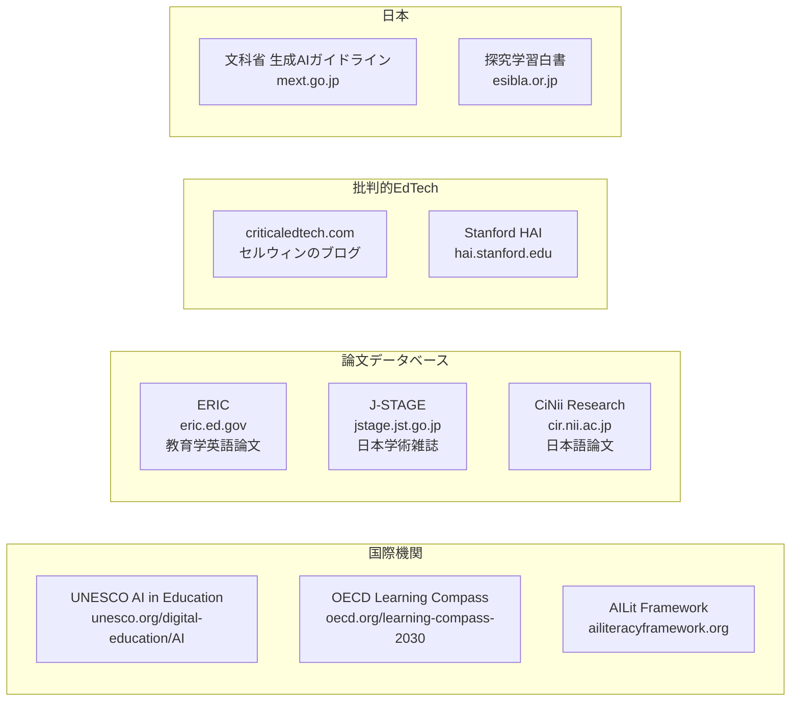

---

## 第4部：2025年の最重要トレンド

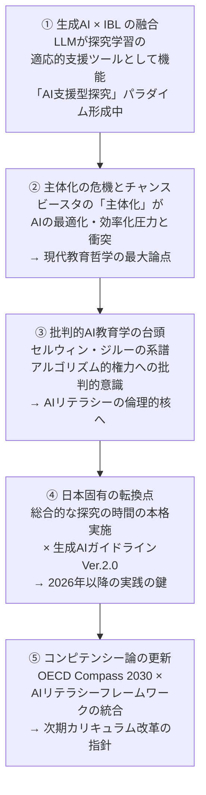

---

## 自分の探究との接続（KAEL への示唆）

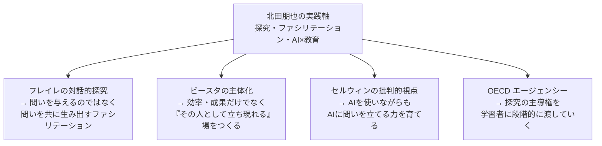

---

## 関連ノート

- [[探究学習の理論・エビデンス総覧]]
- [[ファシリテーションの理論]]
- [[KAEL 活動記録]]
- [[総合的な探究の時間 実践メモ]]
