---
tags:
  - 探究
  - 方法論
  - AI×教育
  - ファシリテーション
  - 教育政策
created: 2026-03-16
updated: 2026-03-16
---

# 探究学習の理論・エビデンス総覧

> **このノートについて**
> 探究学習（Inquiry-Based Learning / IBL）の理論的基盤・主要モデル・国際研究・日本の実践・批判まで、一次文献を参照しながら体系的にまとめた参照ノート。

---

## 目次

1. [[#理論的基盤：5人の巨人]]
2. [[#探究のレベル分類]]
3. [[#主要モデル：5EモデルとPOEモデル]]
4. [[#探究のプロセス・サイクル]]
5. [[#重要論文・研究 厳選20件]]
6. [[#エビデンス：メタ分析のまとめ]]
7. [[#日本の探究学習：総合的な探究の時間]]
8. [[#批判・限界・課題]]
9. [[#現代のコンセンサス]]

---

## 理論的基盤：5人の巨人

探究学習の思想は20世紀初頭から積み重なってきた構成主義の系譜に立つ。

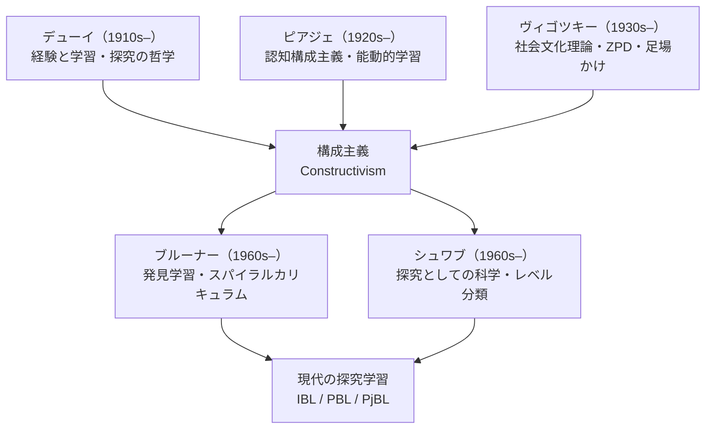

### ジョン・デューイ（John Dewey, 1859–1952）

**主著：**
- *How We Think*（1910）— 反省的思考（reflective thinking）の5段階を提唱
- *Experience and Education*（1938）— 経験主義教育の理論的集大成

**核心メッセージ：**
「学習とは経験の再構成である」。科学は記憶すべき事実ではなく、思考・探究の**方法**として教えられるべき。

> *"Learning by doing"*（実践による学習）

---

### ジャン・ピアジェ（Jean Piaget, 1896–1980）

**核心概念：**

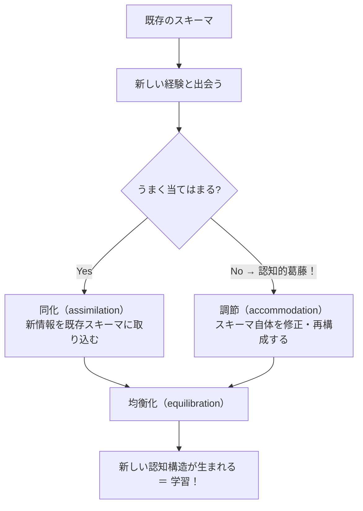

探究活動が「認知的葛藤」を生み、調節を促すことで深い学習が起きる。

---

### レフ・ヴィゴツキー（Lev Vygotsky, 1896–1934）

**最近接発達領域（ZPD）：**

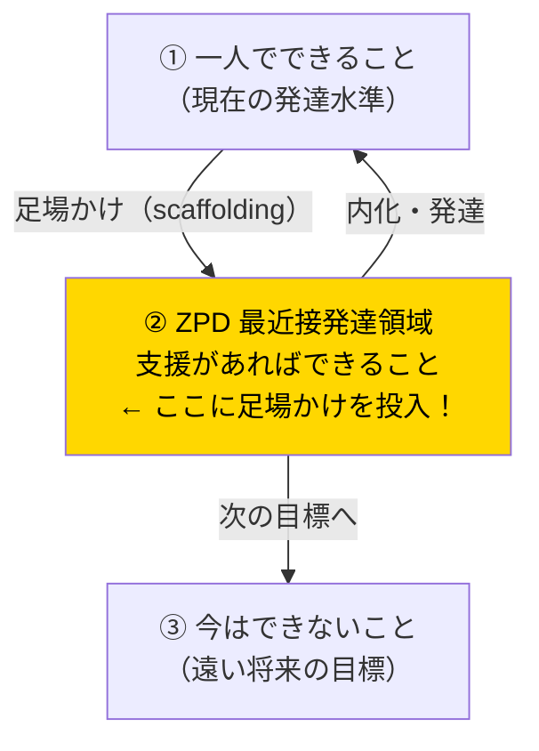

IBL における教師・仲間・ツールによる**足場かけ（scaffolding）**の理論的根拠。
（"scaffolding" の概念化：Wood, Bruner & Ross, 1976）

---

### ジェローム・ブルーナー（Jerome Bruner, 1915–2016）

**発見学習とスパイラルカリキュラム：**

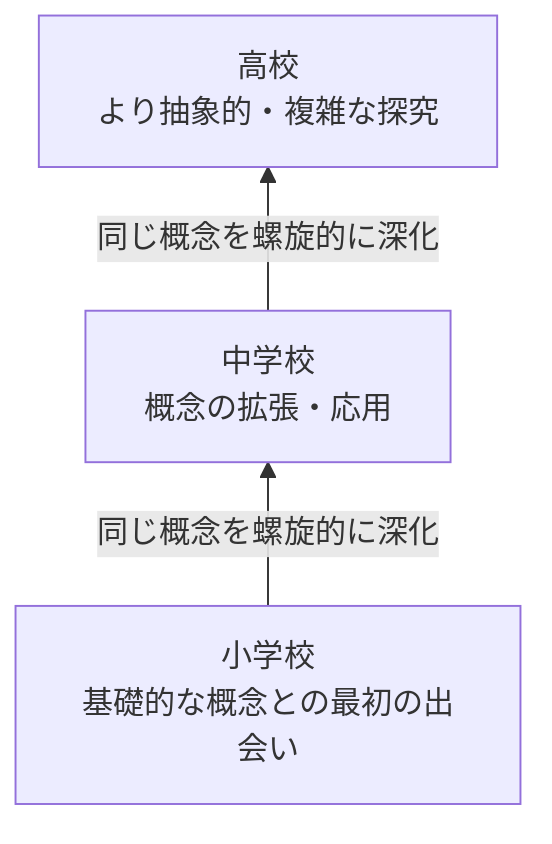

同じ概念を発達段階に合わせて**螺旋的に深化**させる設計原理。*The Process of Education*（1960）で提唱。

---

### ジョセフ・シュワブ（Joseph Schwab, 1909–1988）

「**探究としての科学（science as inquiry）**」を体系化。探究レベルの分類（後述）の先駆者。1960年代 BSCS（生物科学カリキュラム研究）プロジェクトに直接反映。

---

## 探究のレベル分類

**Banchi, H., & Bell, R. (2008). "The Many Levels of Inquiry." *Science and Children*, 46(2), 26–29.**

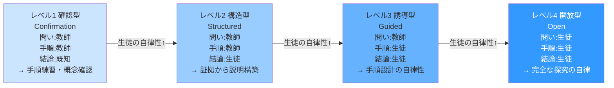

> **実践上の推奨：** 低レベルから始め、生徒の習熟に合わせて段階的に開放型へ移行する。日本の現行実践の多くは「誘導型（レベル3）」に相当。

---

## 主要モデル：5EモデルとPOEモデル

### 5E モデル（Bybee et al., BSCS, 1987）

最も広く普及した授業設計モデル。Rodger Bybee が開発。

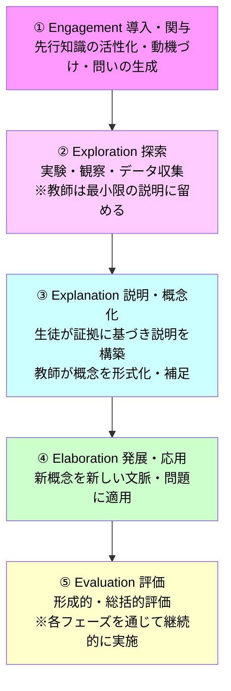

**エビデンス：** Polanin et al. (2024) のメタ分析で効果量 **g = 0.82**（通常授業と比較）。

---

### POE モデル（White & Gunstone, 1992）

**Predict（予測）→ Observe（観察）→ Explain（説明）**

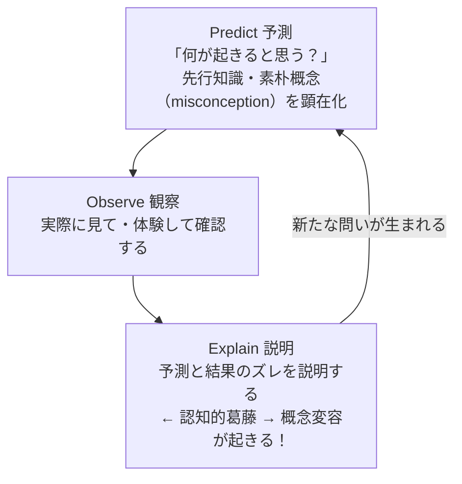

**特徴：** 子どもの「思い込み（misconception）」を授業の出発点にできる。理科の実験・示範（demonstration）に特に有効。

---

### IBL・PBL・PjBL の比較

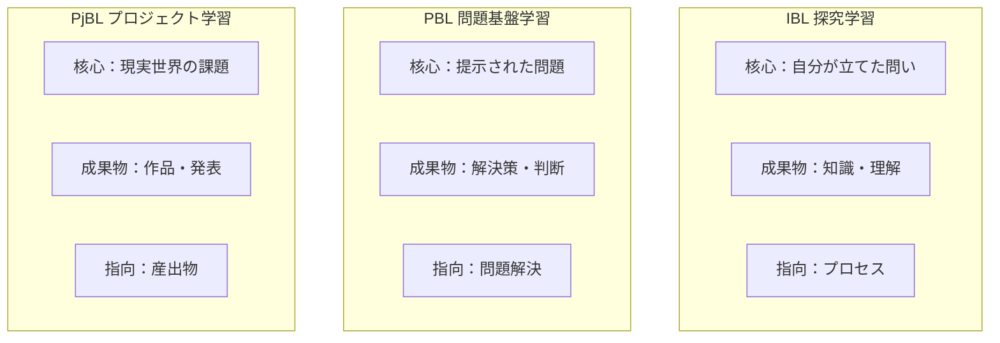

---

## 探究のプロセス・サイクル

### 国際標準モデル（Pedaste et al., 2015）

**Pedaste, M. et al. (2015). "Phases of inquiry-based learning: Definitions and the inquiry cycle." *Educational Research Review*, 14, 47–61.**

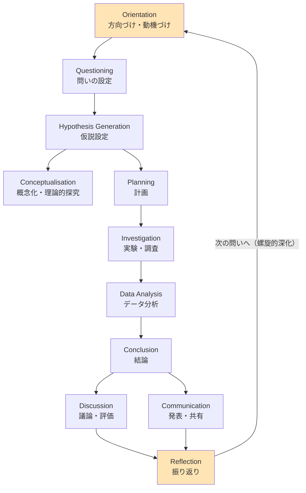

### 日本版（学習指導要領準拠）

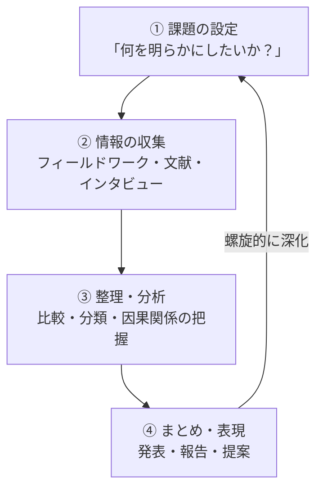

### NRC が定めた科学的探究の5本質的特徴

*National Research Council (2000). Inquiry and the National Science Education Standards.*

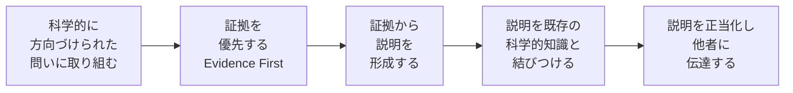

---

## 重要論文・研究 厳選20件

### メタ分析・研究統合（最重要）

| # | 著者・年 | タイトル（略） | 雑誌 | 主な知見 |
|---|---------|--------------|------|---------|
| 1 | **Lazonder & Harmsen (2016)** | Meta-Analysis of IBL: Effects of Guidance | *Review of Educational Research* | 72研究・足場かけが学習成果（d=0.50〜0.71）に有効 |
| 2 | **Furtak et al. (2012)** | Experimental & Quasi-Experimental Studies of IBL Science Teaching | *Review of Educational Research* | 37研究・全体 d=0.50・認識論的活動が最大効果 |
| 3 | **Minner et al. (2010)** | IBL Science Instruction—What Is It and Does It Matter? | *JRST* | 138研究（1984–2002）・能動的思考が概念理解に有効 |
| 4 | **Polanin et al. (2024)** | Effects of the 5E Instructional Model | *AERA Open* | 5E の効果量 g=0.82 |
| 5 | **Kaçar et al. (2021)** | Effect of IBL on Academic Success | *IJELS* | 高校段階で最大効果 |
| 6 | **批判的思考メタ分析 (2023)** | IBL on Critical Thinking in Science | *EJMSTE* | 25論文・批判的思考への効果量 d=1.27（大効果） |
| 7 | **概念理解メタ分析 (2025)** | Effectiveness of IBL on Conceptual Understanding | ResearchGate | 12研究・g=0.913、開放型 g=1.530 |

---

### 理論的・基礎的研究

| # | 著者・年 | タイトル（略） | 主な知見 |
|---|---------|--------------|---------|
| 8 | **Dewey (1910)** | *How We Think* | 反省的思考の5段階 |
| 9 | **Schwab (1962)** | Teaching of Science as Enquiry | 探究3レベル分類の原典 |
| 10 | **Bruner (1960)** | *The Process of Education* | スパイラルカリキュラム |
| 11 | **NRC (2000)** | *Inquiry and the National Science Education Standards* | 科学的探究の5本質的特徴 |
| 12 | **Bransford et al. (2000)** | *How People Learn* | 認知科学と探究の統合 |
| 13 | **Pedaste et al. (2015)** | Phases of inquiry-based learning | 探究11フェーズの体系化 |
| 14 | **Banchi & Bell (2008)** | The Many Levels of Inquiry | 4レベル探究分類の標準文献 |
| 15 | **Bybee (2014)** | The BSCS 5E Instructional Model: Reflections | 5E 開発者自身の省察 |

---

### 批判・論争・応用研究

| # | 著者・年 | タイトル（略） | 主な知見 |
|---|---------|--------------|---------|
| 16 | **Kirschner, Sweller & Clark (2006)** | Why Minimal Guidance Does Not Work | **最重要批判論文**：認知負荷理論から IBL を批判 |
| 17 | **Hmelo-Silver et al. (2007)** | Scaffolding and Achievement: Response to Kirschner | Kirschner への反論：IBL は高度に構造化されている |
| 18 | **Tanchuk (2020)** | Is Inquiry Learning Unjust? | 認知負荷・公正性の観点からの批判 |
| 19 | **Zhang et al. (2022)** | Evidence-Based Rationale for Direct Instruction | 直接教授法の優位性を再主張 |
| 20 | **Letina (2023)** | The Case for Combining IBL and Direct Instruction | 両者統合のエビデンス整理（最新） |

---

## エビデンス：メタ分析のまとめ

### 主要メタ分析の効果量比較

> Cohen's d / Hedges' g の目安：小 = 0.2 ／ 中 = 0.5 ／ 大 = 0.8

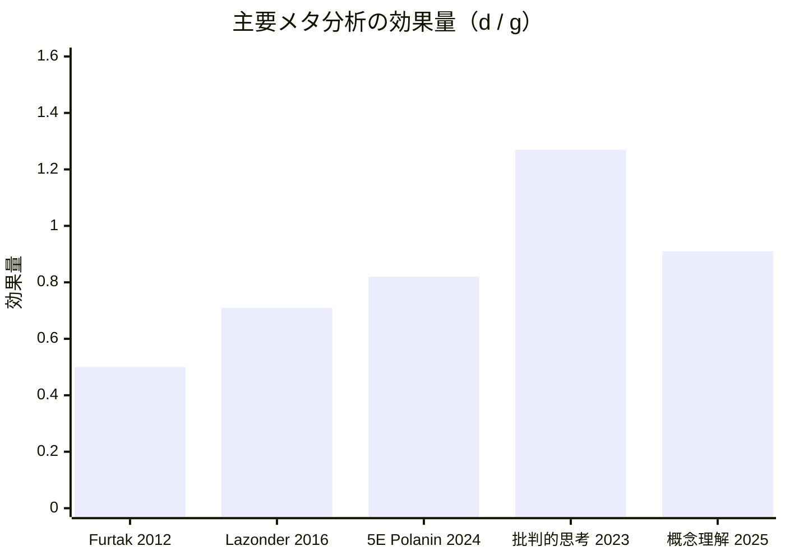

### 効果が現れやすい条件

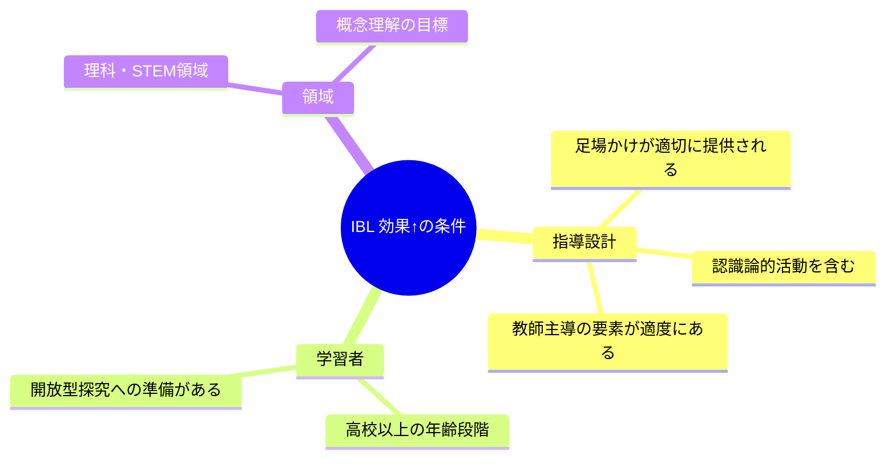

---

## 日本の探究学習：総合的な探究の時間

### 制度的経緯

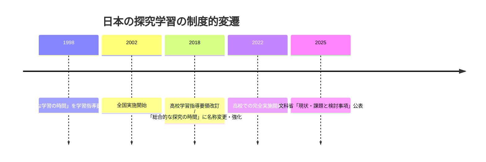

### 「学習の時間」と「探究の時間」の相違

| 観点 | 総合的な**学習**の時間（小・中） | 総合的な**探究**の時間（高） |
|------|-------------------------------|--------------------------|
| 焦点 | 課題解決能力・生き方 | 自己の在り方生き方と一体的な課題探究 |
| 問いの出どころ | 与えられた文脈も可 | 生徒自身が実社会から問いを見出す |
| 深化の方向 | 問題解決重視 | 問い発見→探究サイクルの深化 |
| 自律性 | 段階的 | より高い自律性を期待 |

### 国際 IBL 理論との接続点

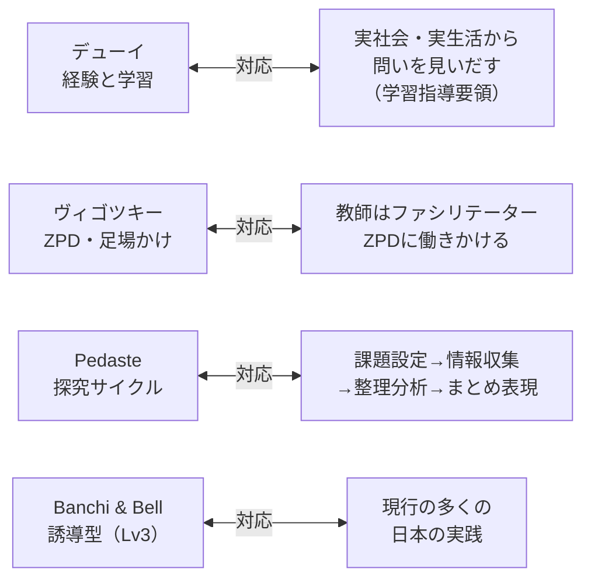

### 現状と課題（NPOカタリバ 2024年調査：全国高校教員340名対象）

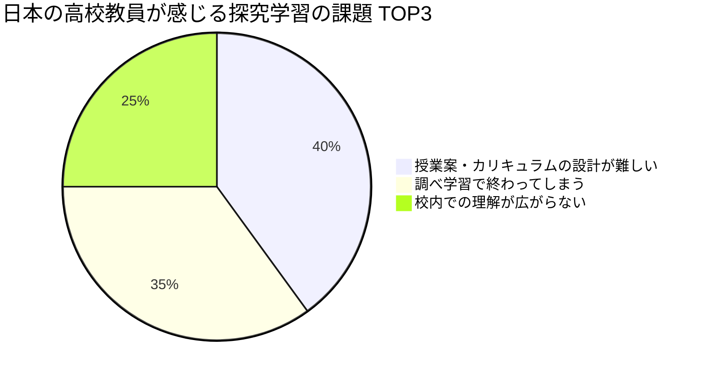

> **「調べ学習で終わる」問題**は、Pedaste の探究サイクルでいう **Analysis（分析）→ Conclusion（結論）→ Reflection（振り返り）** のフェーズが抜け落ちている状態。問いと証拠を結びつける「認識論的活動」の不足（Furtak et al., 2012 が指摘する最重要要素）。

---

## 批判・限界・課題

### 最大の批判：認知負荷理論からの攻撃

**Kirschner, Sweller & Clark (2006). "Why Minimal Guidance During Instruction Does Not Work."**
*Educational Psychologist*, 41(2), 75–86.

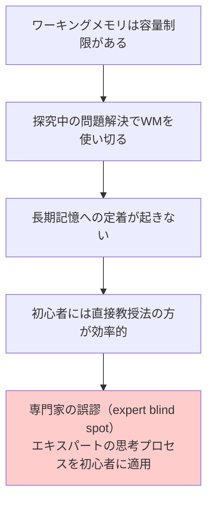

**反論（Hmelo-Silver et al., 2007）：**
> IBL・PBL は「最小限ガイダンス」ではなく、**高度に構造化され足場かけを多用したアプローチ**である。Kirschner らの批判は不当な一括化。

---

### その他の主要な課題

| 課題の種類 | 内容 |
|-----------|------|
| **研究の質** | 小規模・単一学校・短期間の研究が多い。「探究学習」の定義が研究間で不統一 |
| **公平性** | 低SES・ELL・特別支援生徒は探究に必要な背景知識・メタ認知スキルを持ちにくい（Tanchuk, 2020） |
| **実施コスト** | 教師の高度なファシリテーション能力が必要。時間的コストが大きい |
| **評価の困難** | プロセス評価のツール・リテラシー不足 |
| **学習段階依存** | 初等教育段階では効果量が小さくなる傾向 |
| **領域依存** | 理科・STEM 以外の領域では研究・エビデンスが薄い |

---

## 現代のコンセンサス

### 「IBL か直接教授法か」の二項対立を超えて

最新の研究コンセンサス（Letina, 2023）は**「両者の統合」**に向かっている。

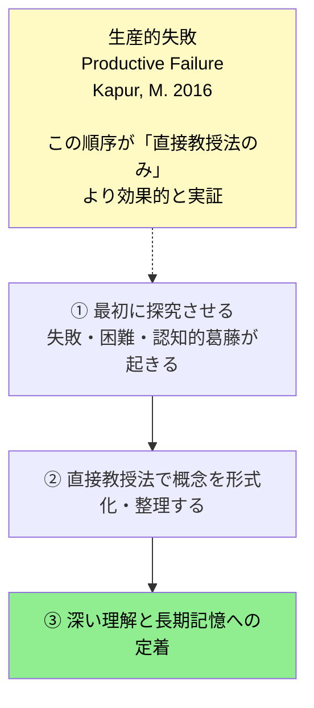

### 実践へのインプリケーション

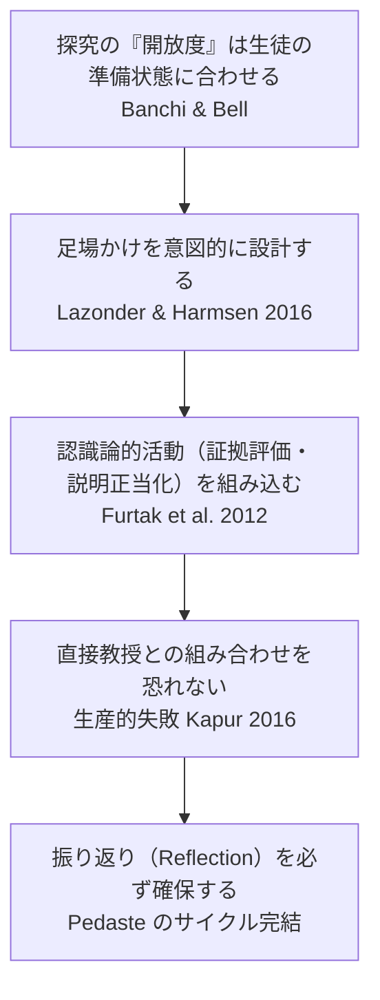

---

## 参考文献（主要なもの）

- Dewey, J. (1910). *How We Think*. D.C. Heath.
- Dewey, J. (1938). *Experience and Education*. Kappa Delta Pi.
- Bruner, J. (1960). *The Process of Education*. Harvard University Press.
- Schwab, J. J. (1962). The Teaching of Science as Enquiry. In *The Teaching of Science*. Harvard University Press.
- Wood, D., Bruner, J. S., & Ross, G. (1976). The role of tutoring in problem solving. *Journal of Child Psychology and Psychiatry*, 17(2), 89–100.
- White, R., & Gunstone, R. (1992). *Probing Understanding*. Falmer Press.
- NRC (2000). *Inquiry and the National Science Education Standards*. National Academies Press.
- Bransford, J. D. et al. (Eds.) (2000). *How People Learn*. National Academies Press.
- Hmelo-Silver, C. E. (2004). Problem-Based Learning: What and How Do Students Learn? *Educational Psychology Review*, 16(3).
- Kirschner, P. A., Sweller, J., & Clark, R. E. (2006). Why Minimal Guidance During Instruction Does Not Work. *Educational Psychologist*, 41(2).
- Hmelo-Silver, C. E., Duncan, R. G., & Chinn, C. A. (2007). Scaffolding and Achievement in Problem-Based and Inquiry Learning. *Educational Psychologist*, 42(2).
- Banchi, H., & Bell, R. (2008). The Many Levels of Inquiry. *Science and Children*, 46(2).
- Minner, D. D. et al. (2010). Inquiry-Based Science Instruction. *JRST*, 47(4).
- Furtak, E. M. et al. (2012). Experimental and Quasi-Experimental Studies of Inquiry-Based Science Teaching. *Review of Educational Research*, 82(3).
- Bybee, R. W. (2014). The BSCS 5E Instructional Model. *Science and Children*, 51(8).
- Pedaste, M. et al. (2015). Phases of inquiry-based learning. *Educational Research Review*, 14.
- Lazonder, A. W., & Harmsen, R. (2016). Meta-Analysis of Inquiry-Based Learning. *Review of Educational Research*, 86(3).
- Kapur, M. (2016). Examining Productive Failure. *Educational Psychologist*, 51(2).
- Tanchuk, N. (2020). Is Inquiry Learning Unjust? *Journal of Philosophy of Education*, 54(4).
- Kaçar, M. et al. (2021). The Effect of IBL on Academic Success. *IJELS*.
- Zhang, W. et al. (2022). Evidence-Based Rationale for Direct Explicit Instruction. *Educational Psychology Review*, 34.
- EJMSTE (2023). The effect of IBL on students' critical thinking skills. *Eurasia Journal of Mathematics, Science and Technology Education*.
- Letina, A. (2023). Let's talk evidence – The case for combining IBL and direct instruction. ScienceDirect.
- Polanin, J. R. et al. (2024). Effects of the 5E Instructional Model. *AERA Open*.
- ResearchGate (2025). Effectiveness of IBL on Improving Students' Conceptual Understanding. Meta-Analysis.
- F1000Research (2024). Systematic review of inquiry-based learning: assessing impact and best practices.

---

## 関連ノート

- [[ファシリテーションの理論]]
- [[KAEL 活動記録]]
- [[総合的な探究の時間 実践メモ]]
