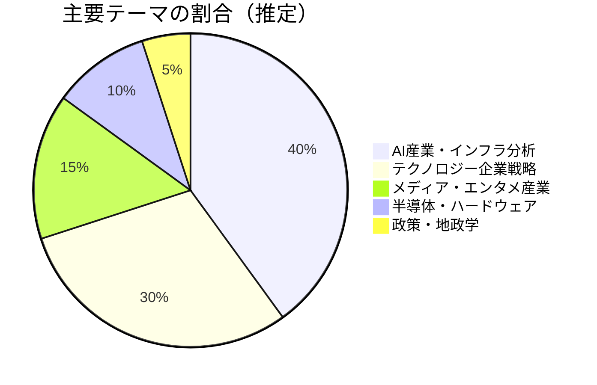
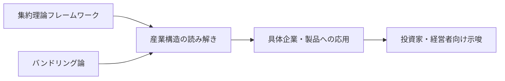

---
tags:
  - Ben Thompson
  - テック戦略
  - AI産業
  - ブログレポート
  - 英語
created: 2026-03-19
updated: 2026-03-19
著者: Ben Thompson
source: "https://stratechery.com"
---

# Ben Thompson ブログ概要レポート
## Stratechery

> [!info] ブログ情報
> - **URL**：[stratechery.com](https://stratechery.com)
> - **形式**：週次記事 + 毎日メール（Daily Update）+ Podcast
> - **料金**：有料制（Passportメンバーシップ）
> - **調査日**：2026-03-19

---

## 📊 ブログの全体傾向

---

## 📝 最近の主要記事（2026-03）

### 1. Jensen Huang and Andy Grove, Groq LPUs and Vera CPUs, Hotel California（2026-03-18）
**主張**：NvidiaがGTC 2026で「単一GPU依存からマルチアーキテクチャ戦略」へシフトを発表。Andy Grove（Intelの伝説的CEO）と比較しながら、戦略転換の意味を分析。「Hotel California戦略（一度入ったら出られない）」の罠についても考察。

### 2. An Interview with Nvidia CEO Jensen Huang About Accelerated Computing（2026-03-17）
**内容**：Jensen Huang独占インタビュー。AIが人間が作ったツールをどう加速するか、エージェント型AIにおけるCPUの役割、GroqのNvidiaによる買収の意図などを詳解。

### 3. Agents Over Bubbles（2026-03-16）
**主張**：「AIはバブルではない」という強い主張。AIエージェントは大量消費者採用がなくてもエンタープライズの生産性向上だけで計算需要を正当化できる。モデルのコモディティ化懸念に対し「モデル×ハーネス統合が差別化要因」と反論。

### 4. 2026.11: Winners, Losers, and the Unknown（2026-03-13）
**内容**：週次ラウンドアップ。AIバリューチェーンの統合・分離の動向、バスケットボール分析へのAI活用、中国AI政策の含意を論じる。

### 5. An Interview with Robert Fishman About Hollywood（2026-03-12）
**内容**：Netflix・Paramount・YouTube・Disney・Amazonの現在のポジショニング分析。AIがコンテンツ産業にどう影響するかを産業構造から読む。

---

## 🔍 思想的立場と特徴

- **「AIバブル論」への強力な反論者**：エンタープライズ需要に基づく構造的変化として捉える
- **インフラレイヤーへの注目**：モデルより「誰がモデルを動かすインフラを握るか」を重視
- **独立系アナリストの矜持**：企業広告・スポンサーに依存せず有料購読で運営
- **歴史的類推の多用**：アンディ・グローブ、Intelの戦略転換など過去事例との比較で現在を読む

---

## 💭 北田視点からの考察メモ

> **教育×AIへの接続ポイント**：
> Thompsonの「誰がインフラ（関数）を握るか」という問いは、
> 安宅の「関数主権」論と響き合う。
> 教育でも「誰が学習データを持ち、誰がアルゴリズムを設定するか」は
> 今後の重大な権力問題になり得る。
> AI産業の動向を教育視点から読むための「経済合理性の語彙」として有用。

---

## 🔗 関連ノート

<!-- [[集約理論]] [[AIインフラ]] [[関数主権]] [[AI産業構造]] -->
