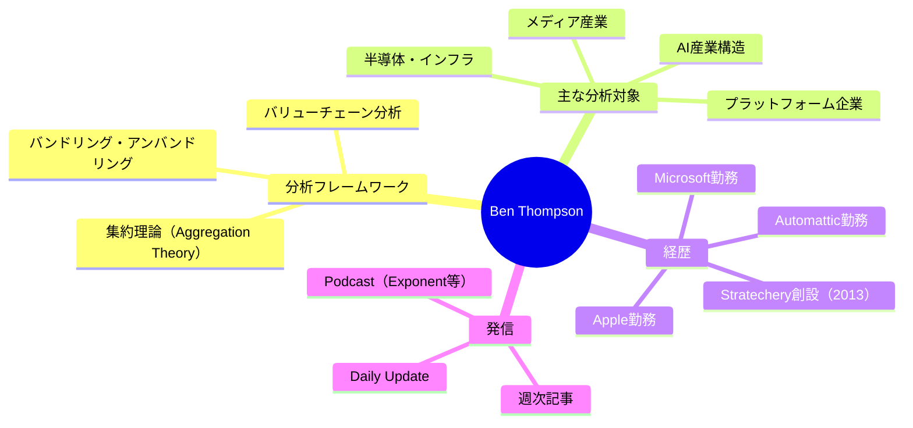

---
tags:
  - Ben Thompson
  - テック戦略
  - AI産業
  - ビジネス分析
  - 英語
  - 人物
created: 2026-03-19
updated: 2026-03-19
著者: Ben Thompson
---

# Ben Thompson（ベン・トンプソン）

> [!info] 基本情報
> - **肩書き**：Stratechery 創設者・著者
> - **ブログ**：[Stratechery](https://stratechery.com)
> - **専門**：テクノロジービジネス戦略・産業分析・メディア論

---

## 👤 人物概要

ウィスコンシン大学卒業後、Apple・Microsoft・Automatticなどで勤務。2013年にStratecheryを創設し、テクノロジー企業の戦略・ビジネスモデル分析を専門とする独立系アナリストとして活動。台湾在住。週次記事＋毎日メールアップデートという独自モデルで、テック業界で最も読まれるニュースレターのひとつに成長させた。「集約理論（Aggregation Theory）」の提唱者として知られ、GAFA等のプラットフォーム支配を説明するフレームワークを確立した。

---

## 🧠 専門領域と思想

---

## 📚 主な概念・フレームワーク

| 概念 | 概要 |
|------|------|
| **集約理論（Aggregation Theory）** | Googleなどが「ユーザーとサプライヤーの間に立つ集約者」として独占的地位を得るメカニズムを説明 |
| **バンドリング論** | テクノロジーの歴史はバンドル（統合）とアンバンドル（分離）の繰り返しであるという理論 |

---

## 💡 現在の主な関心テーマ

- **AIバブル vs パラダイムシフト論**：「エージェント時代」はバブルではなく構造転換と主張
- **NvidiaとAIインフラ**：GPUアーキテクチャとAI産業の競争構造
- **モデルのコモディティ化問題**：モデル単体でなく「モデル×ハーネス」が差別化要因になるという視点
- **エンタープライズAI採用**：消費者ではなく企業のAI活用が計算需要の主ドライバー

---

## 🔗 関連ノート

<!-- [[集約理論]] [[AIインフラ]] [[プラットフォーム戦略]] -->
