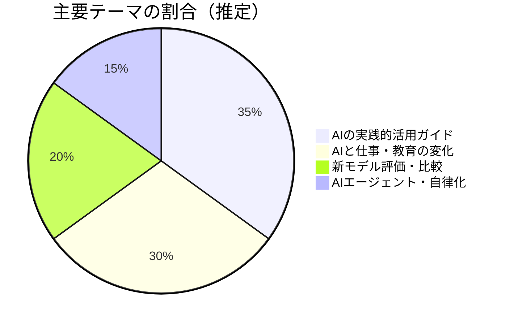
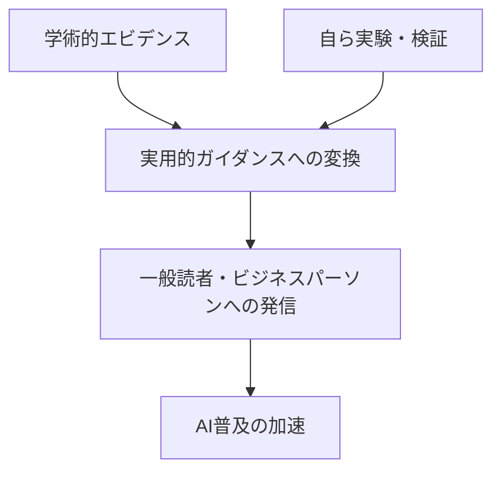

---
tags:
  - Ethan Mollick
  - AI
  - 教育
  - ブログレポート
  - 英語
created: 2026-03-19
updated: 2026-03-19
著者: Ethan Mollick
source: "https://www.oneusefulthing.org"
---

# Ethan Mollick ブログ概要レポート
## One Useful Thing

> [!info] ブログ情報
> - **URL**：[oneusefulthing.org](https://www.oneusefulthing.org)
> - **読者数**：40万人以上
> - **料金**：月$10 / 年$100（無料記事あり）
> - **調査日**：2026-03-19

---

## 📊 ブログの全体傾向

---

## 📝 最近の主要記事

### 1. The Shape of the Thing（2026-03-12）
**主張**：AI時代は「コインテリジェンス（人間とAIの往復）」から、AIエージェントが数時間分の作業を自律的に完了する時代へ移行した。StrongDMの「Software Factory」（AIが書き・テスト・デプロイを自律実行）を例示。再帰的自己改善ループが主要AI企業のロードマップに明記されている現実を指摘。

### 2. A Guide to Which AI to Use in the Agentic Era（2026-02-18）
**内容**：エージェント時代における「どのAIを、どのタスクに使うか」の実践ガイド。チャットボット的使い方から複合システムへの移行を解説。

### 3. GPT-5: It Just Does Stuff（2025-08-07）
**内容**：GPT-5のリリースを受けた評価記事。「ただこなす」という表現で、以前のモデルと異なる実用性の変化を簡潔に指摘。

---

## 🔍 思想的立場と特徴

- **楽観的・実証的スタンス**：AIの危険性より「どう使うか」に重点。証拠に基づく前向きな評価
- **エージェント時代への明確な認識**：「もはやチャットボット時代ではない」という転換点の言語化が明快
- **教授らしい「フレームワーク提供」**：概念を整理して読者が応用しやすい形に落とし込む
- **自分で全て書く**：AI補助はドラフト完成後のみという姿勢（自らのスタンス表明）

---

## 💭 北田視点からの考察メモ

> **教育×AIへの接続ポイント**：
> Mollickの「エージェント時代への移行」論は、KAELが扱う「AI×教育」の最前線に直結する。
> 「子どもが時間をかけてやっていた作業をAIエージェントが数分でこなす時代」に、
> 学校が教えるべきことは何か、という問いへの示唆に富む。
> 『Co-Intelligence』の邦訳が出れば、保護者・教員向けブックガイドに加えたい。

---

## 🔗 関連ノート

<!-- [[Co-Intelligence]] [[AIエージェント]] [[AI×教育]] [[探究学習×AI]] -->
