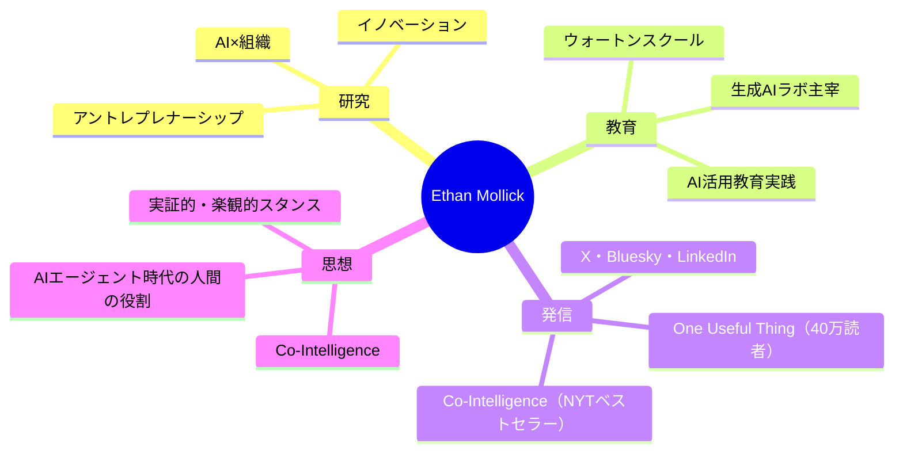

---
tags:
  - Ethan Mollick
  - AI
  - 教育
  - 経営学
  - 英語
  - 人物
created: 2026-03-19
updated: 2026-03-19
著者: Ethan Mollick
---

# Ethan Mollick（イーサン・モリック）

> [!info] 基本情報
> - **肩書き**：ペンシルバニア大学ウォートン校 教授
> - **ブログ**：[One Useful Thing](https://www.oneusefulthing.org)
> - **専門**：起業家精神・イノベーション・AI×教育・経営学

---

## 👤 人物概要

ペンシルバニア大学ウォートン校でアントレプレナーシップ（起業家精神）とイノベーションを専門とする経営学教授。ウォートン生成AIラボを主宰し、AIが仕事・教育・組織に与える影響を実証的に研究。ニューヨーク・タイムズベストセラー『Co-Intelligence』の著者。ニュースレター「One Useful Thing」は40万人以上の読者を持ち、実践的なAI活用ガイドとして世界中で参照される。

---

## 🧠 専門領域と思想

---

## 📚 主な著書

| 著書 | 概要 |
|------|------|
| **『Co-Intelligence』**（2024） | AIと人間が「共に賢くなる」ための実践的・哲学的ガイド。NYTベストセラー |

---

## 💡 現在の主な関心テーマ

- **エージェント時代への移行**：チャットボット→自律エージェントへのパラダイムシフト
- **AIベンチマークの指数関数的進化**：能力向上の速度と社会への意味
- **仕事・雇用へのAI影響**：ホワイトカラー業務の自動化と人間の価値再定義
- **教育現場でのAI活用**：AIネイティブな学習環境の設計

---

## 🔗 関連ノート

<!-- [[Co-Intelligence]] [[AIエージェント]] [[AI×教育]] -->
