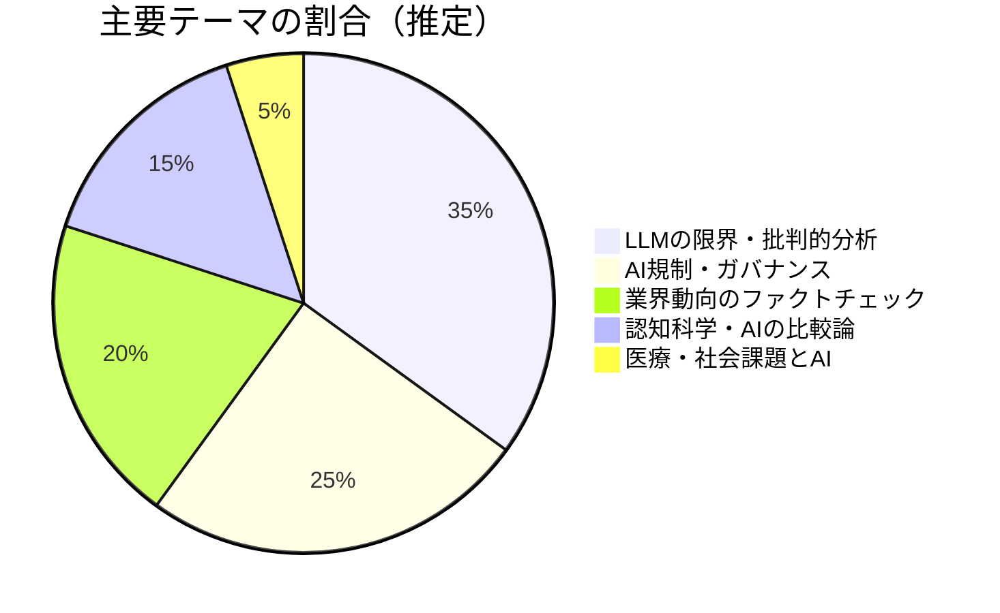
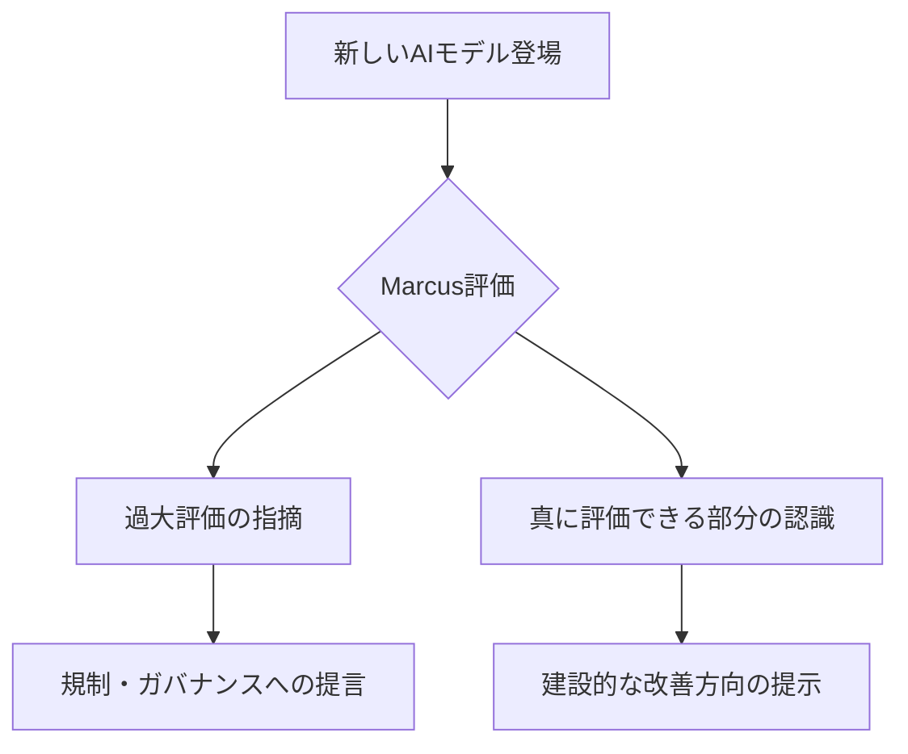

---
tags:
  - Gary Marcus
  - AI批評
  - 認知科学
  - ブログレポート
  - 英語
created: 2026-03-19
updated: 2026-03-19
著者: Gary Marcus
source: "https://garymarcus.substack.com"
---

# Gary Marcus ブログ概要レポート
## Marcus on AI（Substack）

> [!info] ブログ情報
> - **URL**：[garymarcus.substack.com](https://garymarcus.substack.com)
> - **無料読者数**：10万1,000人以上
> - **調査日**：2026-03-19

---

## 📊 ブログの全体傾向

---

## 📝 最近の主要記事

### 1. F Cancer（2026-03-16）
**主張**：がん研究へのAI活用の可能性を認めつつも、「完璧なAIがあっても戦いの一部に過ぎない」と釘を刺す。市場の失敗・科学的課題・技術的限界の三重苦を指摘。テクノソリューショニズム（技術で全て解決できるという楽観）への批判。

### 2. GPT-5: Overdue, overhyped and underwhelming（2025-08-09）
**主張**：GPT-5のリリースが期待より遅く、能力も誇大広告通りではなかったと批判。研究論文が指摘する課題を列挙し、「次世代モデルで解決」という繰り返しのパターンを問題視。

### 3. A knockout blow for LLMs?（2025-06-07）
**主張**：LLMの推論能力に関する批判的分析。「表面的なパターンマッチング」と「真の理解」の区別を問い続ける。

### 4. About that Matt Shumer post（2026-02-11）
**内容**：バイラルになったAI関連投稿の内容を検証。誇張や事実誤認を指摘し、AIコミュニティ内の情報の質を問題提起。

---

## 🔍 思想的立場と特徴

- **「AI懐疑派の代表」としての一貫性**：LLMが「真に理解している」わけではないという立場を堅持
- **科学的根拠を重視**：「研究論文が示すこと」と「業界のPR」を峻別
- **建設的批判**：AIを否定するのでなく「正しく評価すること」で社会への害を減らす姿勢
- **規制推進派**：テクノロジー企業の自主規制では不十分という立場

---

## 💭 北田視点からの考察メモ

> **教育×AIへの接続ポイント**：
> AIを教育に導入する際、Marcusの「批判的視点」は非常に重要なカウンターバランス。
> Mollickら楽観派と並べて読むことで、「AIで何ができて何ができないか」の
> より立体的な理解が得られる。
> 保護者・教員向けのAI教育講座では「楽観派・懐疑派」の両方を紹介したい。

---

## 🔗 関連ノート

<!-- [[LLMの限界]] [[AI規制]] [[AI×教育での批判的視点]] -->
