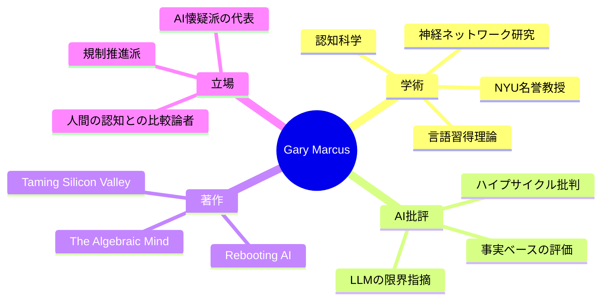

---
tags:
  - Gary Marcus
  - AI批評
  - 認知科学
  - 英語
  - 人物
created: 2026-03-19
updated: 2026-03-19
著者: Gary Marcus
---

# Gary Marcus（ゲーリー・マーカス）

> [!info] 基本情報
> - **肩書き**：ニューヨーク大学（NYU）名誉教授 / 認知科学者 / 起業家
> - **ブログ**：[Marcus on AI（Substack）](https://garymarcus.substack.com)
> - **専門**：認知科学・言語習得・AI批評・神経ネットワーク研究

---

## 👤 人物概要

認知科学・言語習得の研究者としてNYUで長年教鞭を執り、現在は名誉教授。AI分野における最も影響力のある批評家・公共知識人のひとりとして知られる。LLMの限界と過大評価を一貫して指摘し、AIブームに対して科学的根拠に基づく冷静な反論を発信し続けている。ニュースレター「Marcus on AI」は10万人超の読者を持つ。起業家としてもAI企業を設立した経験を持つ。

---

## 🧠 専門領域と思想

---

## 📚 主な著書

| 著書 | 概要 |
|------|------|
| **『Rebooting AI』**（2019） | AIの現実と限界を解説。過大評価への警鐘 |
| **『Taming Silicon Valley』**（2024） | シリコンバレーのAI企業に対する規制・ガバナンスの必要性を論じる |
| **『The Algebraic Mind』** | 脳の計算モデルと記号処理の関係を探る認知科学書 |

---

## 💡 現在の主な関心テーマ

- **LLMの推論限界**：大規模言語モデルが「真の理解」をしているかへの疑問
- **AI規制・ガバナンス**：テクノロジー企業への民主的統制の必要性
- **がん研究×AI**：AIのポテンシャルを認めつつも「万能薬」幻想への批判
- **バイラル情報の検証**：AI業界の誇張・誤情報のファクトチェック

---

## 🔗 関連ノート

<!-- [[LLMの限界]] [[AI規制]] [[認知科学]] -->
