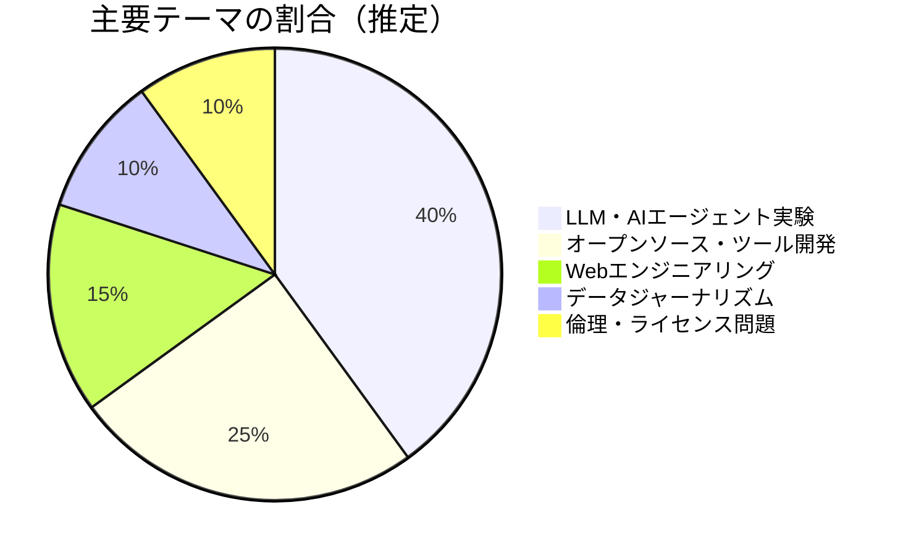
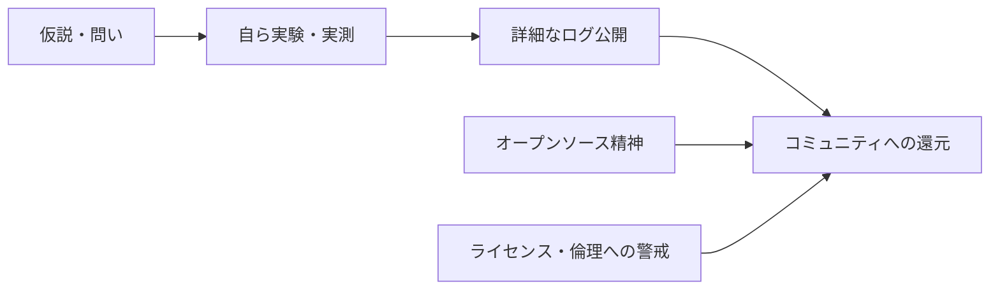

---
tags:
  - Simon Willison
  - AI
  - ソフトウェア開発
  - ブログレポート
  - 英語
created: 2026-03-19
updated: 2026-03-19
著者: Simon Willison
source: "https://simonwillison.net"
---

# Simon Willison ブログ概要レポート
## simonwillison.net

> [!info] ブログ情報
> - **URL**：[simonwillison.net](https://simonwillison.net)
> - **運営歴**：2002年〜（20年以上）
> - **更新頻度**：ほぼ毎日（日次）
> - **調査日**：2026-03-19

---

## 📊 ブログの全体傾向

---

## 📝 最近の主要記事（2026-03）

### 1. Autoresearching Apple's 'LLM in a Flash' to run Qwen 397B locally（2026-03-18）
**内容**：Claude Codeの「autoresearch」パターンを使って、AppleのフラッシュメモリLLM最適化論文を検証。48GB MacBook Pro M3 Maxで397Bパラメータモデルを5.5トークン/秒で動作させた実験記録。

### 2. GPT-5.4 mini and GPT-5.4 nano（2026-03-17）
**内容**：OpenAIの軽量モデルリリースを検証。76,000枚の写真説明を$52で処理できるコスト効率を実測レポート。

### 3. Introducing Mistral Small 4（2026-03-16）
**内容**：119Bパラメータ統合モデルの特性分析。推論能力とマルチモーダル対応の統合を実験。

### 4. Coding agents for data analysis（2026-03-16）
**内容**：NICAR 2026ワークショップ資料。ジャーナリスト向けにデータ分析エージェントの活用方法を体系化したガイド。

### 5. Use subagents and custom agents in Codex（2026-03-16）
**内容**：OpenAI Codexのサブエージェント機能の実用化レポート。自律的なコーディングエージェントの構造を解説。

---

## 🔍 思想的立場と特徴

- **「やってみた」の詳細記録主義**：コストや速度を実測した具体的数値の公開が信頼を生む
- **エンジニア向けの高密度情報**：ビジネス論より技術実装の詳細に重点
- **AI×ジャーナリズムの先駆的実践**：データジャーナリストへのAIエージェント活用支援
- **倫理的懸念の継続的提起**：ライセンス・著作権・AI生成コードの品質問題を繰り返し指摘

---

## 💭 北田視点からの考察メモ

> **教育×AIへの接続ポイント**：
> Willisonのブログは「探究学習の実況中継」とも言える。
> 問いを立て → 実験し → ログを残し → 公開する、という姿勢は
> KAELが子どもたちに育てたい「探究的な学び方」そのもの。
> 英語の壁はあるが、探究的実践のモデルケースとして紹介できる。

---

## 🔗 関連ノート

<!-- [[Claude Code]] [[LLM実験]] [[探究学習の実践]] -->
