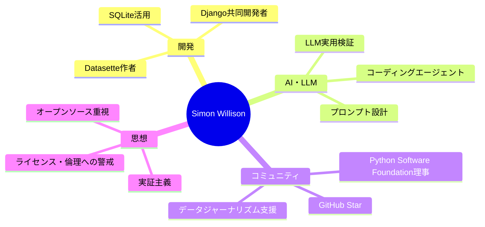

---
tags:
  - Simon Willison
  - AI
  - ソフトウェア開発
  - オープンソース
  - 英語
  - 人物
created: 2026-03-19
updated: 2026-03-19
著者: Simon Willison
---

# Simon Willison（サイモン・ウィリソン）

> [!info] 基本情報
> - **肩書き**：独立系オープンソース開発者 / Datasette 作者
> - **ブログ**：[simonwillison.net](https://simonwillison.net)（2002年〜）
> - **専門**：データツール・LLM・Webエンジニアリング・データジャーナリズム

---

## 👤 人物概要

20年以上にわたりブログを書き続けるベテランエンジニア。Djangoウェブフレームワークの共同開発者として知られ、現在はデータ探索・公開ツール「Datasette」をフルタイムで開発するオープンソース開発者。Python Software Foundation理事・GitHub Star。LLMとAIエージェントの実務的な活用・検証情報の発信者として、エンジニアリングコミュニティで高い信頼を得ている。技術的な検証を自ら行い、詳細なログとともに公開するスタイルが特徴。

---

## 🧠 専門領域と思想

---

## 📚 主な成果物

| 成果物 | 概要 |
|--------|------|
| **Datasette** | SQLiteデータベースをブラウザで探索・公開できるオープンソースツール |
| **Django**（共同開発） | Pythonの主要Webフレームワーク。2005年リリース以来、世界標準に |
| **simonwillison.net** | 2002年から続く技術ブログ。LLM検証記事は世界中で参照される |

---

## 💡 現在の主な関心テーマ

- **コーディングエージェント（Claude Code / Codex）**：自律的なコード開発の実用化
- **ローカルLLM実行**：397Bパラメータモデルを個人PCで動かす最適化技術
- **AI×データジャーナリズム**：ジャーナリストがデータ分析エージェントを使う未来
- **ライセンスとAI倫理**：AIによる「ポーティング」が引き起こす法的・倫理的問題

---

## 🔗 関連ノート

<!-- [[Claude Code]] [[LLM]] [[オープンソース]] -->
