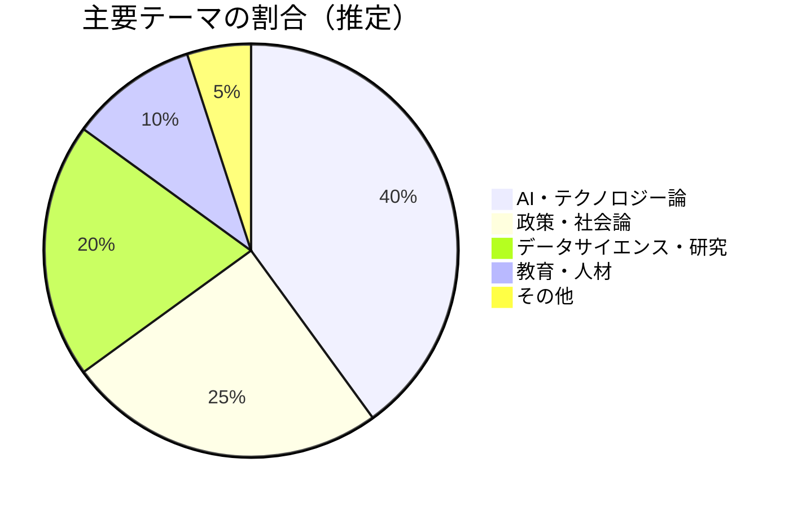
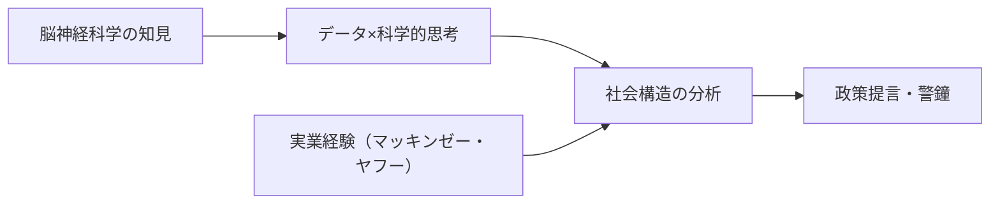

---
tags:
  - 安宅和人
  - AI
  - 教育政策
  - ブログレポート
created: 2026-03-19
updated: 2026-03-19
著者: 安宅和人
source: "https://kaz-ataka.hatenablog.com"
---

# 安宅和人 ブログ概要レポート
## ニューロサイエンスとマーケティングの間

> [!info] ブログ情報
> - **URL**：[kaz-ataka.hatenablog.com](https://kaz-ataka.hatenablog.com)
> - **総記事数**：296記事（263日分）
> - **調査日**：2026-03-19

---

## 📊 ブログの全体傾向

---

## 📝 最近の主要記事（2026年）

### 1. AIの透明性とはなにか？（2026-03-18）
**主張**：AI透明性の本質はソースの完全な追跡ではなく、「観測可能性（observability）と操作可能性（operability）」の担保にある。スカーレット・ヨハンソンの声をめぐるOpenAI問題を引き合いに、AIシステムの依存関係を統計的に測定・管理できる仕組みが重要と論じる。

### 2. 第六の象限（2026-03-06）
**主張**：産業競争のフレームワークを拡張し、「AIプラットフォームが自ら最適化関数を定義する」第六の象限を提唱。Physical AIがこの力を物理世界に持ち込む点を警告。

### 3. 2026年は1984なのか（2026-03-04）
**主張**：現代のAIガバナンス問題をオーウェルの監視国家論と照合。政府とテクノロジー企業が「関数主権（誰がAIの目的関数を決めるか）」をめぐって争う構図を分析。

### 4. 閉じる世界と閉じない世界（2026-02-14）
**主張**：圧縮可能な価値（デジタル・サイバー）と不可逆・体験的価値（身体・現場）を峻別。20世紀型ホワイトカラー/ブルーカラーの区分を再考すべきと提言。

### 5. 関数主権（2026-02-12）
**主張**：医療・行政などの重要領域で「誰がAIの最適化関数を設定するか」が新たな権力問題になると指摘。AI時代の主権概念の再定義を論じる。

---

## 🔍 思想的立場と特徴

- **楽観でも悲観でもない「構造分析型」**：技術の善悪より「誰が何を決めるか」という権力・ガバナンス論に重心
- **概念の解像度が高い**：「関数主権」「Physical AI」など独自フレームで現象を切り取る
- **日本社会への言及が多い**：シン・ニホン以来の「日本のデータ・AI立国」という問題意識が通底

---

## 💭 北田視点からの考察メモ

> **教育×AIへの接続ポイント**：
> 「誰が子どもたちの学習目標（関数）を設定するか」というKAELの問いと、安宅の「関数主権」論は直結する。
> 探究学習の本質は「関数を子ども自身が設定する力」とも言える。

---

## 🔗 関連ノート

<!-- [[関数主権]] [[シン・ニホン]] [[AI×教育]] -->
