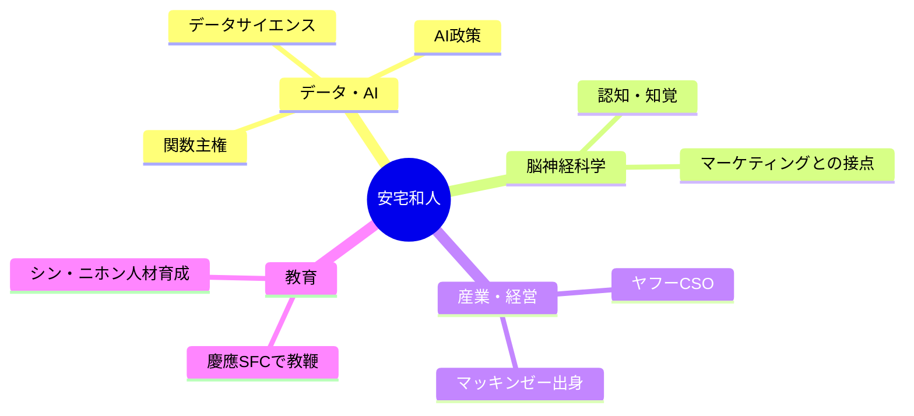

---
tags:
  - 安宅和人
  - AI
  - 教育政策
  - データサイエンス
  - 人物
created: 2026-03-19
updated: 2026-03-19
著者: 安宅和人
---

# 安宅和人（あたか かずと）

> [!info] 基本情報
> - **肩書き**：慶應義塾大学環境情報学部教授 / ヤフー株式会社 CSO（最高戦略責任者）
> - **ブログ**：[ニューロサイエンスとマーケティングの間](https://kaz-ataka.hatenablog.com)
> - **専門**：データサイエンス・AI政策・脳神経科学・マーケティング

---

## 👤 人物概要

東京大学大学院生物化学専攻修了後、マッキンゼー・アンド・カンパニーでコンサルタントとして活躍。その後、イェール大学で脳神経科学の博士号を取得。科学と実務の両領域を横断する稀有な知識人。ヤフーのCSO（最高戦略責任者）として日本のデジタル産業政策に関与しつつ、慶應SFCで次世代人材育成にも携わる。

---

## 🧠 専門領域と思想

---

## 📚 主な著書

| 著書 | 概要 |
|------|------|
| **『イシューからはじめよ』**（2010） | 「解くべき問いを正しく設定する」思考法。ビジネス・研究の必読書 |
| **『シン・ニホン』**（2020） | データ×AIで日本を再設計する構想。政策提言書として話題に |

---

## 💡 現在の主な関心テーマ

- **関数主権**：誰がAIの目的関数を決定するか、という権力・ガバナンス論
- **Physical AI**：デジタルを超えた物理世界へのAI展開
- **閉じる世界と閉じない世界**：不可逆・体験的価値 vs デジタルで代替可能な価値の二分論
- **AIの透明性**：ソースの完全な追跡ではなく「観測可能性・操作可能性」の担保

---

## 🔗 関連ノート

<!-- [[シン・ニホン]] [[関数主権]] [[AI×教育]] -->
