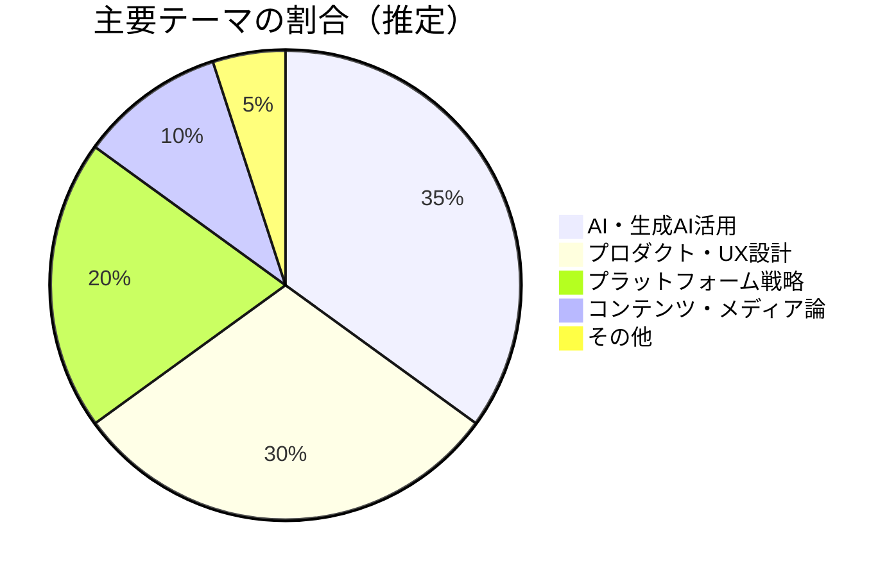
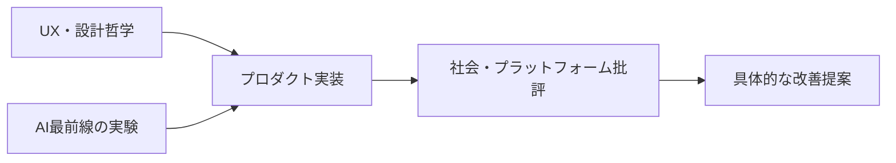

---
tags:
  - 深津貴之
  - AI
  - UX
  - プロダクト
  - ブログレポート
created: 2026-03-19
updated: 2026-03-19
著者: 深津貴之
source: "https://note.com/fladdict"
---

# 深津貴之 ブログ概要レポート
## note（fladdict）

> [!info] ブログ情報
> - **URL**：[note.com/fladdict](https://note.com/fladdict)
> - **総記事数**：446本
> - **フォロワー**：約78,500人
> - **調査日**：2026-03-19

---

## 📊 ブログの全体傾向

---

## 📝 最近の主要記事（2026年）

### 1. OpenClawを活用した全自動開発のメモ（2026-02-17）
**内容**：OpenClaw × Claude Codeによる完全自律型AIコーディングの実験記録。人間の介入なしにコードが書かれ・テストされ・デプロイされるプロセスを詳述。実践的ログとして非常に有益。

### 2. 思想よりも行動ベースでコンテンツのモデレーションをしよう（2026-02-12）
**主張**：コンテンツモデレーションは「思想・価値観の審査」ではなく「行動パターンの検出」を軸にすべきという設計哲学。プラットフォームが中立性を保つための実践論。

### 3. なぜnoteは「PV至上主義」と戦うのか（2026-01-24）
**主張**：PV（ページビュー）を最大化するアルゴリズムはクリエイターを搾取し、コンテンツの質を下げる。noteが「つながり・継続・深さ」を指標にする設計思想を解説。

### 4. noteの推しアルゴリズムについて（2026-01-21）
**内容**：noteが導入した「推し機能」の推薦ロジックを公開。「何を推薦するか」より「誰が誰を応援するか」という関係性を可視化する設計の意図を詳解。

### 5. 「そもそも生成AIでやるべきでない問い」に、企業が挑んでしまう問題（2026-01-09）
**主張**：生成AIは「正解のある問い」より「探索が必要な問い」に使うべき。企業がAIを「正解確認ツール」として使おうとする誤りを指摘。

---

## 🔍 思想的立場と特徴

- **実務と思想の架け橋**：CXOとしての実装経験に裏打ちされた理論が強み
- **「問いの設定」の重要性**：AIを使う前に「そもそも何を解くか」を問い直すスタンスは、教育の探究学習論と共鳴
- **PV至上主義批判**：数字より「関係の質」を優先する設計哲学
- **透明性重視**：アルゴリズムや設計思想を積極的に公開

---

## 💭 北田視点からの考察メモ

> **教育×AIへの接続ポイント**：
> 「生成AIでやるべきでない問い」という視点は、
> 学校教育でAIを導入する際の「何をAIに任せ、何を人間が担うか」という問いと直結する。
> 深津の「行動設計」思想はKAELのワークショップ設計にも応用できる。

---

## 🔗 関連ノート

<!-- [[Claude Code]] [[UX設計]] [[AI×教育設計]] -->
