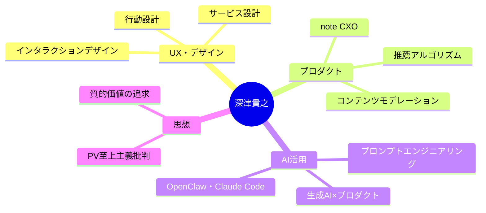

---
tags:
  - 深津貴之
  - AI
  - UX
  - プロダクト
  - 人物
created: 2026-03-19
updated: 2026-03-19
著者: 深津貴之
---

# 深津貴之（ふかつ たかゆき）

> [!info] 基本情報
> - **肩書き**：note株式会社 CXO（Chief Experience Officer）/ THE GUILD 代表
> - **ブログ**：[深津貴之のnote](https://note.com/fladdict)
> - **専門**：UXデザイン・プロダクト設計・サービス設計・AI活用

---

## 👤 人物概要

インタラクションデザイナー・UXデザイナーとして長年にわたり活動。クリエイター向けプラットフォーム「note」のCXOとして、プロダクトの体験設計全体を担う。デザインファーム「THE GUILD」代表として企業のデジタル変革も支援。ChatGPTやClaudeの活用法を日本に広めた先駆者としても知られ、「プロンプトエンジニアリング」の啓発活動で大きな影響を与えた。

---

## 🧠 専門領域と思想

---

## 📚 主な発信テーマ

| テーマ | 内容 |
|--------|------|
| **PV至上主義批判** | アクセス数より「ユーザー行動の質」を重視するプラットフォーム設計哲学 |
| **生成AI活用** | 生成AIで解くべき問いと解くべきでない問いの峻別 |
| **コンテンツモデレーション** | 思想ベースでなく行動ベースでモデレーションを設計すべきという提言 |
| **推薦アルゴリズム** | noteの「推し」アルゴリズムの設計思想の公開 |

---

## 💡 現在の主な関心テーマ

- **全自動開発（OpenClaw × Claude Code）**：AIエージェントによる自律的なコード開発
- **プラットフォームとクリエイターエコシステム**：健全なコンテンツ循環の設計
- **AI時代のサービス設計**：人間とAIが共存するUXの再定義

---

## 🔗 関連ノート

<!-- [[Claude Code]] [[プロダクト設計]] [[生成AI活用]] -->
