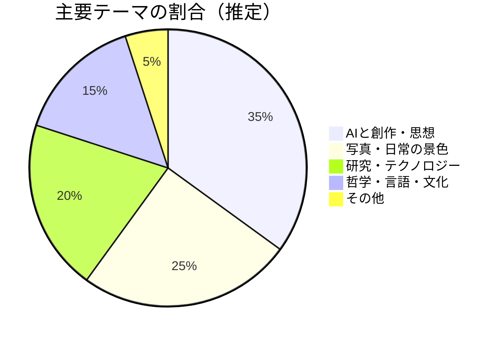
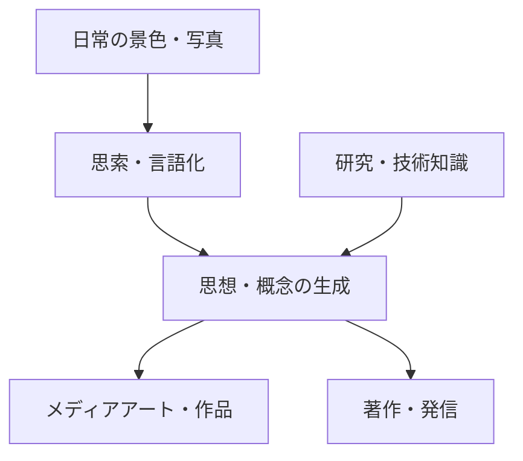

---
tags:
  - 落合陽一
  - AI
  - メディアアート
  - ブログレポート
created: 2026-03-19
updated: 2026-03-19
著者: 落合陽一
source: "https://note.com/ochyai"
---

# 落合陽一 ブログ概要レポート
## note（落合陽一の見ている風景と考えていること）

> [!info] ブログ情報
> - **URL**：[note.com/ochyai](https://note.com/ochyai)
> - **総記事数**：1,718本以上
> - **更新頻度**：月約25本
> - **フォロワー**：約78,300人
> - **調査日**：2026-03-19

---

## 📊 ブログの全体傾向

---

## 📝 最近の主要記事（2026年）

### 1. わたしは，きょうも，蒸留されている（2026-03-18）
**テーマ**：AI時代における「知の蒸留」という概念を自己の変容と絡めて詩的に論じる。AIによって自分の思考・表現が蒸留・再構成されていく感覚を率直に記述。

### 2. ぬるの茶室，とらひこは少しだけしゃべる（2026-03-12）
**テーマ**：茶室という日本の伝統的空間とAI・物性研究を接続。「ぬる（温度感覚）」「とらひこ（固有名詞・存在感）」など感覚的概念を通じてデジタルネイチャーを探求。

### 3. 仮名の海（2026-03-11）
**テーマ**：日本語の仮名文字を「海」として比喩し、言語・文字・記号とデジタル表現の関係を思索的に論じる。

### 4. エージェントが創作に関与するようになると書きかけの原稿が書き終わる（2026-03-11）
**テーマ**：AIエージェントが創作プロセスに入り込むと「書きかけ」が自動的に完成していく体験を報告。創作とAIの共創関係の変容を実感ベースで論じる。

### 5. 落合陽一が何者かわかからないときに読むnote 2025年版（2025-02-04）
**テーマ**：自己紹介・活動総括記事。メディアアーティスト・研究者・実業家・著者という多面的アイデンティティを整理。

---

## 🔍 思想的立場と特徴

- **詩的・感覚的な文体**：論理的説明より感覚・比喩を多用する独自スタイル
- **高頻度更新＝思考の実況中継**：月25本という量は「考えながら書く」プロセスの公開
- **AIを「道具」でなく「共創者」として捉える**：蒸留・エージェント関与など、AIとの関係を能動的に実験
- **物性×デジタル×日本文化の独自交差点**：他の論者にない視座

---

## 💭 北田視点からの考察メモ

> **教育×AIへの接続ポイント**：
> 「エージェントが書きかけの原稿を書き終える」という体験は、
> 子どもの探究学習においても応用可能かもしれない。
> 「書きかけ（問い）を持ち続けること」の価値と、AIによる補完のバランスが問われる。

---

## 🔗 関連ノート

<!-- [[デジタルネイチャー]] [[AIと創作]] [[探究学習×AI]] -->
