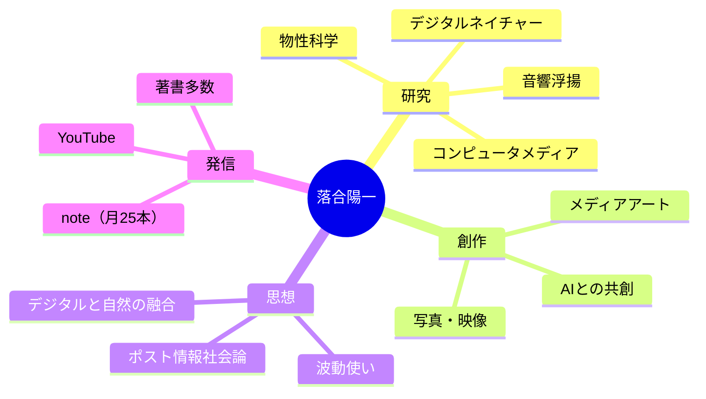

---
tags:
  - 落合陽一
  - AI
  - メディアアート
  - テクノロジー
  - 人物
created: 2026-03-19
updated: 2026-03-19
著者: 落合陽一
---

# 落合陽一（おちあい よういち）

> [!info] 基本情報
> - **肩書き**：筑波大学准教授 / メディアアーティスト / 実業家
> - **ブログ**：[落合陽一のnote](https://note.com/ochyai)
> - **専門**：コンピュータメディア・光学・物性科学・メディアアート

---

## 👤 人物概要

1987年生まれ。東京大学大学院学際情報学府博士課程修了。「魔法使い」を自称し、光・音・物性・計算機メディアを研究するメディアアーティストとして国際的に活躍。筑波大学デジタルネイチャー開発研究センター長を務めつつ、企業顧問・メディア出演・著作と多方面で発信。月25本以上の高頻度でnoteを更新し続ける。

---

## 🧠 専門領域と思想

---

## 📚 主な著書

| 著書 | 概要 |
|------|------|
| **『魔法の世紀』**（2015） | ポスト情報社会の到来と計算機的自然観を論じた思想書 |
| **『デジタルネイチャー』**（2018） | 計算機が自然と融合する未来の生態系を描くビジョン書 |

---

## 💡 現在の主な関心テーマ

- **AIエージェント×創作**：書きかけの原稿をエージェントが完成させる実験
- **AIオーケストレーション**：複数AIエージェントの協調制御（オープンソース研究）
- **蒸留という概念**：AIによる知の蒸留・自己変容の哲学的考察
- **茶室・侘び寂び×AI**：日本の美意識とデジタル自然の接点

---

## 🔗 関連ノート

<!-- [[デジタルネイチャー]] [[AIエージェント]] [[メディアアート]] -->
