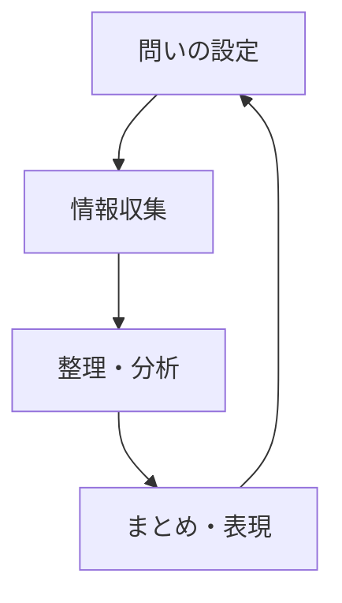

# Obsidian Vault - Claude Code ガイド

## オーナー
**北田朋也（Tomoya Kitada）**
フリーランス教育コーディネーター（京都市）。探究学習・ファシリテーション・AI×教育を軸に活動。

---

## フォルダ構造

```
Obsidian Vault/
├── 00_ホーム/        # プロフィール・ホームノート
├── 01_プロジェクト/  # 進行中プロジェクト
├── 02_教育政策/      # 教育政策・思想系の調査メモ
├── 03_学習・資格/    # 学習記録・資格取得
├── 04_ツール・方法論/ # AI・PKM・方法論
└── _assets/          # 画像・添付ファイル置き場（Obsidianのデフォルトアタッチメント）
```

## ノート作成のルール

### frontmatter（必須）
```yaml
---
tags:
  - タグ1
  - タグ2
created: YYYY-MM-DD
updated: YYYY-MM-DD
---
```

### ノートリンク
- Obsidianのwikilink形式で記述: `[[ノート名]]`
- 外部URL: 通常のMarkdownリンク `[text](url)`

### 保存先の判断
| 内容 | フォルダ |
|------|---------|
| プロジェクト・活動 | `01_プロジェクト/` |
| 教育政策・思想・人物 | `02_教育政策/` |
| 学習メモ・資格 | `03_学習・資格/` |
| ツール・方法論・AI活用 | `04_ツール・方法論/` |
| その他・新規 | `00_ホーム/` に一時保存し整理 |

---

## よく使うタグ

`探究` `対話` `ファシリテーション` `AI×教育` `ClaudeCode` `Obsidian`
`プロジェクト` `教育政策` `学習` `方法論` `ホーム` `自分`

---

## 図・画像の挿入ルール

### 優先順位

**① Mermaid 図（最優先）**
構造・フロー・関係を示す場合は Mermaid コードブロックを使う。Obsidian はネイティブでレンダリングする。



使えるMermaidの種類：
- `graph TD/LR` — フローチャート・関係図
- `sequenceDiagram` — シーケンス図
- `classDiagram` — クラス図・概念構造
- `mindmap` — マインドマップ
- `timeline` — 年表・タイムライン
- `pie` — 円グラフ
- `xychart-beta` — 棒グラフ・折れ線グラフ

**② ASCII アート図**
Mermaidで表現しにくいレイアウト・比較表・スペクトラムには ```` ``` ```` コードブロック内のASCIIアートを使う。

**③ 実画像ファイル（PNG/JPG/SVG）**
実際の画像を埋め込む場合：
1. 画像を `_assets/` フォルダに保存する
2. Obsidianのwikilink形式で挿入: `![[ファイル名.png]]`
3. キャプションを付ける場合: `![[ファイル名.png|キャプションテキスト]]`

**④ 外部URL画像（最終手段）**
ローカル保存できない場合のみ: ``
※ URLが死ぬリスクがあるため非推奨。

### 判断フロー

```
図を入れたい
  ↓
関係・フロー・構造を表したい？ → Mermaid
  ↓ No
比較表・スペクトラム・レイアウト？ → ASCIIアート
  ↓ No
実際の写真・スクリーンショット？ → _assets/ に保存 → ![[]]
  ↓ No
外部の参考画像（URL）？ → （非推奨）
```

---

## 操作上の注意

- **既存ノートを更新する際は `updated:` を今日の日付に変更する**
- **新規ノートは必ずfrontmatterを付与する**
- **wikiリンクは `[[]]` 形式を使い、通常のMarkdownリンクは使わない**
- **図はできる限りMermaidで書く（Obsidianがネイティブレンダリングするため）**
- ファイル名はわかりやすい日本語でOK（スペースなし推奨）
