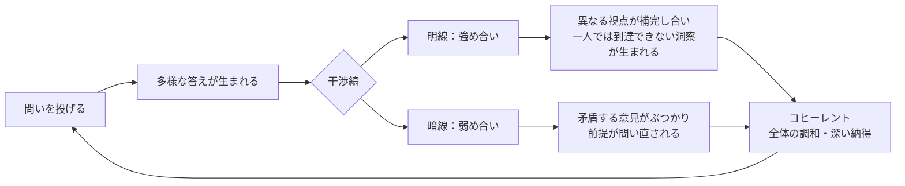
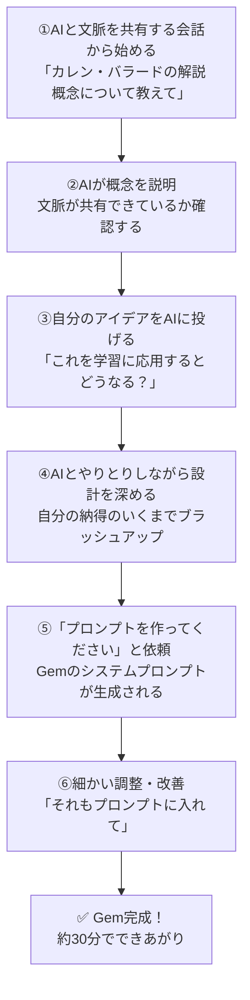

# かえつ有明 AI研修 第2回レポート

> **日時：** 2026年3月25日（水）09:00〜11:00
> **形式：** Zoom オンライン研修
> **ファシリテーター：** 田原さん（コンテンツ）× 北田朋也（テクニカル）

---

## 参加者チェックイン

| 参加者 | 前回からのアップデート |
|--------|----------------------|
| 真田さん | まだほぼ触れていないが、調べる時に少し活用 |
| 石田記子さん | 前回欠席。動画視聴も難しかった。でもGeminiが日常的な力になっている |
| 大木さん | 「解説的学習論」で学ぶことの意味が改めてアップデートされた |
| 高田美喜さん | AIが「道具」だけでなく既存の考え方と結びつくと気づいた。家族間のAIリテラシーギャップも実感 |
| 高野美保さん | 特に触れていないが、他の先生との対話が広がった |
| 山田秀男さん | 初参加。具体化への期待あり |
| 上野愛さん | GeminiのGem機能を使い始めた |
| 佐野かずゆきさん | 学校研修でGemを作ったが、進め方への反省あり（それも学び） |
| 岩井健太さん | 解説的実践を先生へのヒアリングGemに応用、実践中 |
| 吉井さん | 前回より前のめりに。1つでも新しいことを掴みたい |
| **北田朋也** | Zoom議事録の自動化を実験中。文字起こし→議事録ワンクリックを試験運用 |

---

## 今日のテーマ：干渉縞をつくる学び

```
「多様な意見を重ね合わせて、深い理解を生む学習プロセス」
```

---

## 核心概念①｜反射 vs 解説（カレン・バラードより）

```
┌─────────────────────────────────────────────┐
│                                             │
│   【反射（Reflection）】                    │
│                                             │
│   問い ──→ 生徒 ──→ 一つの答え              │
│                                             │
│   鏡のように、決まった答えが返ってくる       │
│   全員から同じ答えが戻ってくる              │
│                                             │
└─────────────────────────────────────────────┘

┌─────────────────────────────────────────────┐
│                                             │
│   【解説（Diffraction）】                   │
│                                             │
│   問い ──→ 生徒A ──→ 答えA\               │
│         │                  ╲               │
│         ├─→ 生徒B ──→ 答えB─→ 干渉縞✨   │
│         │                  ╱               │
│         └─→ 生徒C ──→ 答えC/               │
│                                             │
│   回析格子のように、多様な答えが広がり       │
│   重なり合って新しいパターンが生まれる       │
│                                             │
└─────────────────────────────────────────────┘
```

> **ポイント：** 生徒一人ひとりが「スリット（溝）」になる。光が溝を通って広がるように、問いが生徒を通して多様な回答に広がっていく。

---

## 核心概念②｜干渉縞の2つのパターン



### 強め合い（明線）とは？

> 異なる視点が出会うことで、**一人では到達できなかった深い洞察や新しいコンセプト**が立ち上がる状態。
> お互いの意見の足りないところを補い合って、どちらからとも言えない良い考えが生まれる。

### 弱め合い（暗線）とは？

> 矛盾する意見がぶつかり、**既存の固定観念が揺さぶられ、前提が問い直される**状態。
> ※悪いことではなく、新しい前提の発見につながる！

**例：数学の背理法**
```
「√2 は有理数である」と仮定する
         ↓
どんどん進めると…矛盾が起きる！
         ↓
「あの前提がおかしかったんだ」と気づく
         ↓
「無理数」という新しい概念に到達 ✨
```

---

## 核心概念③｜AIをスクリーンとして活用する

```
┌──────────────────────────────────────────────────┐
│                                                  │
│   教師          生徒（スリット）    AI（スクリーン）│
│                                                  │
│   [問いを投げる] → [生徒A] ─────────────┐        │
│                  → [生徒B] ─────────────┼→ [干渉縞│
│                  → [生徒C] ─────────────┤  を可視化│
│                  → [生徒D] ─────────────┘  する] │
│                                                  │
│   AIが多様な回答を分析・統合し、                  │
│   パターンを「見える化」する                      │
│                                                  │
└──────────────────────────────────────────────────┘
```

**AIスクリーンの3つの評価軸：**
1. **建設的干渉（強め合い）** ── 補完し合う意見のクラスタ
2. **相殺的干渉（弱め合い）** ── 矛盾・対立する意見の発見
3. **分布と境界** ── まだ観測されていない視点の可視化

---

## 田原さんのGem作成プロセス（ライブデモ）



**ポイント：いきなり「作って」ではなく、まずAIと文脈を共有する！**

> 「じゃあAIをスクリーンとして機能させるためのGemのプロンプトを作成してください」と伝えたのは、AIと十分対話して文脈が共有できてから。

---

## 今日の問い：実践ワーク

**問い：「AIは人間の思考を深めるのに役立つのか？」**

- 個人ワーク（6分）でGoogleフォームに回答
- その後、全員の回答をAIスクリーン（Gem）に流し込んで干渉縞を可視化
- ポジティブ・ネガティブ、両方の視点を自由に書く

---

## ファシリテーターの役割分担

```
┌─────────────────────────────────────────┐
│                                         │
│  田原さん                               │
│  ＝コンテンツファシリテーター            │
│                                         │
│  ・難しい概念・理論を提示               │
│  ・問いを設計して投げかける             │
│  ・研究者目線でリードする               │
│                                         │
└─────────────────────────────────────────┘

              ↕ セットで機能

┌─────────────────────────────────────────┐
│                                         │
│  北田朋也                               │
│  ＝テクニカルファシリテーター            │
│                                         │
│  ・AI解説・補足コメントをチャットに投稿  │
│  ・Googleフォーム管理・議事録作成       │
│  ・Zoom録画・ブレイクアウト設定         │
│  ・AI活用の実演・サポート              │
│                                         │
└─────────────────────────────────────────┘
```

> 田原さんより：「テクニカルファシリテーターとしてどういう役割なのかを定義していく必要がある。北田さんが今まさにその役割を作っている最中」

---

## 印象的なエピソード

### 長崎県教育委員会でのGem実験
前日の研修で「なかなか終わらないGem」を使ったところ：
- 教育長 → **3時間ぶっ通しでやりとり**
- その他の参加者 → 30〜40分で完了
- 対策として「3回で問いを終えて、続けますか？」のステップを追加

### 岩井さんのGem実践
解説的実践の考えを先生たちへのヒアリングに応用するGemを作成。
粘り強く質問してくるアプリで、田原さんも「もうここで考えるのをやめようとするところをさらに掘り下げてくる」と体験。

---

## 参加者の声から見えてきたこと

| 傾向 | 内容 |
|------|------|
| 世代間ギャップ | 「夫は全然わからない世代、息子は身近な世代」（高田美喜さん）|
| 焦りと進捗のばらつき | 「吉井さんのチームが進んでいると知って焦った」（佐野さん）|
| 日常的な活用が先行 | 石田さん：理論は難しくてもGeminiが「日常の力」になっている |
| 対話から生まれる学び | 高野さん：触っていなくても、先生同士の対話が広がった |

---

## まとめ：今日の学びの干渉縞

```
「学びは一人では完結しない。
  多様な視点が出会い、重なり合い、
  時に強め合い、時にぶつかり合うことで、
  一人では到達できなかった場所へたどり着く。

  AIはその干渉縞を可視化するスクリーンになれる。」
```

---

## 北田メモ

- 自動議事録ワークフローの試験運用中（Zoom文字起こし→Claude→Obsidian保存）
- テクニカルファシリテーターの「役割の言語化」が今後の課題
- 田原さんから「名前をつけることが大事」→ ロール名を考える

---

*作成：北田朋也 / 2026-03-25*
*参照：Zoom字幕ログ「2026-03-25 08.58.00 かえつ有明AI研修」*

#かえつ有明 #AI研修 #解説的学習論 #Gem #テクニカルファシリテーター #2026
