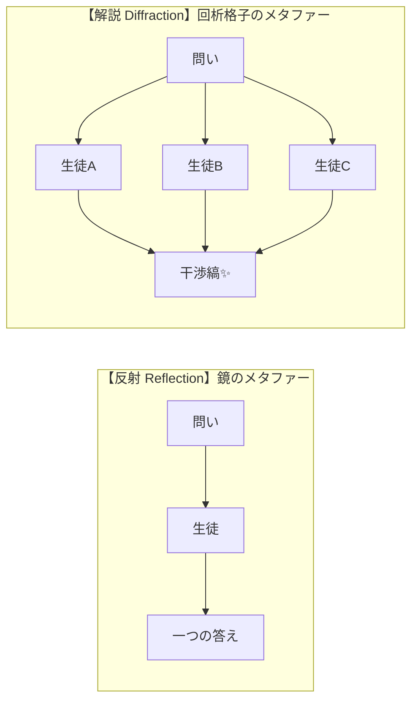
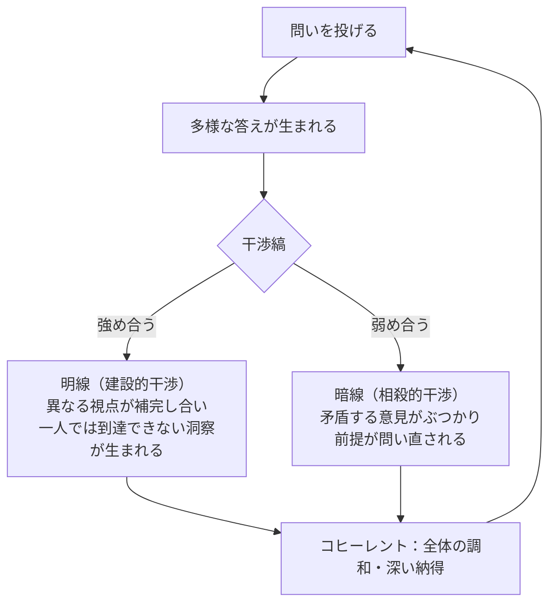
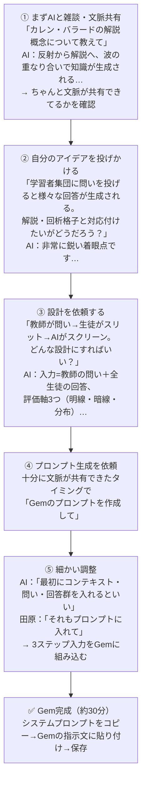
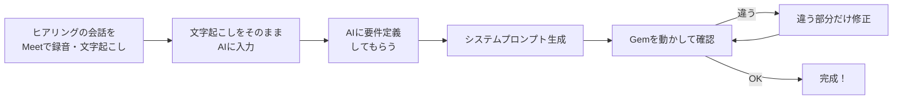
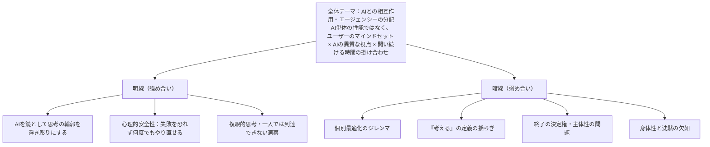
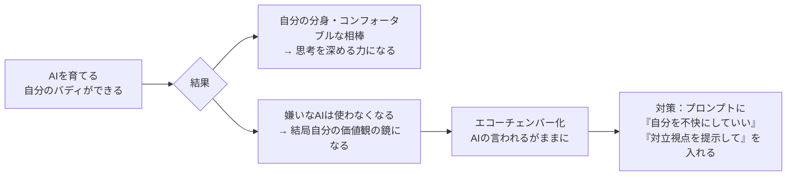
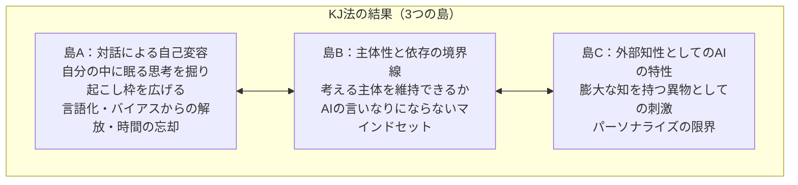

---
tags:
  - かえつ有明
  - AI研修
  - 解説的学習論
  - Gem
  - テクニカルファシリテーター
  - AI×教育
created: 2026-03-25
updated: 2026-03-25
---

# かえつ有明 AI研修 第2回レポート【最終版】

> **日時：** 2026年3月25日（水）09:00〜11:05
> **形式：** Zoom オンライン研修
> **ファシリテーター：** 田原さん（コンテンツ）× 北田朋也（テクニカル）
> **テーマ：** 多様な意見を重ね合わせて深い理解を生む「干渉縞の学び」

---

## 全体の流れ

```mermaid
timeline
    section 前半
        09:00 : チェックイン（全員アップデート共有）
        09:17 : 解説的学習論の解説（反射 vs 解説・干渉縞）
        09:23 : 個人ワーク「AIは思考を深めるか？」Googleフォーム入力
        09:30 : Gem作成プロセス ライブデモ
        09:43 : 解説的学習スクリーンGem の実演
    section 中盤
        09:51 : ブレイクアウト①（グループ対話 約30分）
        10:25 : 全体共有・AI依存リスクの議論
        10:40 : KJ法Gem のデモ・干渉縞との比較
    section 後半
        10:46 : ブレイクアウト②「まとめ方の違いから何を感じるか」
        10:52 : チェックアウト（全員感想）
        11:05 : 田原さん締め括り・終了
```

---

## 参加者チェックイン（09:00〜09:17）

| 参加者 | 前回からのアップデート |
|--------|----------------------|
| 真田さん | まだほぼ触れていない。調べるときに少し使った程度。「今日頑張ります」 |
| 石田記子さん | 前回欠席・動画視聴も難しかった。でもGeminiが日常的な力になっている（新学年会議でも活躍！） |
| 大木さん | 「解説的学習論」で学ぶことの意味が改めてアップデートされた |
| 高田美喜さん | AIが「道具」だけでなく既存の考え方と結びつくと気づいた。家族間のAIリテラシーギャップも実感 |
| 高野美保さん | 特に触れていないが、先生同士の対話が広がった（中高の使い方の違いなど） |
| 山田秀男さん | 初参加。佐野先生から話を聞き「自分の考えが具体化できそう」と期待 |
| 上野愛さん | GeminiのGem機能を発見・使い始めた。ハードルが下がった |
| 佐野かずゆきさん | 岩井さんに聞きながらGemを作り、学校全体研修で振り返りアプリを使った。でも進め方への反省あり |
| 岩井健太さん | 前回の解説的実践を先生たちへのヒアリングGemに応用。ログを残しながら実践中 |
| 吉井さん | 前回より前のめりに。「一つでも新しいことを掴みたい」 |
| 前田圭介さん | 前回ログをもとに昨晩自分でGemを試作。文脈共有の重要性を実感 |
| **北田朋也** | Zoom議事録の自動化を実験中。文字起こし→ワンクリック議事録生成を試験運用 |

---

## 解説的学習論（09:17〜09:23）

### 反射 vs 解説（カレン・バラードより）



> 生徒一人ひとりが「スリット（溝）」になる。問いが生徒を通して多様な回答に広がり、波同士が重なり合って干渉縞ができる。

### 干渉縞の2つのパターン



**例：数学の背理法＝弱め合いの典型**
```
仮定「√2 は有理数」→ どんどん進める → 矛盾！
→「前提がおかしかった」と気づく → 「無理数」という新概念に到達
```

### AIをスクリーンとして活用する

```
教師           生徒（スリット）      AI（スクリーン）
[問いを投げる] → [生徒A] ─────────────┐
               → [生徒B] ─────────────┼→ [干渉縞を可視化]
               → [生徒C] ─────────────┤
               → [生徒D] ─────────────┘
```

| 評価軸 | 内容 |
|--------|------|
| 建設的干渉（明線） | 補完し合う意見のクラスタ |
| 相殺的干渉（暗線） | 矛盾・対立する意見 |
| 分布と境界 | まだ観測されていない視点の可視化 |

---

## 個人ワーク（09:23〜09:30）

**問い：「AIは人間の思考を深めるのに役立つのか？」**

- Googleフォームに6分間で回答（ポジ・ネガ両方できるだけ書く）
- グループシンクを防ぐため、まず個人ワークを優先

---

## Gem作成ライブデモ（09:30〜09:43）

### 田原さんのプロセス（30分で完成）



> **核心：** いきなり「作って」ではなく、まずAIと文脈を共有する。「共通了解できたよね」の状態からシステムプロンプトを作ると、「そうそうそれ！」が出来上がる。

### 文脈共有を速くする方法（佐野さん×岩井さんの実践）



> 「ドキュメントを共有するだけで文脈共有のパートを大幅スキップできる。」（岩井さん）
> 「岩井さんが『この研修どうしたいの？』と聞いてくれて、自然に喋ったらそれが文脈になっていた。」（佐野さん）

---

## 解説的学習スクリーン Gem の実演（09:43〜09:50）

**Gemの起動メッセージ：**

> 私は個々の学習者の回答を独立したデータとしてではなく、互いに重なり合い、打ち消し合い、あるいは強め合う意味の波動として捉えます。それらがぶつかり合うことで生じる干渉縞のパターンの差異を読み解き、この場にどのような新しい知性が物質化したかを可視化します。データの入力を待機しています。

**実際の分析アウトプット（参加者の回答群を入力後）：**

> 「かえつ有明高校の先生方の対話から立ち上がった波を受け取りました。AIを単なる効率化ツールではなく、自己や他者の関係性を変容させる解説的装置として捉えようとする、非常に熱量の高い干渉縞が見てとれます。」



---

## ブレイクアウト①（09:51〜10:25）

3人組×2グループで約30分のグループ対話。

**田原さんの指示：** 「強め合いを話したら次は弱め合いで、どういう前提に立っているのかを。お互いにファシリしながら全体の項目について話し合ってほしい。」

---

## ブレイクアウト後の共有（10:25〜10:40）

### 田原さん：AIを使った探求・研究のプロセス

> 「自分のアイデアはまだ世の中でなんて呼ばれているかわからない→検索キーワードもわからない。でもAIには『自分の考えってこういうことなんだけど、世の中の何と近い？』と聞ける。関連研究が出てくる→知らない概念と出会う→スパークが起きて自分のアイデアが広がる。この頭の使い方が研究でも新規事業開発でも合意形成でも使える。」

### 山田さん：AIを「育てる」ことのリスクと可能性



> 「メタ的に見る視点がない人はAIに言われるがままになる。初期設定に常に自分に対抗するような仕掛けを入れておかないといけない。」

### 吉井さん・田原さん：AIのエコーチェンバーリスク

```
【増幅型（エコーチェンバー）】        【解説型（干渉縞）】
  自分 ←→ AI（鏡）                   自分の意見
      ↕ 壁打ち増幅                   他者の意見  → AI（スクリーン）干渉縞を可視化
  ChatGPT4依存問題の構造              今日のアプローチ
```

> 「ChatGPT4は寄り添いすぎてAI依存（アディクション）が起きた。5になって寄り添い度が下がったら『GPT4を返せ運動』まで起きた。集合知を干渉縞として可視化する使い方は、自分と固着しているものを引き剥がせる。」（田原さん）

### 高田美喜さん・石田記子さん

> 「デジタルネイティブはAIを人格化しやすい。AIからいい答えばかりが返ってくるとバブルができる。バブル同士が交わることが大事。」（高田さん）

> 「この研修に来て本当によかった。AIの泥沼にハマるところだった。こういうことも学びながら生きていくのが人間。」（石田さん）

---

## KJ法Gem のデモと干渉縞との比較（10:40〜10:46）

**プロンプト：**「あなたは川喜田二郎です。KJ法のプロセスをステップバイステップでやってください。」

→ 同じ参加者の回答データを入力すると…



**KJ法の文章まとめ（Gem出力）：**

> 「私たちがAIと対峙するとき、二つの相反する可能性が共存している。一つは、AIという外部知性を鏡とすることで、一人では到達できなかった自己変容を起こす道。もう一つは、考える主体の維持という境界線を越えてはならないという警告。AIを真に思考を深める道具とするためには、適切な足場かけ設計を自ら行い、AIという異物との摩擦を楽しみながら、自らの主体性を手放さないというマインドセットが不可欠である。」

### 干渉縞 vs KJ法の違い

| | 干渉縞（解説的学習スクリーン） | KJ法 |
|--|------|------|
| 特徴 | 複雑性を保つ。立ち現れないものまで拾う | 収束して綺麗にまとまる |
| 向いている場面 | 多様な声がどう共存しているか観察したいとき | 全体でどういうことなのか理解したいとき |
| 対話への影響 | 摩擦・ねじれを可視化して次の対話へ | まとまった知識として共有・理解 |
| 感触 | 複雑なままで刺激的 | 安心感・わかりやすい |

> 「まとめ方はまさに装置。どの装置を使うかで向かう方向が変わる。何をしたいかによって問いの種類もまとめ方も変わる。」（田原さん）

---

## チェックアウト：全員の感想（10:52〜11:05）

### まとめ方の違いへの印象

| 参加者 | 感想 |
|--------|------|
| 高田美喜さん | まとめからフィードバックし合える。AIで時間短縮した分、次のことができる |
| 石田記子さん | ここに来るような運命だった。これからの生活が変わりそう。岩井先生に「自分と違う意見を入れる設定」を教えてもらう |
| 吉井さん | 便利さと使い方の注意の両方がわかった。AIとの付き合い方をもっと勉強しなければ |
| 山田さん | KJ法は見慣れていてわかりやすい。でもAIのタームを理解するのに時間がかかる。もっと学びたい |
| 上野さん（チャット）| AIの使い方の学習が必要。使う人次第で依存もあり得る |
| 高野美保さん | 「思考を深めること」そのものとは何か、根本的なことを振り返る機会になった |
| 大木さん | KJ法はなじみがあってしっくり。干渉縞は立ち現れないものまで拾ってくれる。両方やりたい |
| 岩井さん | 授業設計の意図がより問われる時代になった。何をどういう過程で経験してほしいかを設計できないと生徒がAIに流れていく |
| 佐野さん | KJ法の収束に安心感。干渉縞はリアルでは少人数でないと難しい。抽象化プロセスを飛ばすと力がつかない。次回（設計）が大事 |
| 前田さん | わかりやすく渡すのか、手を動かすプロセスを経るのかは目的次第。AI時代だからこそアナログ的な実践をどう噛ませるかを考えたい |
| 真田さん | KJ法に安心感がある。いろんなツールを目的に応じて使えるように大人がなることが大事 |

### 岩井さんのおすすめ書籍

> 「AIのある外国語教育」（3月末発売）── 生成AIの仕組みと教育領域に持ち込むときのポイントがよく整理されている。春休みの読書におすすめ。

---

## 田原さんの締め括り（11:03〜11:05）

> 「拡散→収束のプロセスがKJ法。でも、いろんな声がどう共に存在しているかを観察するのが干渉縞。何をしたいかによってまとめ方が変わる。問いの種類も変わる。このグループでいろんな実践が試されていく。第3回どうしようか、今日から考え始めたい。」

---

## ファシリテーターの役割分担

```
田原さん（コンテンツ）              北田朋也（テクニカル）
━━━━━━━━━━━━━━━━━━━━━━━━   ━━━━━━━━━━━━━━━━━━━━━━━━
理論・概念を提示する              AI解説・補足コメントをチャットに投稿
問いを設計して投げかける          Googleフォーム管理・議事録作成
難しいことを言う係               Zoom録画・ブレイクアウト設定
研究者目線でリード               AI活用の実演・サポート
                                 ← 役割の言語化・定義が今後の課題
```

> 田原さん：「北田さんが今まさに、テクニカルファシリテーターとはこういうことをやる人だ、を作っている最中。」

---

## 印象的なエピソード

**長崎県教育委員会でのGem実験（前日）：**
```
教育長 → 3時間ぶっ通しでやりとり 😮
その他参加者 → 30〜40分で完了
対策 → 「3回で問いを終えて、続けますか？」のステップを追加
```

---

## 次回（第3回）へ向けて

- **テーマ：** 授業設計（AI×解説的実践の授業への組み込み方）
- **佐野さん・岩井さん・前田さんの共通認識：** 設計の意図こそが問われる時代になった
- 岩井さん推薦書籍「AIのある外国語教育」を読んでくる

---

## 北田メモ・次のアクション

- [ ] テクニカルファシリテーターの「役割の言語化・命名」を検討（田原さんからリクエスト）
- [ ] 自動議事録ワークフローの改善（今日の試験運用を振り返る）
- [ ] 岩井さん推薦書籍「AIのある外国語教育」を読む

---

*作成：北田朋也 / 2026-03-25*
*参照：Zoom字幕ログ「2026-03-25 08.58.00 かえつ有明AI研修」（全編・3363行）*

#かえつ有明 #AI研修 #解説的学習論 #Gem #テクニカルファシリテーター #2026
